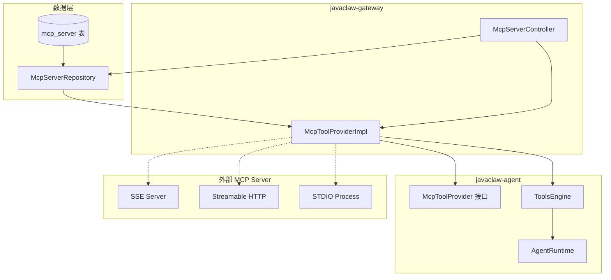
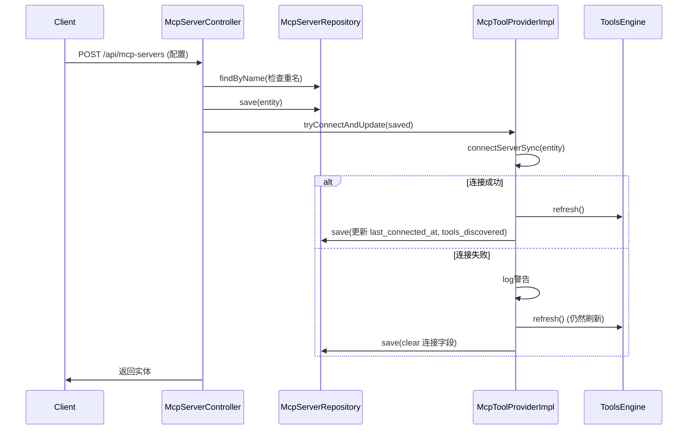

# JavaClaw MCP 工具管理指南

本文档详细介绍 JavaClaw 项目中 MCP (Model Context Protocol) 工具的管理机制、数据流和 API 接口。

---

## 一、架构概览



---

## 二、数据模型

### 2.1 数据库表结构 (V5__mcp_server.sql)

| 字段 | 类型 | 说明 |
|------|------|------|
| `id` | BIGINT PK | 主键 |
| `name` | VARCHAR(128) | MCP 服务名（唯一） |
| `server_url` | VARCHAR(512) | SSE/HTTP URL 或 STDIO JSON 配置 |
| `transport_type` | VARCHAR(32) | 传输类型: `SSE` / `STREAMABLE_HTTP` / `STDIO` |
| `auth_config` | JSON | 认证配置（Header 映射） |
| `enabled` | TINYINT | 是否启用 (0/1) |
| `last_connected_at` | DATETIME | 上次成功连接时间 |
| `tools_discovered` | JSON | 缓存上次发现的工具列表 |
| `created_at` / `updated_at` | DATETIME | 审计时间 |

### 2.2 实体类

**文件**: `javaclaw-gateway/src/main/java/com/atm/javaclaw/gateway/entity/McpServerEntity.java`

```java
@Table("mcp_server")
public class McpServerEntity {
    @Id
    private Long id;
    private String name;
    private String serverUrl;
    private String transportType;
    private String authConfig;
    private Integer enabled;
    private LocalDateTime lastConnectedAt;
    private String toolsDiscovered;
    private LocalDateTime createdAt;
    private LocalDateTime updatedAt;
    // getters/setters...
}
```

---

## 三、核心接口与实现

### 3.1 SPI 接口 (javaclaw-agent)

**文件**: `javaclaw-agent/src/main/java/com/atm/javaclaw/agent/tools/mcp/McpToolProvider.java`

```java
public interface McpToolProvider {
    // 获取所有已连接 MCP 服务器的工具回调
    ToolCallback[] getAllCallbacks();
    
    // 获取每个服务器的工具名列表 (用于分组展示)
    Map<String, List<String>> getServerToolNames();
}
```

### 3.2 实现类 (javaclaw-gateway)

**文件**: `javaclaw-gateway/src/main/java/com/atm/javaclaw/gateway/service/McpToolProviderImpl.java`

#### 核心方法一览

| 方法 | 访问修饰 | 功能描述 |
|------|----------|----------|
| `onApplicationReady()` | `@EventListener` | 应用启动时自动连接所有 enabled=1 的 MCP 服务器 |
| `getAllCallbacks()` | `public` | 返回所有已连接服务器的工具回调数组 |
| `getServerToolNames()` | `public` | 返回 Map<服务器名, 工具名列表> |
| `connectServerSync(McpServerEntity)` | `public` | 同步连接到指定 MCP 服务器 |
| `disconnectServer(String)` | `public` | 断开指定服务器的连接 |
| `testConnection(McpServerEntity)` | `public` | 测试连接（不持久化） |
| `createSyncClient(McpServerEntity)` | `private` | 根据传输类型创建对应的 MCP 客户端 |
| `prefixToolNames(...)` | `private` | 给工具名添加前缀避免冲突 |

#### 启动流程 (onApplicationReady)

```java
@EventListener(ApplicationReadyEvent.class)
public void onApplicationReady() {
    Schedulers.boundedElastic().schedule(() -> {
        repository.findAllByEnabled(1)
            .collectList()
            .doOnNext(servers -> {
                for (McpServerEntity server : servers) {
                    try {
                        connectServerSync(server);
                    } catch (Exception e) {
                        // 连接失败，自动禁用该服务器
                        server.setEnabled(0);
                        server.setUpdatedAt(LocalDateTime.now());
                        repository.save(server).subscribe();
                        log.warn("Failed to connect MCP server '{}' on startup", ...);
                    }
                }
                toolsEngine.refresh();
                log.info("MCP tool provider initialized...");
            })
            .block();
    });
}
```

**关键行为**:
- 在 `boundedElastic` 线程执行（避免阻塞 Netty IO 线程）
- 连接失败时自动将 `enabled` 设为 0
- 最后调用 `toolsEngine.refresh()` 更新工具注册表

#### 连接流程 (connectServerSync)

```java
public void connectServerSync(McpServerEntity server) {
    // 1. 先断开旧连接
    disconnectServer(server.getName());
    
    // 2. 创建并初始化客户端
    McpSyncClient client = createSyncClient(server);
    client.initialize();
    clients.put(server.getName(), client);
    
    // 3. 获取工具列表并添加前缀
    SyncMcpToolCallbackProvider provider = new SyncMcpToolCallbackProvider(List.of(client));
    ToolCallback[] callbacks = provider.getToolCallbacks();
    ToolCallback[] prefixed = prefixToolNames(server.getName(), callbacks);
    mcpToolCallbacks.put(server.getName(), prefixed);
}
```

#### 支持的传输类型

| 类型 | 客户端实现 | 配置方式 |
|------|------------|----------|
| `SSE` | `WebFluxSseClientTransport` | URL + headers |
| `STREAMABLE_HTTP` | `HttpClientStreamableHttpTransport` | URL + headers |
| `STDIO` | `StdioClientTransport` | JSON: `{command, args, env}` |

---

## 四、HTTP API 接口

**文件**: `javaclaw-gateway/src/main/java/com/atm/javaclaw/gateway/http/McpServerController.java`

**基础路径**: `/api/mcp-servers`

### 4.1 API 一览表

| 方法 | 路径 | 功能 | 响应 |
|------|------|------|------|
| GET | `/` | 列出所有 MCP 服务器 | `List<McpServerEntity>` |
| GET | `/{id}` | 按 ID 查询 | `McpServerEntity` 或 404 |
| POST | `/` | 创建新服务器 | 创建后的实体 |
| PUT | `/{id}` | 更新服务器配置 | 更新后的实体 |
| DELETE | `/{id}` | 删除服务器 | `{"success": true, "deletedName": ...}` |
| POST | `/reconnect` | 重连所有启用的服务器 | `{"success": true, "connected": n, "failed": m, "totalTools": n}` |
| POST | `/{id}/test` | 测试指定服务器的连接 | 连接结果 |
| POST | `/test-config` | 测试配置（不保存） | 连接结果 |

### 4.2 创建/更新流程



### 4.3 测试连接 (test-config)

用于保存前先测试配置是否正确：

```bash
POST /api/mcp-servers/test-config
{
    "name": "test",
    "serverUrl": "http://localhost:3000/sse",
    "transportType": "SSE",
    "authConfig": {"Authorization": "Bearer xxx"}
}
```

返回：
```json
{
    "success": true/false,
    "serverName": "test",
    "toolsDiscovered": [...],
    "error": "..." // 失败时
}
```

---

## 五、ToolsEngine 集成

**文件**: `javaclaw-agent/src/main/java/com/atm/javaclaw/agent/tools/ToolsEngine.java`

### 5.1 构造与注入

```java
public ToolsEngine(
        List<ToolCallbackProvider> providers,
        @Autowired(required = false) DynamicToolProvider dynamicToolProvider,
        @Autowired(required = false) McpToolProvider mcpToolProvider) {
    // builtin 来自 Spring AI 的 ToolCallbackProvider
    this.builtinCallbacks = providers.stream()...
    this.dynamicToolProvider = dynamicToolProvider;
    this.mcpToolProvider = mcpToolProvider;
    refresh(); // 初始化时就合并
}
```

**注意**: `McpToolProvider` 是可选注入（`required = false`），因为 MCP 功能不是必须的。

### 5.2 刷新机制 (refresh)

```java
public synchronized void refresh() {
    List<ToolCallback> all = new ArrayList<>(Arrays.asList(builtinCallbacks));
    
    // 1. 动态工具
    if (dynamicToolProvider != null) {
        all.addAll(dynamicToolProvider.getDynamicCallbacks());
    }
    
    // 2. MCP 工具
    if (mcpToolProvider != null) {
        ToolCallback[] mcp = mcpToolProvider.getAllCallbacks();
        all.addAll(Arrays.asList(mcp));
    }
    
    this.allToolCallbacks = all.toArray(new ToolCallback[0]);
    log.info("ToolsEngine refreshed: {} builtin + {} dynamic + {} mcp = {} total", ...);
}
```

### 5.3 工具过滤 (getToolCallbacksFor)

```java
public ToolCallback[] getToolCallbacksFor(String toolsEnabledSpec, String mcpToolsEnabledSpec) {
    // 1. 过滤 builtin + dynamic 工具
    ToolCallback[] builtinCustom = getBuiltinCustomCallbacksFor(toolsEnabledSpec);
    
    // 2. 单独过滤 MCP 工具
    ToolCallback[] mcp = getMcpCallbacksFor(mcpToolsEnabledSpec);
    
    // 3. 合并返回
    // ...
}
```

#### MCP 过滤规则

| `mcpToolsEnabledSpec` | 行为 |
|-----------------------|------|
| `null` / 空字符串 | 返回空数组（不使用 MCP） |
| `"full"` | 返回所有 MCP 工具 |
| JSON 数组 `["tool1", "tool2"]` | 只返回指定工具名 |

### 5.4 工具元数据

```java
public List<Map<String, String>> getToolMetadata() {
    return Arrays.stream(allToolCallbacks).map(cb -> {
        String name = cb.getToolDefinition().name();
        String source = detectSource(name); // builtin / custom / mcp
        // ...
    }).toList();
}
```

工具名以 `mcp_` 开头的被识别为 MCP 工具，并按 `MCP:{serverName}` 分组。

---

## 六、AgentRuntime 使用

**文件**: `javaclaw-agent/src/main/java/com/atm/javaclaw/agent/runtime/AgentRuntime.java`

在对话处理时获取工具：

```java
ToolCallback[] tools = toolsEngine.getToolCallbacksFor(
    request.toolsEnabled(),      // builtin + dynamic 过滤
    request.mcpToolsEnabled()    // MCP 过滤
);
```

两个参数分别控制不同类型的工具，实现精细化的工具权限管理。

---

## 七、关键设计决策

### 7.1 为什么使用前缀 (mcp_serverName_toolName)

- **避免冲突**: 不同 MCP 服务器可能有同名工具
- **识别来源**: 通过前缀可快速判断工具来自哪个 MCP 服务器
- **过滤便利**: `ToolsEngine` 可以按前缀过滤 MCP 工具

### 7.2 为什么 enabled=0 时不删除记录

- **保留配置**: 服务器暂时不可用时不丢失配置
- **手动恢复**: 管理员可以在问题解决后手动启用
- **审计追踪**: 保留历史记录便于排查

### 7.3 为什么用 Schedulers.boundedElastic()

- **避免阻塞 Netty IO 线程**: `.block()` 在 IO 线程上会导致警告或错误
- **弹性线程池**: 支持大量并发阻塞操作，超过上限会排队
- **启动时序**: 确保 `ToolsEngine` 在 MCP 连接完成后刷新

---

## 八、相关文件清单

### 核心实现
| 文件 | 职责 |
|------|------|
| `javaclaw-agent/src/main/java/com/atm/javaclaw/agent/tools/mcp/McpToolProvider.java` | SPI 接口定义 |
| `javaclaw-agent/src/main/java/com/atm/javaclaw/agent/tools/mcp/PrefixedToolCallback.java` | 工具名前缀包装器 |
| `javaclaw-gateway/src/main/java/com/atm/javaclaw/gateway/service/McpToolProviderImpl.java` | 接口实现 |
| `javaclaw-gateway/src/main/java/com/atm/javaclaw/gateway/entity/McpServerEntity.java` | 实体类 |
| `javaclaw-gateway/src/main/java/com/atm/javaclaw/gateway/repository/McpServerRepository.java` | 数据访问 |
| `javaclaw-gateway/src/main/java/com/atm/javaclaw/gateway/http/McpServerController.java` | HTTP API |

### 集成使用
| 文件 | 职责 |
|------|------|
| `javaclaw-agent/src/main/java/com/atm/javaclaw/agent/tools/ToolsEngine.java` | 工具合并与过滤 |
| `javaclaw-agent/src/main/java/com/atm/javaclaw/agent/runtime/AgentRuntime.java` | 运行时工具获取 |

### 数据库
| 文件 | 职责 |
|------|------|
| `javaclaw-gateway/src/main/resources/db/migration/V5__mcp_server.sql` | 初始建表 |
| `javaclaw-gateway/src/main/resources/db/migration/V6__agent_mcp_tools.sql` | Agent MCP 配置 |
| `javaclaw-gateway/src/main/resources/db/migration/V11__drop_mcp_agent_name.sql` | 删除 agent_name 列 |

---

## 九、常见问题

### Q1: MCP 服务器连接失败会怎样？
启动时连接失败会自动将 `enabled` 设为 0，并记录警告日志。配置保留在数据库中，管理员可手动修复后重新启用。

### Q2: 如何重新连接所有 MCP 服务器？
调用 `POST /api/mcp-servers/reconnect`，会遍历所有 `enabled=1` 的服务器重新连接。

### Q3: MCP 工具如何与内置工具区分？
MCP 工具名格式为 `mcp_{serverName}_{originalToolName}`，通过前缀可识别来源。

### Q4: 为什么 `McpToolProvider` 是可选注入？
MCP 功能不是必须的，系统可以在没有 MCP 配置的情况下正常运行。
