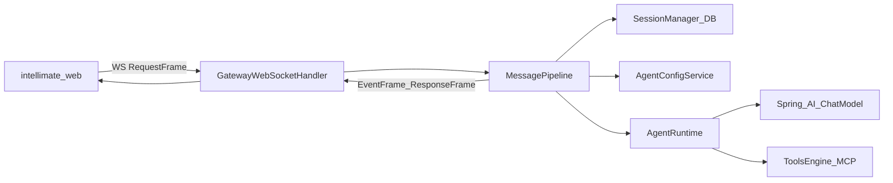
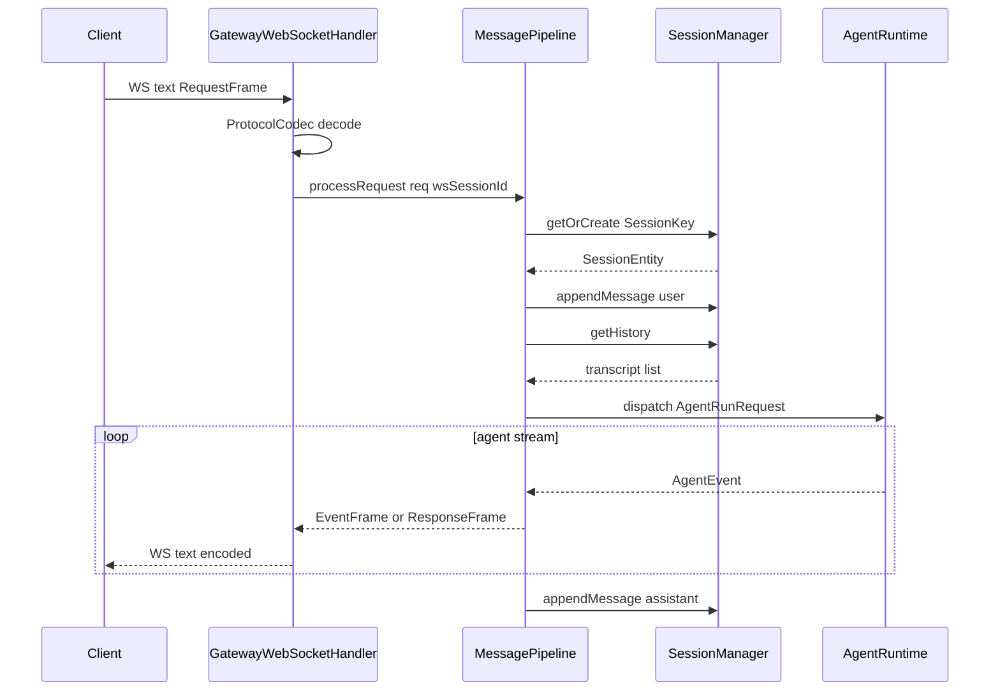

# IntelliMate 项目分层架构与典型场景

## 一、整体鸟瞰

仓库根 [pom.xml](../pom.xml) 定义四个 **Maven 子模块**，外加仓库内的 **intellimate-web**（独立前端工程，非 Maven module）：

| 分层 | 模块 / 目录 | 依赖关系（简述） |
|------|-------------|------------------|
| 共享内核 | [intellimate-core](../intellimate-core) | 无业务模块依赖；被 agent / gateway 引用 |
| 通道抽象 | [intellimate-channel-api](../intellimate-channel-api) | 依赖 core；定义 `ChannelAdapter` SPI |
| Agent 引擎 | [intellimate-agent](../intellimate-agent) | 依赖 core；Spring AI + 工具/MCP/技能运行时 |
| 可执行网关 | [intellimate-gateway](../intellimate-gateway) | 聚合 core、channel-api、agent；WebFlux + R2DBC + Flyway |
| 展示层 | [intellimate-web](../intellimate-web) | 通过 WebSocket/HTTP 调用网关 |

数据流主路径（Web 聊天）可概括为：

---

## 二、各层「整体职责」

### 1. intellimate-core

**整体**：跨模块共享的 **配置**（如 [IntelliMateProperties](../intellimate-core/src/main/java/com/atm/intellimate/core/config/IntelliMateProperties.java)）、**网关帧协议**（[GatewayFrame](../intellimate-core/src/main/java/com/atm/intellimate/core/protocol/GatewayFrame.java) / `RequestFrame` / `EventFrame` / `ResponseFrame`）、**会话键与元数据**（`SessionKey`、`SessionMetadata`）、以及统一异常类型。

**不包含**：具体 LLM 调用、数据库实体、HTTP 路由实现。

### 2. intellimate-channel-api

**整体**：第三方 IM（微信、飞书等）的 **SPI 契约**。核心接口 [ChannelAdapter](../intellimate-channel-api/src/main/java/com/atm/intellimate/channel/api/ChannelAdapter.java) 将外部协议映射为 `InboundEnvelope` / `OutboundMessage`，由网关侧 [ChannelsManager](../intellimate-gateway/src/main/java/com/atm/intellimate/gateway/channel/ChannelsManager.java) 等装配；当前实现示例为 [WebChatAdapter](../intellimate-gateway/src/main/java/com/atm/intellimate/gateway/channel/webchat/WebChatAdapter.java)。

### 3. intellimate-agent

**整体**：**与通道无关** 的 Agent 执行引擎：模型解析（`ChatModelRegistry`）、多轮对话循环（[AgentRuntime](../intellimate-agent/src/main/java/com/atm/intellimate/agent/runtime/AgentRuntime.java)）、工具/MCP 回调（`ToolsEngine`）、可选技能摘要注入（`SkillContentProvider`）、按会话串行排队（`RunQueueManager.enqueue`）、工具审批挂起（`ToolApprovalGate`）等。对外以 `Flux<AgentEvent>` 流式输出，由网关映射为 `EventFrame`。

### 4. intellimate-gateway

**整体**：**唯一 Spring Boot 可运行应用**（见 [intellimate-gateway/pom.xml](../intellimate-gateway/pom.xml)）：WebSocket 入站、安全校验、[MessagePipeline](../intellimate-gateway/src/main/java/com/atm/intellimate/gateway/pipeline/MessagePipeline.java) 编排、会话与 transcript 持久化（R2DBC）、Agent/MCP/模型相关 Spring Bean、REST 管理接口（如 Agent/Skill 配置）等。

### 5. intellimate-web

**整体**：React 单页应用：维护连接、发送 `conversation.message` 等请求、消费 `agent.chunk` / `agent.tool_call` 等事件并渲染 UI（[useWebSocket.ts](../intellimate-web/src/hooks/useWebSocket.ts) 等）。

---

## 三、典型场景：按链路逐跳（WebSocket → Handler → Pipeline → SessionManager → Agent）

以下均以 **Web 通道 + WebSocket** 为主路径，与 [GatewayWebSocketHandler](../intellimate-gateway/src/main/java/com/atm/intellimate/gateway/websocket/GatewayWebSocketHandler.java)、[MessagePipeline](../intellimate-gateway/src/main/java/com/atm/intellimate/gateway/pipeline/MessagePipeline.java) 一致。帧协议见 [intellimate-core](../intellimate-core) 中的 `GatewayFrame` 系列类型。

### 3.0 主链路五跳总览

| 跳 | 组件 / 代码入口 | 职责摘要 |
|----|-----------------|----------|
| 1. WebSocket 传输层 | Spring `WebSocketSession` + [ProtocolCodec](../intellimate-gateway/src/main/java/com/atm/intellimate/gateway/websocket/ProtocolCodec.java) | 文本帧入站 `decode` → `GatewayFrame`；出站 `encode`。 |
| 2. GatewayWebSocketHandler | [GatewayWebSocketHandler](../intellimate-gateway/src/main/java/com/atm/intellimate/gateway/websocket/GatewayWebSocketHandler.java) | 握手后校验 token；`routeFrame` 分发；`RequestFrame` → `MessagePipeline.processRequest`；Pipeline 产出帧经 `outSink` 回写 WebSocket。 |
| 3. MessagePipeline | [MessagePipeline](../intellimate-gateway/src/main/java/com/atm/intellimate/gateway/pipeline/MessagePipeline.java) | 按 `method` 分支；`conversation.message` 拼 `SessionKey`、调 SessionManager、可选 Command 短路或进入流式对话；`mapAgentEvent` → `EventFrame` / `ResponseFrame`。 |
| 4. SessionManager | [SessionManager](../intellimate-gateway/src/main/java/com/atm/intellimate/gateway/session/SessionManager.java) / [SessionManagerImpl](../intellimate-gateway/src/main/java/com/atm/intellimate/gateway/session/SessionManagerImpl.java) | `getOrCreate` 持久化会话；`appendMessage` / `getHistory` / `resetSession` 操作 [TranscriptMessageEntity](../intellimate-gateway/src/main/java/com/atm/intellimate/gateway/entity/TranscriptMessageEntity.java)。 |
| 5. Agent | [AgentRuntime](../intellimate-agent/src/main/java/com/atm/intellimate/agent/runtime/AgentRuntime.java) | `dispatch` → `RunQueueManager.enqueue`（按 `sessionId` 串行）；`executeAgentLoop` 产出 `Flux<AgentEvent>`。 |

**说明**：`wsSessionId`（WebSocket 会话 ID）在 Pipeline 里参与拼接 `contextId`（默认 `contextId` 参数或 `wsSessionId::agentName`），与数据库主键 `SessionEntity.id` 不同；传给 `AgentRunRequest` 的是后者。

**通道 API**：Web 路径不经过 `ChannelAdapter.onMessage`；若未来飞书等适配器接入，应在适配器内构造与 Pipeline 一致的会话键与消息语义，再复用 SessionManager + Pipeline 编排（以网关现有 channel 集成为准）。

---

### 场景 A：用户发送普通对话消息（五跳全开）

| 跳 | 处理 |
|----|------|
| **WebSocket** | 客户端发送 JSON 文本帧；`ProtocolCodec` 反序列化为 `RequestFrame`（`method = conversation.message`，`params` 含 `text`、`channelId`、`contextType`、`contextId`、`agentName` 等）。 |
| **GatewayWebSocketHandler** | 连接已建立且 token 合法；`handleRequest` → `messagePipeline.processRequest(request, session.getId())`，第二个参数即 `wsSessionId`。 |
| **MessagePipeline** | 解析 `SessionKey` / `SessionMetadata`；`getOrCreate` 后若 **非** [CommandHandler.isCommand](../intellimate-gateway/src/main/java/com/atm/intellimate/gateway/pipeline/CommandHandler.java) 则进入 `processMessageStreaming`：`appendMessage`(user) → `getHistory` + `AgentConfigService.resolve` → 构建 `AgentRunRequest` → `agentRuntime.dispatch`；对流式 `AgentEvent` 调用 `mapAgentEvent`；流结束后 `appendMessage`(assistant) 并 `ResponseFrame.success`。 |
| **SessionManager** | `getOrCreate`：按 `channelId/contextType/contextId` 查找或新建 [SessionEntity](../intellimate-gateway/src/main/java/com/atm/intellimate/gateway/entity/SessionEntity.java)，并更新 `lastActiveAt`；`appendMessage` 写入用户与助手消息；`getHistory` 取最近 N 条并按 `createdAt` 排序。 |
| **AgentRuntime** | `dispatch` 入队后执行多轮模型调用与工具；发出 `TextChunk`、`ToolCall`、`ToolResult`、`ApprovalRequired`、`Done`、`Error` 等 `AgentEvent`。 |

**时序（场景 A）**：

---

### 场景 B：用户输入斜杠命令（如 `/reset`、`/help`）

| 跳 | 处理 |
|----|------|
| **WebSocket** | 同场景 A，载荷仍为 `conversation.message`，`text` 以 `/` 开头。 |
| **GatewayWebSocketHandler** | 同场景 A，转入 Pipeline。 |
| **MessagePipeline** | `getOrCreate` 之后命中 `CommandHandler.isCommand` → **不调用** `processMessageStreaming` 与 **Agent**；`commandHandler.handle` 返回 `Flux<GatewayFrame>`（多为 `ResponseFrame`）。 |
| **SessionManager** | **会执行** `getOrCreate`（刷新 `lastActiveAt`）。命令如 `/clear`、`/reset` 会 `resetSession`（删除 transcript）；**不会**走普通对话里的「先 append 用户自然语言再跑模型」路径。 |
| **AgentRuntime** | **不参与**。 |

---

### 场景 C：工具需人工审批（两轮请求）

**第一轮（与场景 A 相同前缀，直到 Agent 要求审批）**

| 跳 | 处理 |
|----|------|
| **WebSocket** / **Handler** | 同场景 A。 |
| **MessagePipeline** | 同场景 A，直至 `mapAgentEvent` 收到 `ApprovalRequired` → 下发 `EventFrame` `agent.approval_required`。 |
| **SessionManager** | 同场景 A（已 persist 用户消息等，依执行进度而定）。 |
| **AgentRuntime** | 在工具路径上阻塞于 `ToolApprovalGate`，等待审批结果。 |

**第二轮（用户点击同意/拒绝）**

| 跳 | 处理 |
|----|------|
| **WebSocket** | 客户端发送 `RequestFrame`，`method = conversation.approve_tool`，`params` 含 `sessionId`（`SessionEntity.id`）、`toolCallId`、`approved`、可选 `modifiedArguments`。 |
| **GatewayWebSocketHandler** | 同场景 A，`processRequest` 第二参仍为 `wsSessionId`（Pipeline 对审批分支不依赖其拼会话键）。 |
| **MessagePipeline** | 入口即 [processApprovalResponse](../intellimate-gateway/src/main/java/com/atm/intellimate/gateway/pipeline/MessagePipeline.java)：`agentRuntime.resolveApproval(...)`，返回 `ResponseFrame.success` / `failure`。 |
| **SessionManager** | **本请求不调用**（无 `getOrCreate` / `appendMessage`）。 |
| **AgentRuntime** | `resolveApproval` 唤醒对应 `ToolApprovalGate`，挂起中的循环继续执行或按拒绝分支处理。后续 `AgentEvent` 仍经 Pipeline → Handler → WebSocket 出站。 |

---

### 场景 D：未知 method 或 Pipeline 异常

| 跳 | 处理 |
|----|------|
| **WebSocket** | 收到任意合法 JSON 帧并解码为 `RequestFrame`。 |
| **GatewayWebSocketHandler** | 照常调用 `processRequest`。 |
| **MessagePipeline** | `method` 既不是 `conversation.approve_tool` 也不是 `conversation.message` 时，**立即** `ResponseFrame.failure`（未知 method）；其它异常由 `onErrorResume` 打 ERROR 日志并 `ResponseFrame.failure`。此路径 **通常不调用** SessionManager、**不调用** Agent（以 `processRequest` 最前分支为准，未进入 `getOrCreate` 之后逻辑）。 |
| **SessionManager** | 通常 **跳过**。 |
| **AgentRuntime** | 通常 **跳过**。 |

客户端宜按 `requestId` 关联失败结果并提示用户。

---

### 场景 E：WebSocket 连接与心跳

| 跳 | 处理 |
|----|------|
| **WebSocket** | 双向文本通道；服务端定时向下游写帧。 |
| **GatewayWebSocketHandler** | 连接成功后发送 `session.welcome`；`Flux.interval` 发送 `EventFrame` `ping`；客户端回 `EventFrame` `pong` 时 `missedPongs` 归零；超限则完成 `outSink` 并断开。 |
| **MessagePipeline** | **不进入**。 |
| **SessionManager** | **不进入**。 |
| **AgentRuntime** | **不进入**。 |

---

### 场景 F：多通道 IM（`ChannelAdapter`）与 Web 路径并列说明

| 跳 | 处理 |
|----|------|
| **WebSocket / Handler / Pipeline** | 当前 **主生产路径**：浏览器经 WebSocket + `conversation.message` 驱动上表流程。 |
| **SessionManager** | 另提供 [resolveSession(InboundEnvelope)](../intellimate-gateway/src/main/java/com/atm/intellimate/gateway/session/SessionManagerImpl.java)：`InboundEnvelope` → 同样落到 `getOrCreate`，便于 IM 适配器与 Web 共用会话模型。 |
| **Agent** | 仍由 Pipeline（或未来统一的入站编排）构造 `AgentRunRequest` 后调用；**当前仓库以 WebSocket 入站为主**，IM 深度集成时需在 Gateway 增加从 `ChannelAdapter.onMessage` 到 Pipeline 等价逻辑的接线。 |

[ChannelAdapter](../intellimate-channel-api/src/main/java/com/atm/intellimate/channel/api/ChannelAdapter.java) 负责厂商协议与 `InboundEnvelope` / `OutboundMessage` 的互转；编排责任仍在 Gateway。

---

## 四、小结表（场景 → 链路与落点）

| 场景 | WebSocket→Handler→Pipeline→SessionManager→Agent |
|------|-----------------------------------------------------|
| 普通聊天 | 五跳全开；Pipeline 内再拉 `AgentConfigService`；Agent 产出事件经 Pipeline 映射后由 Handler 回写 WS |
| 斜杠命令 | 前四跳中 SessionManager 仅 `getOrCreate`（及命令触发的 `resetSession` 等）；**Agent 跳过** |
| 工具审批 | 第一轮同普通聊天至 `ApprovalRequired`；第二轮 `approve_tool` **仅 Handler→Pipeline→Agent**，**SessionManager 跳过** |
| 错误/未知请求 | 通常仅 Handler→Pipeline 即返回 `ResponseFrame.failure`；SessionManager / Agent 跳过 |
| 心跳 welcome | 仅 Handler（及 WS 传输）；Pipeline / SessionManager / Agent 跳过 |
| 多通道（规划） | `ChannelAdapter` + `SessionManager.resolveSession` 与 WebSocket 路径并列；Agent 仍由 Pipeline 类编排触发 |

---

## 五、延伸阅读

- **第三节**：典型场景已按 WebSocket → GatewayWebSocketHandler → MessagePipeline → SessionManager → Agent 分跳展开；小结见第四节。
- **REST Agent/Skill 管理**：网关 HTTP 控制器（如 `AgentController`、`SkillDefinitionController`）与 `AgentConfigService` / 持久化实体配合，为运行时提供解析后的 `ResolvedAgentConfig`；不改变上述 WebSocket 主路径的形状。
- **RunQueueManager**：按 `sessionId` 将 `AgentRuntime` 执行排队，避免同一会话并发多轮互相践踏 transcript 与工具状态。
