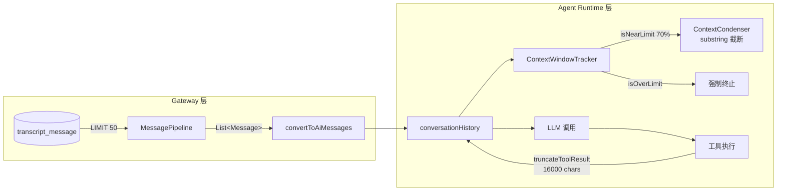
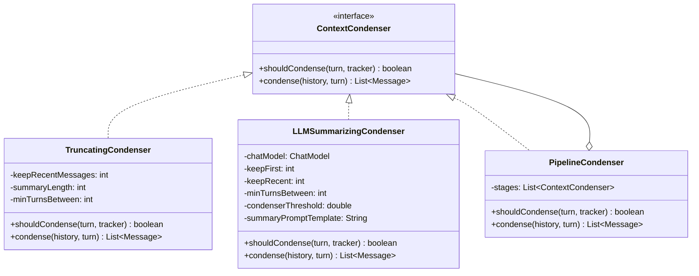
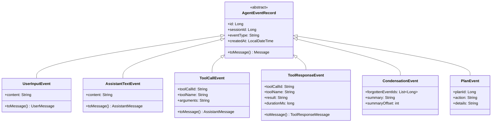
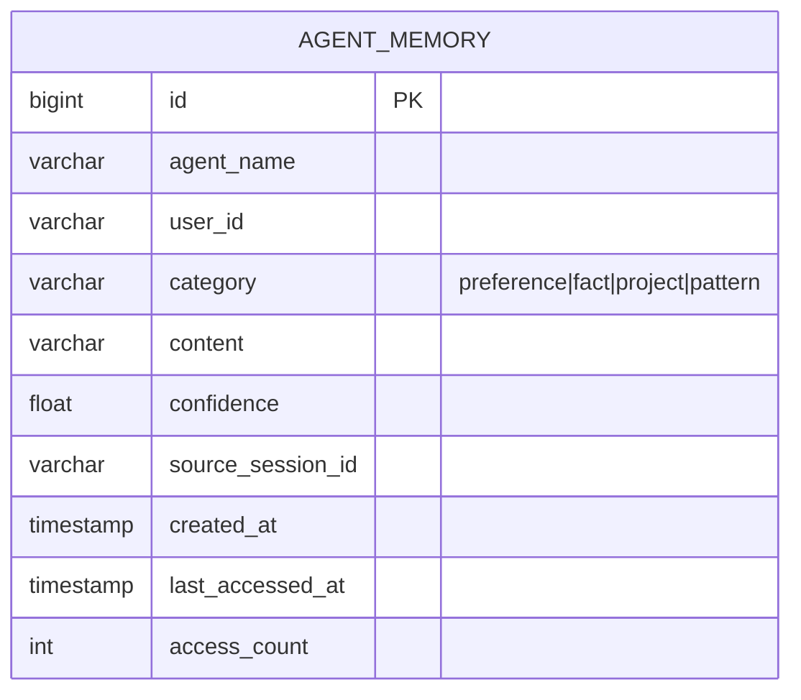
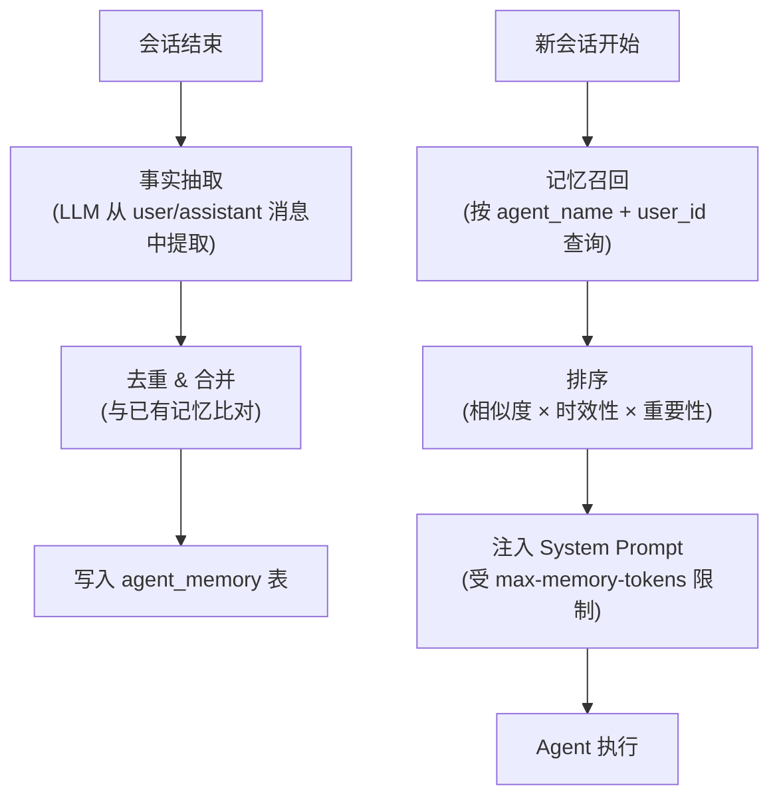
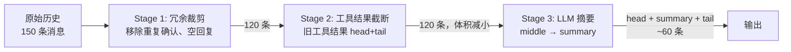
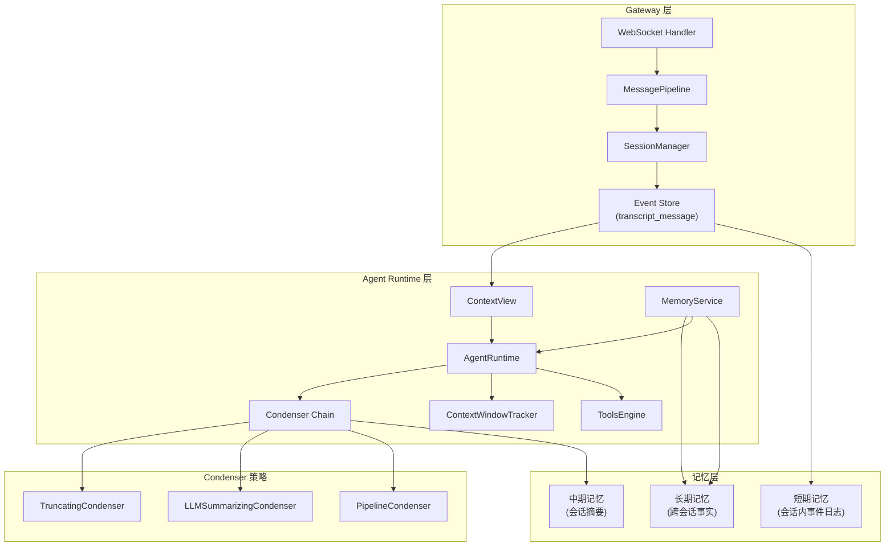
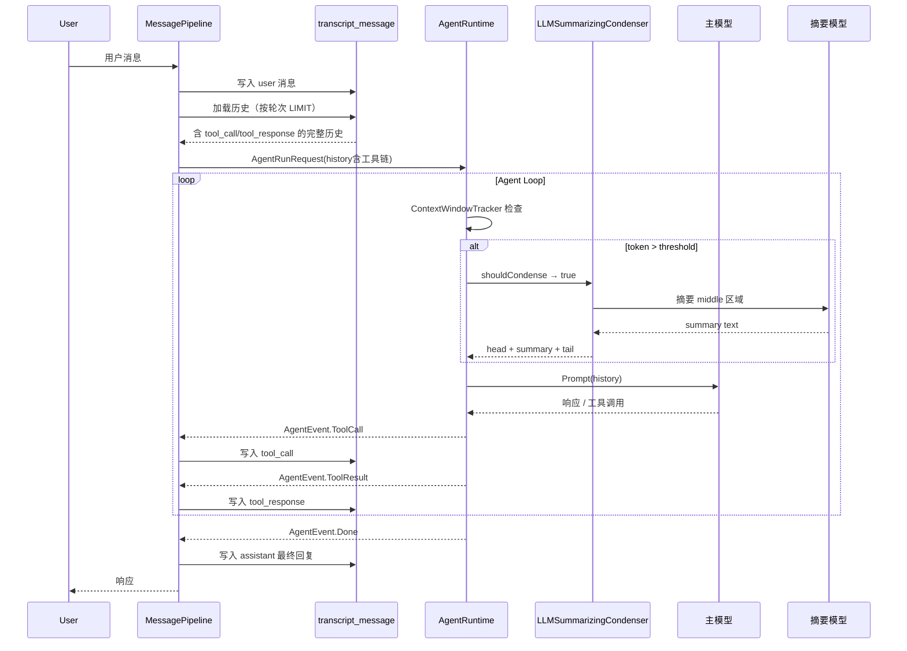
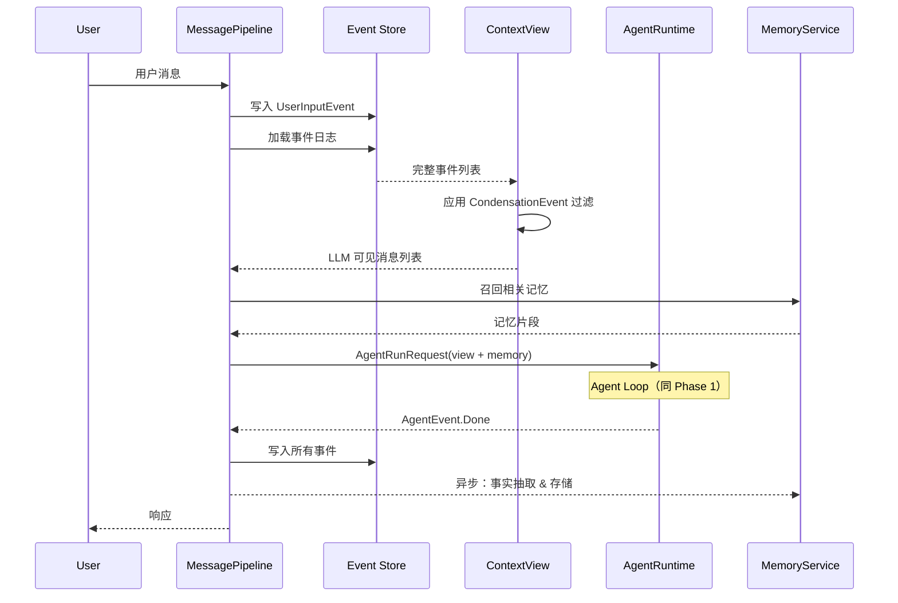

# IntelliMate 上下文管理优化设计方案

> 版本：v1.0 | 日期：2026-04
>
> 基于《AI Agent 上下文管理主流方案调研报告》的调研结论，结合 IntelliMate 现有架构设计

---

## 一、现状分析

### 1.1 当前架构概览



### 1.2 核心问题

| 问题 | 影响 | 严重程度 |
|------|------|---------|
| **ContextCondenser 仅做 substring 截断** | 丢失工具返回的关键信息（如文件内容、命令输出的核心结果），模型后续可能重复调用相同工具 | 高 |
| **工具调用链不持久化** | `transcript_message` 仅写入 user/assistant 文本，tool_call/tool_response 丢失。跨 turn 重启后 LLM 无法知道之前执行过哪些工具操作 | 高 |
| **压缩阈值硬编码** | `shouldCondense` 中的 70% 阈值硬编码在 `ContextCondenser.java`，无法按模型或场景调整 | 中 |
| **缺乏跨会话记忆** | 每次会话从零开始，用户偏好、项目上下文无法累积 | 中 |
| **上下文为扁平列表** | 无法区分事件类型、无法选择性压缩/保留、无法做精细化回溯 | 中 |
| **压缩仅针对 ToolResponseMessage** | UserMessage / AssistantMessage 中的冗余内容（如重复的解释、确认性回复）无法被压缩 | 低 |

### 1.3 当前数据流与代码映射

| 阶段 | 代码位置 | 行为 |
|------|---------|------|
| 历史加载 | `MessagePipeline.loadHistory()` | `SELECT ... ORDER BY created_at DESC LIMIT :limit` |
| 消息转换 | `SessionManagerImpl.convertToAiMessages()` | role → UserMessage/AssistantMessage/ToolResponseMessage |
| 历史注入 | `AgentRuntime.executeAgentLoop()` L150-155 | SystemMessage + history + UserMessage |
| Token 追踪 | `ContextWindowTracker` | API usage 优先，fallback chars/3.5 |
| 压缩触发 | `ContextCondenser.shouldCondense()` | `isNearLimit(0.70) && turnGap >= minTurnsBetween` |
| 压缩执行 | `ContextCondenser.condense()` | 旧 ToolResponseMessage → `substring(0, 200) + "... [condensed]"` |
| 工具截断 | `AgentRuntime.truncateToolResult()` | 超 16000 chars → head 8000 + tail 8000 |
| 系统 prompt 截断 | `AgentRuntime.buildSystemPrompt()` | 总长 > 150000 chars → 硬截断 |

---

## 二、优化目标

### 2.1 设计原则

1. **渐进式改造**：分阶段实施，每个阶段独立可用，不破坏现有功能
2. **向后兼容**：新配置均有合理默认值，升级后零配置可运行
3. **可观测性**：压缩行为可追踪、可审计
4. **开放扩展**：Condenser 策略可插拔，未来支持更多压缩模式

### 2.2 量化目标

| 指标 | 当前 | Phase 1 目标 | Phase 2 目标 |
|------|------|-------------|-------------|
| 长对话（50+ turn）信息保留率 | ~5%（200/16000 字符） | ~60%（LLM 摘要保留核心信息） | ~80%（分层记忆 + 检索） |
| 跨 turn 工具链可回溯 | 不可回溯 | 完全可回溯 | 完全可回溯 + 跨会话 |
| 配置灵活性 | 部分硬编码 | 全量可配置 | 全量可配置 + 动态调整 |
| 压缩延迟（P99） | ~0ms（纯截断） | < 3s（LLM 摘要） | < 3s |

---

## 三、分阶段设计

### Phase 1：基础增强（低风险、高收益）

#### 3.1 LLM 摘要式 Condenser

**核心思路**：参考 OpenHands 的 head + summary + tail 模式，用独立 LLM 调用对 middle 区域生成语义摘要，替代 substring 截断。

##### 3.1.1 架构设计



##### 3.1.2 LLMSummarizingCondenser 详细设计

**消息分区策略**：

```
[SystemMessage] [Head: keepFirst 条] [Middle: 待摘要区域] [Tail: keepRecent 条] [当前 UserMessage]
     ↓                  ↓                    ↓                    ↓                    ↓
   不变               不变          LLM 摘要 → 1条 UserMessage      不变               不变
```

**摘要 Prompt 模板**（`condenser-summary-prompt.md`）：

```markdown
你是一个专业的上下文压缩助手。请将以下对话历史压缩为一段简洁的摘要，保留：
1. 用户的核心目标和当前任务状态
2. 已完成的关键操作及其结果（特别是工具调用的关键输出）
3. 尚未完成的任务和下一步计划
4. 重要的约束条件和发现

要求：
- 使用第三人称描述
- 保留文件路径、命令、错误信息等关键细节
- 不超过 {maxSummaryTokens} tokens
- 输出格式为纯文本，不使用 markdown

对话历史：
{messages}
```

**关键实现逻辑**：

```java
public class LLMSummarizingCondenser implements ContextCondenser {

    private final ChatModel condenserModel;
    private final int keepFirst;
    private final int keepRecent;
    private final int minTurnsBetween;
    private final double condenserThreshold;
    private final String summaryPromptTemplate;
    private int lastCondensedAtTurn = -100;

    @Override
    public boolean shouldCondense(int currentTurn, ContextWindowTracker tracker) {
        if (!tracker.isNearLimit(condenserThreshold)) {
            return false;
        }
        return currentTurn - lastCondensedAtTurn >= minTurnsBetween;
    }

    @Override
    public List<Message> condense(List<Message> history, int currentTurn) {
        this.lastCondensedAtTurn = currentTurn;

        // 分区：head / middle / tail
        int headEnd = Math.min(keepFirst, history.size());
        int tailStart = Math.max(headEnd, history.size() - keepRecent);

        List<Message> head = history.subList(0, headEnd);
        List<Message> middle = history.subList(headEnd, tailStart);
        List<Message> tail = history.subList(tailStart, history.size());

        if (middle.isEmpty()) {
            return new ArrayList<>(history);
        }

        // 生成摘要
        String middleText = formatMessagesForSummary(middle);
        String summaryPrompt = summaryPromptTemplate
                .replace("{messages}", middleText)
                .replace("{maxSummaryTokens}", "1024");

        String summary = condenserModel.call(summaryPrompt);

        // 组装结果：head + summary(作为 UserMessage) + tail
        List<Message> result = new ArrayList<>();
        result.addAll(head);
        result.add(new UserMessage(
                "[Context Summary]\n" + summary));
        result.addAll(tail);
        return result;
    }
}
```

**摘要模型选择策略**：
- 使用 `intellimate.agent.condenser-model` 配置项指定摘要专用模型
- 推荐使用较快、较便宜的模型（如 `qwen-turbo`、`gpt-4o-mini`）
- 若未配置，fallback 到当前 Agent 使用的主模型

##### 3.1.3 回退策略

当 LLM 摘要调用失败时（超时、API 错误等），自动 fallback 到 `TruncatingCondenser`（即当前的 substring 截断行为），并记录 WARN 日志。

```java
@Override
public List<Message> condense(List<Message> history, int currentTurn) {
    try {
        return doLLMCondense(history, currentTurn);
    } catch (Exception e) {
        log.warn("LLM summarization failed, falling back to truncation: {}", e.getMessage());
        return fallbackCondenser.condense(history, currentTurn);
    }
}
```

#### 3.2 工具调用链持久化

**核心改造**：在 `MessagePipeline` 中，将 Agent 运行期间的 tool_call 和 tool_response 事件写入 `transcript_message` 表。

##### 3.2.1 数据库 Schema 变更

当前 `transcript_message` 表已有 `tool_call_id` 和 `tool_name` 字段，但未被写入。新增字段：

```sql
-- Flyway migration: V{next}__add_tool_chain_fields.sql
ALTER TABLE transcript_message
    ADD COLUMN tool_call_arguments TEXT AFTER tool_name,
    ADD COLUMN message_type VARCHAR(32) DEFAULT 'chat' AFTER tool_call_arguments;

-- message_type 取值：'chat' (user/assistant文本), 'tool_call', 'tool_response'
-- 为工具链查询添加索引
CREATE INDEX idx_transcript_session_type ON transcript_message(session_id, message_type, created_at);
```

##### 3.2.2 写入时机

在 `MessagePipeline.mapAgentEvent()` 中，对 `AgentEvent.ToolCall` 和 `AgentEvent.ToolResult` 事件进行持久化：

```
Agent Runtime                    MessagePipeline
    │                                 │
    ├─ AgentEvent.ToolCall ──────────>├─ 写入 transcript (role=assistant, message_type=tool_call)
    │                                 │
    ├─ AgentEvent.ToolResult ────────>├─ 写入 transcript (role=tool, message_type=tool_response)
    │                                 │
    ├─ AgentEvent.Done ──────────────>├─ 写入 transcript (role=assistant, message_type=chat)
```

##### 3.2.3 历史加载适配

`SessionManagerImpl.convertToAiMessages()` 已有 `tool` role 的分支处理逻辑，但因无数据从未生效。持久化后该逻辑自然启用。需确保：

- 加载时 `tool_call` 类型的 assistant 消息正确携带 `tool_calls` metadata
- `ToolResponseMessage` 正确匹配对应的 `tool_call_id`
- `historyLimit` 的语义从"消息条数"变为"交互轮次数"——避免大量工具调用快速消耗条数配额

##### 3.2.4 historyLimit 语义调整

```sql
-- 原查询：简单 LIMIT
SELECT * FROM transcript_message
WHERE session_id = :sid ORDER BY created_at DESC LIMIT :limit

-- 新查询：按轮次计数，一个 user+assistant+tools 算一轮
-- 先找到最近 N 个 user 消息的时间戳，再取该时间戳之后的所有消息
SELECT * FROM transcript_message
WHERE session_id = :sid
  AND created_at >= (
    SELECT MIN(created_at) FROM (
      SELECT created_at FROM transcript_message
      WHERE session_id = :sid AND role = 'user'
      ORDER BY created_at DESC LIMIT :limit
    ) t
  )
ORDER BY created_at ASC
```

#### 3.3 配置项全量化

##### 3.3.1 新增配置项

```yaml
intellimate:
  agent:
    # 现有配置（保持不变）
    max-context-tokens: 128000
    condenser-keep-recent: 20
    condenser-min-turns-between: 5

    # 新增配置
    condenser-type: llm-summarizing       # truncating | llm-summarizing | pipeline
    condenser-threshold: 0.70             # 触发压缩的 token 使用率阈值（原硬编码 0.70）
    condenser-model: qwen-turbo           # 摘要专用模型（为空则使用主模型）
    condenser-keep-first: 4               # LLM 摘要模式：保留开头 N 条消息
    condenser-max-summary-tokens: 1024    # 摘要最大 token 数
    condenser-summary-length: 200         # 截断模式：截取长度（保持兼容）
```

##### 3.3.2 IntelliMateProperties.Agent 变更

在 `IntelliMateProperties.Agent` 中新增字段：

```java
private String condenserType = "truncating";      // 默认保持现有行为
private double condenserThreshold = 0.70;
private String condenserModel;                     // null → 使用主模型
private int condenserKeepFirst = 4;
private int condenserMaxSummaryTokens = 1024;
```

##### 3.3.3 Condenser 工厂

```java
@Component
public class CondenserFactory {

    private final ChatModelRegistry chatModelRegistry;

    public ContextCondenser create(IntelliMateProperties.Agent config) {
        return switch (config.getCondenserType()) {
            case "truncating" -> new TruncatingCondenser(
                    config.getCondenserKeepRecent(),
                    config.getCondenserSummaryLength(),
                    config.getCondenserMinTurnsBetween(),
                    config.getCondenserThreshold());
            case "llm-summarizing" -> new LLMSummarizingCondenser(
                    resolveCondenserModel(config),
                    config.getCondenserKeepFirst(),
                    config.getCondenserKeepRecent(),
                    config.getCondenserMinTurnsBetween(),
                    config.getCondenserThreshold(),
                    config.getCondenserMaxSummaryTokens());
            case "pipeline" -> new PipelineCondenser(List.of(
                    new TruncatingCondenser(...),
                    new LLMSummarizingCondenser(...)
                ));
            default -> throw new IllegalArgumentException(
                    "Unknown condenser type: " + config.getCondenserType());
        };
    }
}
```

---

### Phase 2：智能记忆

#### 3.4 事件日志系统

**核心思路**：参考 OpenHands 的 Event Store + View 投影模式，将 `transcript_message` 演进为结构化事件日志。

##### 3.4.1 事件类型体系



##### 3.4.2 View 投影

```java
public class ContextView {

    /**
     * 从事件日志构建 LLM 可见的消息列表。
     * 排除被 CondensationEvent 标记为 forgotten 的事件，
     * 在 summaryOffset 位置插入摘要。
     */
    public static List<Message> fromEvents(List<AgentEventRecord> events) {
        Set<Long> forgottenIds = new HashSet<>();
        Map<Integer, String> summaries = new LinkedHashMap<>();

        // 收集压缩记录
        for (AgentEventRecord event : events) {
            if (event instanceof CondensationEvent ce) {
                forgottenIds.addAll(ce.getForgottenEventIds());
                summaries.put(ce.getSummaryOffset(), ce.getSummary());
            }
        }

        // 构建 View
        List<Message> view = new ArrayList<>();
        int idx = 0;
        for (AgentEventRecord event : events) {
            if (summaries.containsKey(idx)) {
                view.add(new UserMessage("[Context Summary]\n" + summaries.get(idx)));
            }
            if (!forgottenIds.contains(event.getId())
                    && !(event instanceof CondensationEvent)) {
                view.add(event.toMessage());
            }
            idx++;
        }
        return view;
    }
}
```

**优势**：
- 底层事件日志完整保留，支持调试和审计
- 压缩是 **可逆** 的——删除 CondensationEvent 即可恢复完整视图
- 支持多种压缩策略叠加（多次压缩产生多条 CondensationEvent）

#### 3.5 跨会话长期记忆

**核心思路**：参考 DeerFlow 的 MemoryMiddleware + CrewAI 的 Unified Memory。

##### 3.5.1 记忆模型



##### 3.5.2 记忆生命周期



##### 3.5.3 关键设计决策

| 决策点 | 选择 | 理由 |
|--------|------|------|
| 抽取时机 | 会话结束时异步抽取 | 不影响实时响应延迟 |
| 存储粒度 | 原子事实（一条记忆 = 一个事实） | 便于去重、检索、过期 |
| 注入方式 | System Prompt 尾部追加 | 不干扰已有 prompt 结构 |
| 排序算法 | `score = similarity × recency_decay × importance` | 综合考虑相关性和时效性 |
| 去抖动 | 30s 内多次写入合并 | 避免频繁 DB 写入 |

##### 3.5.4 配置项

```yaml
intellimate:
  agent:
    memory-enabled: false                   # 默认关闭
    memory-max-facts: 100                   # 单用户最大记忆条数
    memory-max-injection-tokens: 2048       # 注入 System Prompt 的最大 token 数
    memory-extraction-model: qwen-turbo     # 事实抽取模型
    memory-categories:                      # 记忆分类
      - preference
      - fact
      - project
      - pattern
```

#### 3.6 动态上下文发现

**核心思路**：参考 Cursor 的"按需拉取而非预加载一切"理念。

##### 3.6.1 改造方向

| 场景 | 当前行为 | 优化后行为 |
|------|---------|-----------|
| Skills | 所有 skill 完整内容加载到 System Prompt | 仅加载 skill 名称和描述，Agent 通过工具按需读取完整内容 |
| MCP 工具描述 | 全量加载 | 仅名称列表 + `read_tool_description` 工具 |
| Agent 上下文文件 | SOUL/USER/AGENTS 全量加载 | 提供分段检索能力，按需注入 |

##### 3.6.2 预期收益

基于 Cursor 的公开数据，MCP 工具描述的动态发现可减少约 **47%** 的 Agent 总 token 消耗。对于 IntelliMate 中配置了大量 skills 和 MCP 工具的场景，预计可减少 System Prompt 体积 **30-50%**。

---

### Phase 3：高级优化

#### 3.7 Pipeline 多阶段 Condenser

**核心思路**：参考 OpenHands 的 `PipelineCondenser`，支持多种压缩策略链式组合。



适用场景：
- 超长对话（100+ turn）——单一策略可能不够
- 需要精细控制不同消息类型的压缩优先级

#### 3.8 大工具输出文件化

**核心思路**：参考 Cursor 的"文件作为接口"设计。

对超过阈值（如 32KB）的工具输出：
1. 写入临时文件（基于 session 目录）
2. 上下文中仅保留摘要 + 文件路径引用
3. Agent 可通过 `FileReadTool` 按需读取完整内容

```
工具执行结果（50KB）
    ↓ 超过 file-threshold
写入 /tmp/intellimate/{sessionId}/tool-output-{id}.txt
    ↓
上下文中注入：
"[Tool output saved to file: tool-output-{id}.txt, 50KB]
Preview: {前 500 字符}
Use file_read tool to access full content."
```

#### 3.9 KV Cache 友好的上下文组织

**核心思路**：保持消息前缀稳定，最大化 KV Cache 命中率。

设计原则：
1. **System Prompt 稳定**：将频繁变化的内容（如 plan context）放到 System Prompt 末尾而非中间
2. **Head 固定**：`keepFirst` 保证的消息始终在同一位置
3. **摘要插入点固定**：摘要始终紧跟 head 之后
4. **Tail 自然增长**：新消息追加在末尾

```
[SystemPrompt - 稳定前缀] [Head - 固定] [Summary - 固定位置] [Tail - 自然增长...] [新消息]
       ← KV Cache 可复用区域 →                              ← 每轮新增 →
```

---

## 四、整体架构演进

### 4.1 目标架构



### 4.2 数据流变更（Phase 1 → Phase 2）

#### Phase 1 数据流



#### Phase 2 数据流（新增事件日志 + 记忆）



---

## 五、实施计划

### 5.1 Phase 1 时间线（预估 2-3 周）

| 周 | 任务 | 交付物 |
|----|------|-------|
| W1 | ContextCondenser 接口化 + TruncatingCondenser 重构 | 接口定义、现有行为不变的重构 |
| W1 | IntelliMateProperties 新增配置项 + CondenserFactory | 配置项、工厂类 |
| W1 | LLMSummarizingCondenser 实现 + 摘要 prompt | 核心压缩器 |
| W2 | 工具调用链持久化：DB migration + 写入逻辑 | Flyway 脚本、Pipeline 改造 |
| W2 | 历史加载适配：按轮次查询 + ToolMessage 转换 | Repository 改造 |
| W3 | 集成测试 + 回归测试 | 测试用例 |
| W3 | 配置文档 + 运维指南 | 文档 |

### 5.2 Phase 2 时间线（预估 3-4 周）

| 周 | 任务 | 交付物 |
|----|------|-------|
| W1 | 事件类型体系设计 + DB schema 演进 | 事件类、Flyway 脚本 |
| W2 | ContextView 投影 + CondensationEvent 写入 | View 构建器 |
| W2 | MemoryService + agent_memory 表 + 事实抽取 | 记忆服务 |
| W3 | 记忆召回 + System Prompt 注入 | 记忆注入逻辑 |
| W3-W4 | 集成测试 + 性能测试 | 测试 |

### 5.3 Phase 3 时间线（预估 2 周）

| 周 | 任务 | 交付物 |
|----|------|-------|
| W1 | PipelineCondenser + 大输出文件化 | Pipeline 压缩器、文件化逻辑 |
| W2 | KV Cache 优化 + 性能基准测试 | 上下文重组、基准数据 |

---

## 六、风险与缓解

| 风险 | 影响 | 缓解措施 |
|------|------|---------|
| LLM 摘要调用增加延迟 | 每次压缩增加 1-3s | 使用快速模型（qwen-turbo）；设置超时；失败自动 fallback 截断 |
| LLM 摘要丢失关键信息 | Agent 后续决策错误 | 摘要 prompt 强调保留关键细节；保留 head/tail 原文；支持 PipelineCondenser 多阶段兜底 |
| 工具链持久化增加 DB 写入 | 写入量增加 3-5x | R2DBC 异步写入；批量 insert；可配置开关 |
| 事件日志体积增长 | 存储成本上升 | 定期清理策略（如保留最近 30 天）；大输出文件化减少 DB 存储 |
| 跨会话记忆注入不当 | 过时/错误的记忆干扰当前任务 | confidence 评分 + 时效衰减；用户可手动清理记忆 |

---

## 七、与现有文档的关系

| 文档 | 关系 |
|------|------|
| [上下文压缩行为全景清单](../上下文压缩行为全景清单.md) | 本方案的现状基线，Phase 1 完成后需同步更新 |
| [Skills 设计方案](../skills/Skills_设计方案.md) | Phase 2 动态上下文发现涉及 Skills 加载方式改造 |
| [Plan Mode 设计](../plan/intellimate-plan-mode-design.md) | Plan 执行历史的隔离加载逻辑需适配事件日志系统 |

---

## 八、总结

本设计方案将 IntelliMate 的上下文管理从当前的**单一截断模式**逐步演进为**多策略、可插拔、分层记忆**的架构：

- **Phase 1** 解决最紧迫的两个问题——LLM 摘要替代盲截断、工具链持久化——预计信息保留率从 ~5% 提升到 ~60%
- **Phase 2** 构建事件日志和长期记忆基础设施，支撑更智能的上下文管理
- **Phase 3** 在稳定的基础上做性能优化和高级特性

每个阶段独立可交付，向后兼容，可根据实际需求灵活调整优先级和范围。
