# JavaClaw 人脑记忆架构设计方案

> 版本：v1.0 | 日期：2026-04
>
> 用人脑记忆系统的生物学模型重新设计 JavaClaw 的上下文管理架构

---

## 一、引言与设计动机

### 1.1 背景

JavaClaw 当前的上下文管理机制由 **12+ 个独立的截断/压缩机制** 组成，分散在 Gateway、Agent Runtime、工具层和 Prompt 层。这些机制各自独立运作、互不感知、阈值硬编码，导致：

- **认知复杂度高**：开发者需要理解 12+ 个配置参数的含义和交互效果
- **行为不可预测**：多层截断叠加可能导致关键信息在某一层被意外丢弃
- **优化困难**：改善一层的压缩效果可能被另一层的盲截断抵消

现有的优化方案（Phase 1/2/3）虽然全面，但本质上是在碎片化机制之上**继续叠加新机制**（LLMSummarizingCondenser、PipelineCondenser、EventStore、ContextView、MemoryService 等），增加了而非减少了系统复杂度。

### 1.2 设计理念

人脑每天处理约 **1100 万比特** 的感官输入，却仅有约 **50 比特/秒** 的意识处理带宽。大脑通过一套优雅的分层记忆系统（3 个存储层级 + 2 个核心过程），在极端的带宽不对称下高效运作了数十万年。

本方案提议：**用人脑记忆系统的架构模型作为 JavaClaw 上下文管理的统一设计框架**，以 3 层记忆结构 + 2 个核心过程替代现有 12+ 个碎片化机制，从根本上简化和统一架构。

---

## 二、生物学基础：人脑记忆系统

本章提供详细的神经科学背景，作为后续技术设计的生物学依据。每个概念都附有原始研究引用和与 JavaClaw 的类比预告。

### 2.1 记忆的多存储模型（Atkinson & Shiffrin, 1968）

1968 年，Richard Atkinson 和 Richard Shiffrin 提出了认知心理学中最具影响力的记忆模型之一——**多存储模型（Multi-Store Model）**，也称模态模型（Modal Model）。该模型将人类记忆描述为由三个结构性组件构成的信息处理系统：

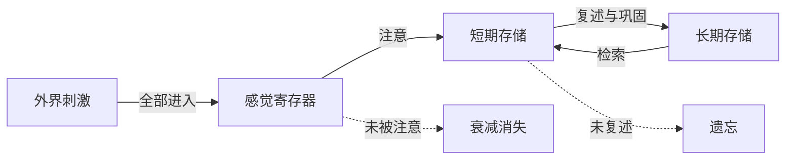

**各级存储的关键参数**：
- **感觉寄存器** — 容量: 极大, 持续: 不到 1 秒
- **短期存储** — 容量: 7 加减 2 项, 持续: 约 30 秒
- **长期存储** — 容量: 无限, 持续: 永久

**三级组件的核心特征**：

| 特征 | 感觉寄存器 | 短期存储 | 长期存储 |
|------|-----------|---------|---------|
| **容量** | 极大（几乎无限） | 有限（7±2 项） | 无限 |
| **持续时间** | <1 秒（视觉 ~250ms） | ~15-30 秒 | 数分钟到终身 |
| **编码方式** | 感觉特异（视觉/听觉原始格式） | 主要为语音/语义 | 语义为主 |
| **信息丢失** | 快速衰减 | 干扰和衰减 | 检索失败（非真正丢失） |
| **转入机制** | → 注意力选择 | → 复述与巩固 | → 线索检索 |

**模型的关键洞见**：

1. **结构与控制过程分离**：三级存储是固定的结构性特征；注意、复述、编码策略等是可调的控制过程
2. **信息流的方向性**：感觉 → 短期 → 长期（编码方向）；长期 → 短期（检索方向）
3. **选择性注意的瓶颈**：大量感觉输入中，只有被"注意"选中的信息才能进入短期存储

> **参考文献**：Atkinson, R. C., & Shiffrin, R. M. (1968). Human memory: A proposed system and its control processes. In K. W. Spence & J. T. Spence (Eds.), *Psychology of Learning and Motivation*, Vol. 2, pp. 89-195. Academic Press.

> **JavaClaw 类比预告**：这三级结构将分别映射为工具输出直接入库（感觉寄存器）、WorkingMemory（短期/工作记忆）、LongTermMemory（长期记忆）。

---

### 2.2 感觉记忆：信息的第一道闸门

感觉记忆是外界刺激进入认知系统的**第一个缓冲区**。它的容量极大，但持续时间极短，功能是在信息被进一步处理之前提供一个短暂的"快照"。

#### 2.2.1 Sperling 的经典实验（1960）

George Sperling 通过一系列精巧的实验首次系统地研究了视觉感觉记忆（图像记忆）：

**实验设计**：
- 向被试展示一个 3×4 的字母矩阵，曝光时间仅约 **50 毫秒**
- **全部报告条件**：要求报告所有字母 → 平均只能回忆 **~4.5 个**（共 12 个）
- **部分报告条件**：曝光后用声音线索指定某一行 → 该行几乎 **全部正确**

**关键发现**：
- 部分报告的高准确率证明：曝光瞬间，**至少 9 个以上** 的字母都被感觉系统"看到"了
- 但这些信息衰减极快——当线索延迟超过 **~300ms** 时，部分报告的优势消失
- 结论：感觉记忆的容量远大于意识所能处理的，但持续时间极短

#### 2.2.2 两种主要的感觉记忆

| 类型 | 模态 | 持续时间 | 容量 | 发现者 |
|------|------|---------|------|--------|
| **图像记忆（Iconic Memory）** | 视觉 | ~250-500ms | ≥9 项 | Sperling, 1960 |
| **回声记忆（Echoic Memory）** | 听觉 | ~3-4 秒 | 较小 | Neisser, 1967 |

图像记忆持续极短（约 1/4 秒），但容量大；回声记忆持续更长（3-4 秒），这解释了为什么我们能"回放"刚才没注意听到的一句话。

#### 2.2.3 感觉记忆的生物学机制

- 视觉感觉记忆主要涉及**初级视觉皮层（V1）** 和**视觉联合皮层**的短暂神经活动
- 信息以**拓扑映射（topographic mapping）** 的方式保持——视网膜上的空间关系在皮层上被保留
- 衰减的本质是神经元放电模式的快速消散（离子通道关闭、突触前递质耗竭）

> **参考文献**：
> - Sperling, G. (1960). The information available in brief visual presentations. *Psychological Monographs: General and Applied*, 74(11), 1-29.
> - Neisser, U. (1967). *Cognitive Psychology*. New York: Appleton-Century-Crofts.

> **JavaClaw 类比预告**：工具的原始输出就像感觉刺激——信息量巨大（一个 `exec` 命令可能返回数万字符），完整进入工作记忆。当工作记忆接近容量上限时，记忆巩固机制会智能压缩旧内容，类似大脑的注意力选择——不是在输入端丢弃信息，而是在处理过程中决定哪些需要详细保留、哪些可以摘要化。

---

### 2.3 工作记忆：意识的工作台

工作记忆（Working Memory）是认知科学中最核心的概念之一，它不仅是信息的临时存储，更是**主动处理和操作信息**的场所——相当于大脑的"工作台"或"RAM"。

#### 2.3.1 Miller 的"神奇数字 7±2"（1956）

George Miller 在 1956 年发表了认知心理学史上被引用最多的论文之一：

**核心发现**：
- 人类的即时记忆广度（memory span）约为 **7±2 个项目**
- 这一限制跨越了不同类型的刺激：二进制数字（1 bit/个）、十进制数字（3.32 bits/个）、字母、单词——无论信息密度如何，能同时保持的**项目数**大致相同

**分块理论（Chunking）——Miller 的核心贡献**：
- 记忆容量不是以**比特**为单位，而是以**块（chunk）** 为单位
- 一个 chunk 是"个体能识别的最大有意义单元"
- 例如："IBM" 对懂英语的人是 1 个 chunk（一个缩写），对不懂英语的人是 3 个 chunk（三个字母）
- **通过分块，可以在不增加"槽位"数量的前提下大幅增加信息总量**

```
不分块：F - B - I - C - I - A - I - B - M → 9 个 chunks（超出容量）
分  块：FBI - CIA - IBM             → 3 个 chunks（轻松记住）
```

> **参考文献**：Miller, G. A. (1956). The magical number seven, plus or minus two: Some limits on our capacity for processing information. *Psychological Review*, 63(2), 81-97.

#### 2.3.2 Baddeley 的多组件工作记忆模型（1974, 2000）

Alan Baddeley 和 Graham Hitch 在 1974 年提出了更精细的工作记忆模型，将"短期记忆"从被动存储升级为**多组件的主动处理系统**：

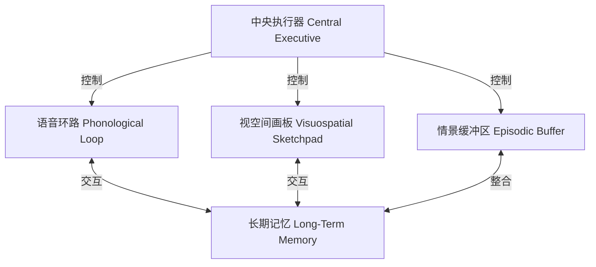

**各组件功能说明**：
- **中央执行器**: 注意力控制、任务切换、信息协调、抑制干扰
- **语音环路**: 语言与声学信息存储、内部语音复述
- **视空间画板**: 视觉与空间信息处理、心理图像操作
- **情景缓冲区** (2000 年补充): 多源信息整合、意识体验接口

**四个组件的功能**：

| 组件 | 功能 | 容量 | 类比 |
|------|------|------|------|
| **中央执行器** | 注意力分配、任务切换、信息流控制、抑制无关信息 | 容量有限但灵活 | AgentRuntime 的决策循环 |
| **语音环路** | 存储和复述语言信息（内部独白） | ~2 秒的语音信息 | 当前对话文本的缓冲 |
| **视空间画板** | 操作视觉和空间信息（心理旋转、导航） | ~3-4 个视觉对象 | 代码结构、文件树的心理模型 |
| **情景缓冲区** | 整合来自各子系统和长期记忆的信息为统一的情景表征 | ~4 个多维块 | 将工具输出、历史和记忆融合为连贯上下文 |

**实验证据——双重任务范式**：
- 同时执行两个**不同模态**的任务（如记忆数字 + 追踪移动点）时，效率几乎不受影响
- 同时执行两个**相同模态**的任务（如记忆数字 + 记忆字母）时，出现显著干扰
- 证明了语音环路和视空间画板是**独立的子系统**

> **参考文献**：
> - Baddeley, A. D., & Hitch, G. (1974). Working memory. In G. H. Bower (Ed.), *Psychology of Learning and Motivation*, Vol. 8, pp. 47-89. Academic Press.
> - Baddeley, A. D. (2000). The episodic buffer: a new component of working memory? *Trends in Cognitive Sciences*, 4(11), 417-423.

#### 2.3.3 Cowan 的嵌入式过程模型（1999）——修正容量估计

Nelson Cowan 对工作记忆容量提出了更严格的估计：

**核心观点**：
- Miller 的 7±2 可能高估了"纯粹"的工作记忆容量
- 在控制了分块和复述策略后，真实的**注意力焦点容量**约为 **3-4 个块**
- 工作记忆 = **被激活的长期记忆**（无明确容量限制）+ **注意力焦点**（3-4 块限制）

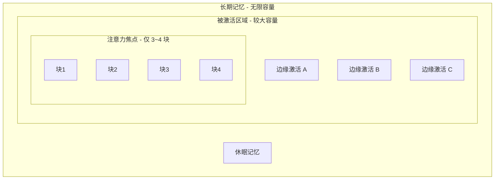

**关键洞见**：
- "记住 7 个数字"可能是因为我们**快速在更多的激活项之间切换注意力**，而非同时持有 7 个
- 注意力焦点的 3-4 块才是**真正的处理瓶颈**
- 被激活但不在焦点中的信息仍可被快速调入——类似"页面缓存"

> **参考文献**：Cowan, N. (1999). An embedded-processes model of working memory. In A. Miyake & P. Shah (Eds.), *Models of Working Memory: Mechanisms of Active Maintenance and Executive Control*, pp. 62-101. Cambridge University Press.

> **JavaClaw 类比预告**：WorkingMemory 的 tokenBudget 对应工作记忆容量；MemoryChunk 的 chunking 策略直接借鉴 Miller 的分块理论（一组 tool_call + tool_response = 1 个 chunk）；注意力权重（relevance scoring）对应 Cowan 的注意力焦点选择机制。

---

### 2.4 长期记忆分类学

长期记忆并非单一系统，而是由多个功能独立、依赖不同脑区的子系统构成。两个最重要的分类体系是 Tulving (1972) 和 Squire (1992) 的工作。

#### 2.4.1 Tulving 的情景记忆与语义记忆（1972）

Endel Tulving 在 1972 年首次提出了长期记忆内部的核心二分法：

**情景记忆（Episodic Memory）**：
- 关于**个人经历的事件**，带有时间和空间标记
- "我记得上周三在会议室里讨论了那个 bug"
- 以**自传式参照（autonoetic consciousness）** 为特征——你能"重新体验"那个场景
- 主要依赖**海马体（hippocampus）** 和**内侧颞叶（medial temporal lobe）**
- 容易受到遗忘和干扰

**语义记忆（Semantic Memory）**：
- 关于**世界的一般性知识和事实**，与个人经历脱钩
- "Java 是一种面向对象编程语言"、"巴黎是法国的首都"
- 以**知晓意识（noetic consciousness）** 为特征——你"知道"但不一定记得在哪里学到的
- 更依赖**新皮层（neocortex）** 的分布式网络
- 一旦巩固，相对稳定持久

**两种记忆的对比**：

| 维度 | 情景记忆 | 语义记忆 |
|------|---------|---------|
| **内容** | 个人事件（什么、何时、何地） | 一般事实和概念 |
| **时间标记** | 有（"上周三"） | 无（脱离了原始学习情境） |
| **意识体验** | 自传式（"重新体验"） | 知晓式（"知道"） |
| **编码** | 自动、情境绑定 | 需要深度加工 |
| **脆弱性** | 容易遗忘和扭曲 | 相对稳定 |
| **脑区** | 海马体为核心 | 新皮层分布式存储 |
| **示例** | "昨天debug了auth模块3小时" | "Spring Boot 默认端口是 8080" |

> **参考文献**：Tulving, E. (1972). Episodic and semantic memory. In E. Tulving & W. Donaldson (Eds.), *Organization of Memory*, pp. 381-403. New York: Academic Press.

#### 2.4.2 Squire 的长期记忆分类体系（1992）

Larry Squire 在 1992 年基于大量失忆症患者的研究，提出了更完整的长期记忆分类体系：

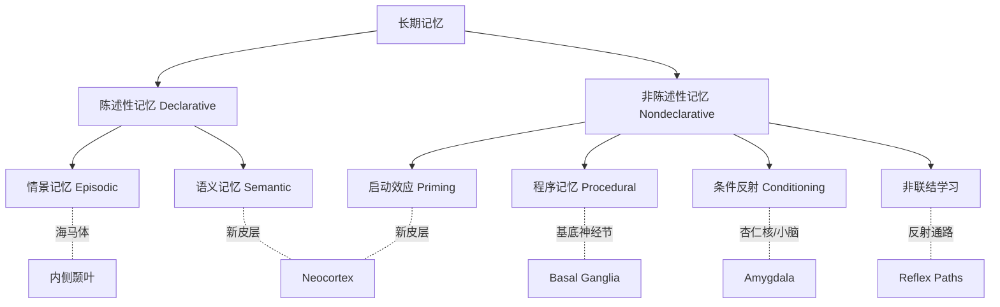

**分类说明**：
- **陈述性记忆**（外显记忆）: 可意识到、可用语言描述的记忆
- **非陈述性记忆**（内隐记忆）: 通过行为表现体现、无需意识参与

**核心证据——双分离（Double Dissociation）**：
- **失忆症患者（海马体损伤）**：无法形成新的陈述性记忆（不记得 5 分钟前发生的事），但能正常学习新技能（如镜像绘画任务表现逐渐提高）
- 证明陈述性记忆和程序记忆由**不同脑区系统**支持

**程序记忆的特征**：
- **通过反复练习获得**：骑自行车、打字、编程模式
- **难以言述**：你知道怎么骑自行车，但很难用语言解释每个动作的细节
- **执行时不需要意识参与**：自动化，甚至有意识干预反而会降低表现
- **相对持久**：即使多年不骑自行车，重新上车很快就能恢复

> **参考文献**：
> - Squire, L. R. (1992). Memory and the hippocampus: A synthesis from findings with rats, monkeys, and humans. *Psychological Review*, 99(2), 195-231.
> - Squire, L. R., & Zola, S. M. (1996). Structure and function of declarative and nondeclarative memory systems. *Proceedings of the National Academy of Sciences*, 93(24), 13515-13522.

> **JavaClaw 类比预告**：LongTermMemory 的三个子系统直接映射自这个分类体系——EpisodicMemory（会话经历记录）、SemanticMemory（项目知识和用户偏好）、ProceduralMemory（成功的工具使用模式和工作流模板）。

---

### 2.5 记忆巩固：从短期到永久

记忆巩固（Memory Consolidation）是短期记忆转化为长期记忆的关键过程。它不是简单的"复制粘贴"，而是一个涉及多脑区协作的**主动重组过程**。

#### 2.5.1 两阶段巩固模型

现代神经科学将记忆巩固分为两个阶段：

**阶段一：突触巩固（Synaptic Consolidation）**
- 时间跨度：编码后的**数分钟到数小时**
- 发生地点：主要在**海马体**
- 核心机制：**长时程增强（Long-Term Potentiation, LTP）**
  - 当两个神经元**反复同时激活**时，它们之间的突触连接会被持久性增强
  - 分子过程：NMDA 受体激活 → Ca²⁺ 内流 → 蛋白激酶激活 → 新蛋白质合成 → 突触结构改变
  - 著名表述（Hebb 规则，1949）："Neurons that fire together, wire together"（共同激活的神经元会连接在一起）
- 特点：依赖蛋白质合成——蛋白质合成抑制剂可阻断长期记忆形成，但不影响短期记忆

**阶段二：系统巩固（Systems Consolidation）**
- 时间跨度：**数天到数年**
- 核心框架：**互补学习系统理论（Complementary Learning Systems, CLS）**

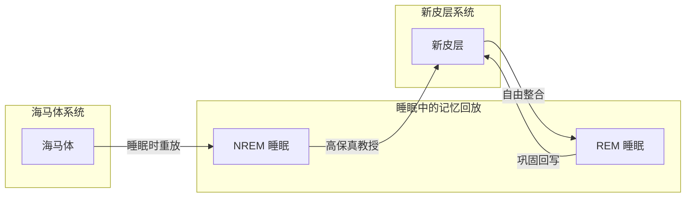

**两个学习系统的分工**：
- **海马体**: 快速学习、稀疏编码、模式分离 — 清醒时快速编码新经历
- **新皮层**: 慢速学习、分布式编码、模式整合 — 构建结构化长期知识

**睡眠回放过程**：
- **NREM 睡眠**: 海马体向新皮层高保真回放当天经历
- **REM 睡眠**: 新皮层自由探索已有知识网络，完成整合

**海马体-新皮层的分工**：
- **海马体**：像一个"快速记录本"——能在单次经历中快速编码新信息，使用稀疏、模式分离的表示
- **新皮层**：像一个"百科全书"——学习缓慢，但通过重叠、分布式表示构建结构化的长期知识
- 这种分工解决了**灾难性遗忘问题**：如果新皮层直接快速学习新信息，会覆盖已有知识

**睡眠中的记忆回放——巩固的核心机制**：

睡眠并非大脑的"休息时间"，而是**记忆巩固的黄金时期**。在非快速眼动（NREM）睡眠期间：

1. **海马体尖波涟漪（Sharp-Wave Ripples）**：高频（~200Hz）爆发式神经活动，将白天编码的经历快速"回放"
2. **丘脑皮层睡眠纺锤波（Sleep Spindles）**：~12-15Hz 的振荡，被认为是新皮层接收信息的"窗口期"
3. **皮层慢波振荡（Slow Oscillations）**：~0.75Hz 的全脑同步活动，协调上述过程的时间配合

这三种脑电节律的**精确时序耦合**（慢波 → 纺锤波 → 尖波涟漪）被认为是系统巩固的神经签名。

**巩固带来的质的变化**：

巩固不是简单的"搬运"，而是一个**变换过程**：
- **要旨抽取（Gist Extraction）**：细节模糊化，核心含义保留
- **规则发现**：从多次经历中提取共同模式和规则
- **知识整合**：新记忆与已有知识结构融合
- **情绪调节**：强烈情绪与记忆内容的分离

> **参考文献**：
> - Frankland, P. W., & Bontempi, B. (2005). The organization of recent and remote memories. *Nature Reviews Neuroscience*, 6(2), 119-130.
> - Diekelmann, S., & Born, J. (2010). The memory function of sleep. *Nature Reviews Neuroscience*, 11(2), 114-126.
> - McClelland, J. L., McNaughton, B. L., & O'Reilly, R. C. (1995). Why there are complementary learning systems in the hippocampus and neocortex. *Psychological Review*, 102(3), 419-457.

> **JavaClaw 类比预告**：MemoryConsolidator 直接模拟记忆巩固过程——当工作记忆（短期）接近容量上限时，用 LLM 对旧内容做"回放式摘要"（类似睡眠回放），提取要旨（保留核心信息）和语义事实（写入长期记忆），替代现有的 substring 盲截断。

---

### 2.6 记忆检索：线索依赖性回忆

存储的信息只有在能被**成功检索（retrieve）** 时才有价值。记忆检索不是简单的"读取文件"，而是一个**重建（reconstruction）** 过程。

#### 2.6.1 编码特异性原则（Tulving & Thomson, 1973）

Tulving 和 Thomson 提出的编码特异性原则是记忆检索研究中最重要的理论之一：

> "检索线索的有效性取决于该线索与编码时存储的信息之间的匹配程度。"

**核心含义**：
- 编码时的**上下文**（环境、情绪、思维状态）会与目标信息一起被存储
- 检索时提供的线索越接近编码时的上下文，检索成功率越高
- 记忆不是被"找到"的，而是被**特定线索"触发重建"** 的

**支持证据**：

1. **环境依赖记忆（Godden & Baddeley, 1975）**：
   - 潜水员在水下学习的单词，在水下回忆比在陆地上好 ~40%
   - 反之亦然——编码和检索环境匹配时效果最佳

2. **状态依赖记忆**：
   - 在特定情绪或生理状态下编码的信息，在相似状态下更容易检索
   - 例如：高兴时学的内容，高兴时更容易回忆

3. **语义关联检索**：
   - 看到"医生"更容易想到"护士"而非"面包"
   - 语义网络中的**扩散激活（Spreading Activation）**

#### 2.6.2 检索练习效应（Testing Effect）

**Roediger & Karpicke (2006)** 的研究揭示了一个反直觉的发现：

- **主动检索**（尝试回忆）比**被动复习**（重新阅读）更能增强长期记忆
- 每次成功检索都会**重新巩固**并**强化**该记忆痕迹
- 这被称为 "retrieval-induced strengthening"——检索诱导的强化

**神经机制**：
- 检索激活海马体-新皮层网络，触发类似编码时的 LTP 过程
- 检索后的**再巩固（reconsolidation）** 使记忆暂时变得可塑，随后以更强的形式重新稳定

> **参考文献**：
> - Tulving, E., & Thomson, D. M. (1973). Encoding specificity and retrieval processes in episodic memory. *Psychological Review*, 80(5), 352-373.
> - Roediger, H. L., & Karpicke, J. D. (2006). Test-enhanced learning. *Psychological Science*, 17(3), 249-255.

> **JavaClaw 类比预告**：MemoryRetrieval 直接实现编码特异性原则——用当前用户消息和任务上下文作为"检索线索"，从长期记忆中找到**编码时上下文最匹配的记忆**。access_count 的递增机制对应"检索练习效应"——越常被检索的记忆越稳固。

---

### 2.7 遗忘：大脑的高效资源管理

遗忘往往被视为记忆系统的"缺陷"，但现代神经科学研究表明，**遗忘是大脑精心设计的功能**，是高效信息管理的关键。

#### 2.7.1 艾宾浩斯遗忘曲线（1885）

Hermann Ebbinghaus 在 1880-1885 年间进行了记忆研究的开创性实验：

**实验方法**：
- 记忆无意义音节（如 ZAG、BEK），排除语义关联的干扰
- 在不同时间间隔后测试记忆保持量

**核心发现——遗忘曲线**：

```
记忆保持率 (%)
100 ┤████
 80 ┤██
 60 ┤█          记忆保持公式：R = e^(-t/S)
 44 ┤█          R = 记忆保持率
 36 ┤           t = 时间间隔
 33 ┤           S = 记忆强度
 28 ┤
 25 ┤
 21 ┤
    ├──┬──┬──┬──┬──┬──┬──→ 时间
   0  20min 1h  9h  1d  2d  6d  31d
```

| 时间间隔 | 记忆保持率 |
|---------|-----------|
| 20 分钟 | ~58% |
| 1 小时 | ~44% |
| 9 小时 | ~36% |
| 1 天 | ~33% |
| 2 天 | ~28% |
| 6 天 | ~25% |
| 31 天 | ~21% |

**关键特征**：
- 遗忘速度在最初几小时**极快**，随后逐渐减缓
- 保留下来的记忆相对稳定——曲线趋向一个非零渐近线
- **间隔重复（Spaced Repetition）** 可以有效"重置"遗忘曲线，每次复习后衰减速度更慢

2015 年 Murre 和 Dros 在 *PLOS ONE* 上发表的研究成功复制了艾宾浩斯的原始发现，证实了遗忘曲线的基本形状在 130 年后仍然成立。

#### 2.7.2 遗忘的主动神经生物学机制

长期以来，遗忘被认为是被动的"记忆痕迹衰减"。但 2016 年以来的研究揭示了**主动遗忘**的分子机制：

**关键发现（Bhatt et al., 2016, Scientific Reports）**：
- 长时程增强（LTP）的衰减和长期记忆的遗忘需要**主动的分子过程**：
  - **NMDA 受体激活**
  - **L 型电压依赖钙离子通道**
  - **钙调磷酸酶（Calcineurin）**
- **阻断这些分子通路可以维持本应被遗忘的记忆**
- 遗忘是一个被**主动调控**的过程，而非被动衰减

**遗忘的适应性价值**：
- **减少干扰**：清除过时或不相关的信息，提高相关信息的检索效率
- **促进泛化**：遗忘具体细节有助于提取一般性规则和模式
- **优化资源**：维持所有记忆的代谢成本极高，选择性遗忘是能量效率的体现
- **支持灵活性**：允许根据新信息更新认知模型，而非被旧信息锁定

> **参考文献**：
> - Ebbinghaus, H. (1885). *Uber das Gedachtnis: Untersuchungen zur experimentellen Psychologie*. Leipzig: Duncker & Humblot.
> - Murre, J. M., & Dros, J. (2015). Replication and analysis of Ebbinghaus' forgetting curve. *PLOS ONE*, 10(7), e0120644.
> - Bhatt, D. H., et al. (2016). Forgetting of long-term memory requires activation of NMDA receptors, L-type voltage-dependent Ca²⁺ channels, and calcineurin. *Scientific Reports*, 6, 22771.

> **JavaClaw 类比预告**：遗忘机制是长期记忆的"垃圾回收"——通过 `importance × recency_decay × access_frequency` 的衰减公式模拟艾宾浩斯遗忘曲线，主动清理不再相关的记忆，保持记忆库的"信噪比"。

---

### 2.8 生物学模型全景总结

将上述所有理论整合为一个全景视图：

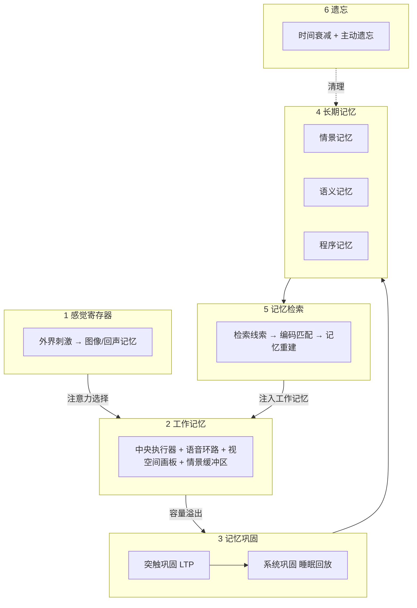

**全景对应关系**：

| 编号 | 生物学模块 | 核心研究者 | 关键参数 |
|------|-----------|-----------|---------|
| 1 | 感觉寄存器 | Sperling, 1960 | 容量大、持续短、注意力过滤 |
| 2 | 工作记忆 | Miller 1956; Baddeley 1974; Cowan 1999 | 7 加减 2 块 / 3-4 块注意力焦点 |
| 3 | 记忆巩固 | McClelland 1995; Born 2010 | LTP 突触强化、睡眠回放 |
| 4 | 长期记忆 | Tulving 1972; Squire 1992 | 情景/语义/程序三子系统 |
| 5 | 记忆检索 | Tulving & Thomson, 1973 | 编码特异性、检索强化 |
| 6 | 遗忘 | Ebbinghaus 1885; Bhatt 2016 | 指数衰减、主动分子机制 |

**从生物学到工程的映射总结**：

| 生物学概念 | 核心研究者 | 关键参数 | JavaClaw 映射 |
|-----------|-----------|---------|-------------|
| 感觉寄存器 | Sperling, 1960 | 容量大、持续短、注意力过滤 | 工具输出完整入库 + 巩固管理 |
| 工作记忆容量 | Miller, 1956; Cowan, 1999 | 7±2 块 / 3-4 块注意力焦点 | `WorkingMemory.tokenBudget` |
| 分块机制 | Miller, 1956 | 信息组块化提高有效容量 | `MemoryChunk`（tool_call+response=1块） |
| 情景记忆 | Tulving, 1972 | 事件+时空标记 | `EpisodicMemory`（会话历史摘要） |
| 语义记忆 | Tulving, 1972 | 脱离情境的知识 | `SemanticMemory`（项目事实/用户偏好） |
| 程序记忆 | Squire, 1992 | 技能和模式 | `ProceduralMemory`（工具使用模式） |
| 突触巩固 | Hebb, 1949; LTP | 重复激活 → 连接增强 | `MemoryConsolidator` LLM 摘要 |
| 系统巩固 | CLS理论, 睡眠回放 | 海马体→新皮层转移 | 会话结束→长期记忆写入 |
| 编码特异性 | Tulving & Thomson, 1973 | 线索-编码匹配 | `MemoryRetrieval` 语义相似度检索 |
| 检索练习效应 | Roediger & Karpicke, 2006 | 检索强化记忆 | `access_count++` 被检索记忆增强 |
| 遗忘曲线 | Ebbinghaus, 1885 | R = e^(-t/S) | `recency_decay` 时间衰减函数 |
| 主动遗忘 | Bhatt et al., 2016 | NMDA/Calcineurin | 定时清理低分记忆 |

---

## 三、问题诊断：JavaClaw 现有上下文管理为何复杂

### 3.1 现有机制清单（12+个独立组件）

当前 JavaClaw 的上下文管理由以下独立机制组成，各自有独立的配置、阈值和代码实现：

**Gateway 层（1 个）**：

| 机制 | 配置/常量 | 行为 |
|------|----------|------|
| history-limit | 50 条 | 从 DB 加载最近 N 条消息，更早的直接丢弃 |

**Agent Runtime 层（6 个）**：

| 机制 | 配置/常量 | 行为 |
|------|----------|------|
| ContextWindowTracker | 128000 tokens | 实时估算 token 消耗，超限强制终止 |
| ContextCondenser | keep-recent=20, summary-length=200 | 对旧 ToolResponseMessage 做 substring(0,200) 截断 |
| truncateToolResult | 16000 chars | 保留首尾各 8000 字符，中间截断 |
| TOTAL_MAX_CHARS | 150000 chars | 系统提示词总长硬截断 |
| max-turns | 128 | Agent 循环硬上限 |
| ToolCallLoopDetector | window=8, warn=3, terminate=5 | 检测重复工具调用 |

**工具层（4 个）**：

| 机制 | 配置/常量 | 行为 |
|------|----------|------|
| ExecTool | 8000 chars | Shell 输出 head+tail 截断 |
| FileReadTool | 500 lines | 文件分页读取 |
| WebSearchTool | 10 results | 搜索结果条数限制 |
| ToolResultCache | LRU 50 | 只读工具结果缓存 |

**Prompt 层（1 个）**：

| 机制 | 行为 |
|------|------|
| Plan 执行输出规范 | 通过 prompt 引导减少冗余输出 |

### 3.2 核心问题

1. **碎片化**：12+ 个机制各自独立，无统一模型——改一个可能被另一个抵消
2. **全部是盲截断**：无一基于语义理解，关键信息可能在任意一层被丢弃
3. **多层叠加**：工具结果经历"工具自身截断 → truncateToolResult → ContextCondenser"三层处理
4. **无跨会话记忆**：每次会话从零开始
5. **配置难以理解**：12+ 个参数散落在不同层级，调优需要理解整条数据链

### 3.3 现有数据流全景

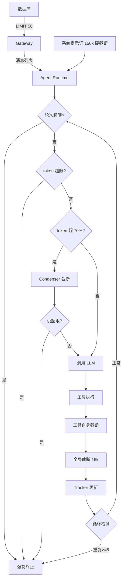

---

## 四、独立模块设计：javaclaw-memory

### 4.1 模块定位

基于人脑记忆模型，创建一个**完全独立的 Maven 模块 `javaclaw-memory`**，从 `javaclaw-agent` 和 `javaclaw-gateway` 中剥离所有上下文管理逻辑，统一收归记忆模块。

#### 4.1.1 模块依赖关系（改造前 vs 改造后）

**改造前**：上下文管理逻辑散落在 agent 和 gateway 中

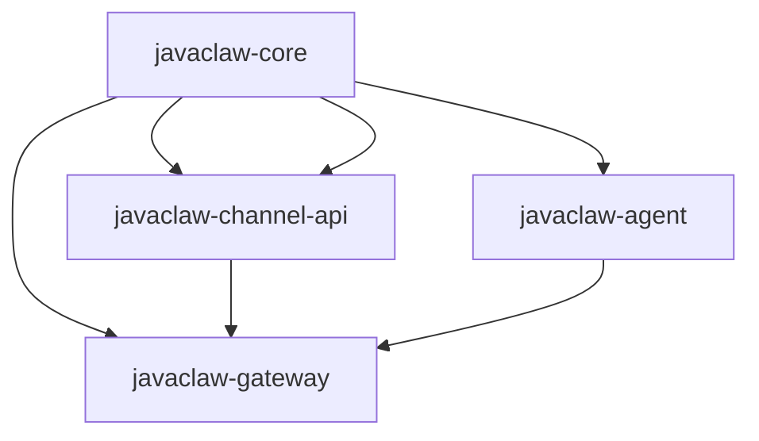

**改造后**：新增独立的 `javaclaw-memory` 模块

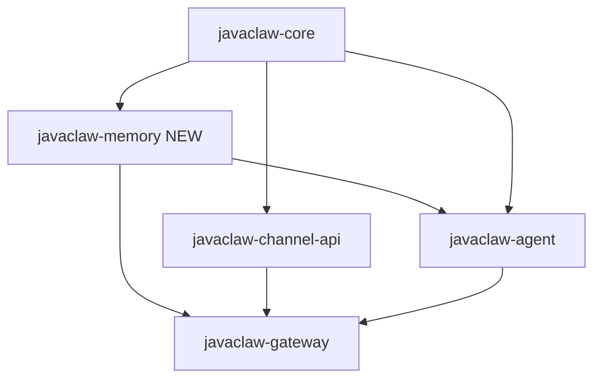

#### 4.1.2 模块职责边界

| 模块 | 改造前职责 | 改造后职责 | 迁出内容 |
|------|----------|----------|---------|
| **javaclaw-memory** | 不存在 | 全部记忆管理: 工作记忆、巩固、长期记忆、检索、遗忘 | — |
| **javaclaw-agent** | 包含 ContextWindowTracker / ContextCondenser / truncateToolResult / 各工具截断 | 专注于 Agent 执行循环和工具调用，通过 `javaclaw-memory` API 管理上下文 | ContextWindowTracker, ContextCondenser, truncateToolResult |
| **javaclaw-gateway** | 包含 historyLimit 查询 / 消息转换 | 专注于协议处理和消息路由，通过 `javaclaw-memory` API 加载和存储记忆 | historyLimit 逻辑迁入 MemoryRetrieval |
| **javaclaw-core** | 配置和公共模型 | 新增 MemoryChunk 等公共模型（或放在 memory 模块内） | — |

#### 4.1.3 javaclaw-memory 模块结构

```
javaclaw-memory/
├── pom.xml
└── src/main/java/com/atm/javaclaw/memory/
    ├── MemorySystem.java                    # 统一门面 API
    ├── model/
    │   ├── MemoryChunk.java                 # 信息块数据模型
    │   ├── ChunkType.java                   # 块类型枚举
    │   ├── ContentCategory.java             # 内容类别枚举
    │   └── MemoryEntry.java                 # 长期记忆条目
    ├── perception/
    │   └── ImportanceAssessor.java           # 工具输出 importance 自动评估
    ├── working/
    │   ├── WorkingMemory.java               # 工作记忆管理
    │   └── TokenEstimator.java              # Token 估算
    ├── consolidation/
    │   ├── MemoryConsolidator.java          # 记忆巩固
    │   ├── ConsolidationResult.java         # 巩固结果
    │   └── ConsolidationPromptBuilder.java   # 巩固提示词构建
    ├── longterm/
    │   ├── LongTermMemory.java              # 长期记忆
    │   ├── EpisodicMemory.java              # 情景记忆子系统
    │   ├── SemanticMemory.java              # 语义记忆子系统
    │   └── ProceduralMemory.java            # 程序记忆子系统
    ├── retrieval/
    │   ├── MemoryRetrieval.java             # 线索检索
    │   └── ScoringFunction.java             # 评分函数
    ├── forgetting/
    │   └── ForgettingScheduler.java         # 遗忘定时任务
    └── config/
        └── MemoryProperties.java            # 配置属性类
```

#### 4.1.4 Maven POM

```xml
<artifactId>javaclaw-memory</artifactId>
<name>JavaClaw Memory</name>
<description>人脑记忆架构的上下文管理模块</description>

<dependencies>
    <dependency>
        <groupId>com.atm</groupId>
        <artifactId>javaclaw-core</artifactId>
    </dependency>
    <!-- Spring AI（用于 ChatModel 调用巩固模型） -->
    <dependency>
        <groupId>org.springframework.ai</groupId>
        <artifactId>spring-ai-core</artifactId>
    </dependency>
    <!-- Reactor（响应式支持） -->
    <dependency>
        <groupId>io.projectreactor</groupId>
        <artifactId>reactor-core</artifactId>
    </dependency>
</dependencies>
```

#### 4.1.5 统一门面 API（MemorySystem）

`MemorySystem` 是 `javaclaw-memory` 对外暴露的**唯一入口**，`javaclaw-agent` 和 `javaclaw-gateway` 仅通过此接口与记忆系统交互：

```java
@Component
public class MemorySystem {

    private final MemoryConsolidator consolidator;
    private final LongTermMemory longTermMemory;
    private final MemoryRetrieval retrieval;
    private final MemoryProperties config;

    /** 为一次 Agent 运行创建工作记忆实例 */
    public WorkingMemory createWorkingMemory(String systemPrompt) {
        return new WorkingMemory(
            config.getWorking().getTokenBudget(),
            config.getWorking().getConsolidationThreshold(),
            consolidator,
            systemPrompt
        );
    }

    /** 从长期记忆检索相关记忆（线索检索） */
    public List<MemoryChunk> retrieveMemories(String cue, String userId) {
        if (!config.getLongTerm().isEnabled()) return List.of();
        return retrieval.retrieve(cue, userId);
    }

    /** 会话结束时写入情景记忆 */
    public void storeSessionMemory(String userId, Long sessionId, String summary) {
        if (!config.getLongTerm().isEnabled()) return;
        longTermMemory.storeEpisodic(userId, sessionId, summary);
    }
}
```

### 4.2 从现有模块迁出的代码

| 原文件 | 原模块 | 迁移到 | 说明 |
|-------|-------|-------|------|
| `ContextWindowTracker.java` | javaclaw-agent | `javaclaw-memory` WorkingMemory 内部 | token 追踪逻辑合并为 WorkingMemory 的内部方法 |
| `ContextCondenser.java` | javaclaw-agent | 废弃，不迁移 | 新架构不使用截断，完全依赖 LLM 巩固 |
| `AgentRuntime.truncateToolResult()` | javaclaw-agent | 废弃，不迁移 | 工具输出完整进入工作记忆，无需截断 |
| 各工具的截断常量 | javaclaw-agent | 废弃，不迁移 | ExecTool/FileReadTool 等不再自行截断 |
| `MessagePipeline.loadHistory()` | javaclaw-gateway | `javaclaw-memory` MemoryRetrieval | 历史加载逻辑迁入检索模块 |
| `TOTAL_MAX_CHARS` 截断 | javaclaw-agent | `javaclaw-memory` WorkingMemory | 合并为 tokenBudget 统一约束 |

### 4.3 改造后的调用关系

**javaclaw-agent 中的 AgentRuntime（改造后）**：

```java
public class AgentRuntime {

    private final MemorySystem memorySystem;  // 注入记忆系统

    private AgentResult executeAgentLoop(AgentRunRequest request) {
        // 1. 创建工作记忆（替代旧的 ContextWindowTracker + 手动 history 管理）
        WorkingMemory wm = memorySystem.createWorkingMemory(systemPrompt);

        // 2. 注入检索到的长期记忆
        List<MemoryChunk> recalled = memorySystem.retrieveMemories(
            request.userMessage(), request.userId());
        recalled.forEach(wm::accept);

        // 3. 加载会话历史
        for (Message msg : request.history()) {
            wm.accept(MemoryChunk.fromMessage(msg));
        }
        wm.accept(MemoryChunk.fromUser(request.userMessage()));

        // 4. Agent 循环
        for (int turn = 0; turn < maxTurns; turn++) {
            List<Message> llmInput = wm.buildLLMInput();  // 唯一出口
            ChatResponse response = chatModel.call(llmInput);
            wm.updateFromApiUsage(response.usage());

            if (hasToolCalls(response)) {
                for (ToolCall call : response.toolCalls()) {
                    String rawOutput = executeTool(call);
                    // 工具输出完整进入工作记忆，不做任何截断
                    // 容量由 WorkingMemory 统一管理
                    // 容量不足时自动触发 MemoryConsolidator
                    MemoryChunk chunk = MemoryChunk.fromToolInteraction(
                        call, rawOutput);
                    wm.accept(chunk);
                }
            } else {
                break;
            }
        }
    }
}
```

**javaclaw-gateway 中的 MessagePipeline（改造后）**：

```java
public class MessagePipeline {

    private final MemorySystem memorySystem;

    // loadHistory 逻辑简化：不再自己管理 LIMIT 查询
    // 改为通过 MemorySystem 统一管理
}
```

---

### 4.4 架构全景

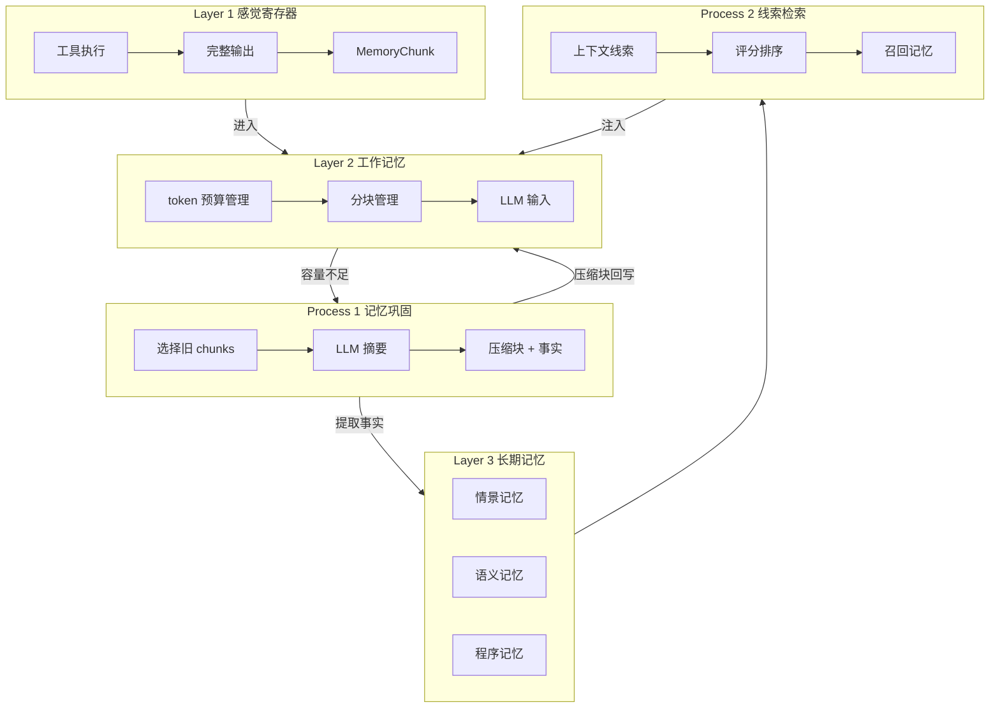

### 4.2 现有机制归并

| 人脑层级/过程 | 归并的现有机制 | 新组件 | 替代方式 |
|-------------|-------------|-------|---------|
| **感觉寄存器** | ExecTool 8k / FileReadTool 500行 / WebSearchTool 10条 / truncateToolResult 16k | 废弃全部截断 | 工具输出完整进入工作记忆，由巩固机制统一管理容量 |
| **工作记忆** | history-limit 50 / ContextWindowTracker 128k / TOTAL_MAX_CHARS 150k / max-turns 128 | `WorkingMemory` | 单一 tokenBudget 约束，分块管理 |
| **记忆巩固** | ContextCondenser (substring 200字符截断) | `MemoryConsolidator` | LLM 语义摘要 + 事实提取一体化 |
| **长期记忆** | 无 | `LongTermMemory` | 情景/语义/程序三子系统 |
| **线索检索** | Gateway LIMIT N 查询 | `MemoryRetrieval` | 基于编码特异性原则的语义检索 |

**保留为独立安全/性能机制**（不属于记忆模型）：
- `ToolCallLoopDetector` → 安全保护，防止无限循环
- `ToolResultCache` → 性能优化，减少重复调用
- Prompt 输出规范 → 行为引导

---

## 五、各层详细技术设计

### 5.1 Layer 1: 感觉寄存器（工具输出直接入库 + 未来子 Agent 委派）

**生物学对应**：人脑的感觉寄存器接收外界刺激的原始信号。Sperling (1960) 证明感觉记忆容量极大（>=9 项），信息先完整进入感觉系统，后续由注意力和工作记忆的容量约束来管理。

**当前设计（v1.0）**：工具输出**直接、完整地**进入工作记忆，**不做任何截断或过滤**。当工作记忆容量不足时，由 MemoryConsolidator（记忆巩固）来智能压缩旧内容，而非在输入端截断。

**核心原则**：信息不在输入端丢弃，而在巩固阶段智能压缩。

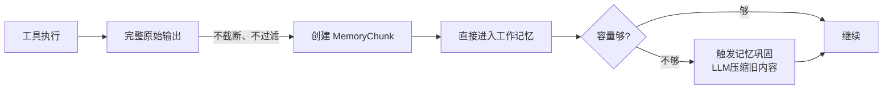

> **TODO — 未来增强：子 Agent 委派模式**
>
> 当子 Agent 功能实现后，可升级为：工具输出由子 Agent 在独立工作记忆中完整处理，只返回分析结论给父 Agent。这样父 Agent 的工作记忆中只有简洁的结论，而非大块的工具原始输出。子 Agent 方式能进一步减少父 Agent 的上下文压力，但需要额外的 LLM 调用开销。

#### 5.1.2 MemoryChunk 数据模型

```java
public record MemoryChunk(
    String id,                    // 唯一标识
    ChunkType type,               // 这个 chunk 的来源类型（见下方说明）
    String content,               // 过滤/处理后的内容
    ContentCategory category,     // 内容的数据类别（见下方说明）
    float importance,             // 0.0-1.0，由内容特征决定（错误信息 > 正常输出）
    int estimatedTokens,          // 估算 token 数
    long originalSize,            // 原始大小（字节），用于审计
    Instant createdAt,            // 创建时间
    Map<String, String> metadata  // 扩展元数据（toolName, toolCallId 等）
) {}
```

**ChunkType — 这个 chunk 从哪里来的**：

| 类型 | 含义 | 示例 |
|------|------|------|
| `USER` | 用户的输入消息 | "请帮我修复 auth 模块的 bug" |
| `ASSISTANT` | 助手的文本回复 | "我已分析了代码，发现了空指针问题..." |
| `TOOL_INTERACTION` | 一次工具调用 + 返回结果 | file_read 请求 + 文件内容返回 |
| `SYSTEM` | 系统提示词 | Agent 的角色定义、Plan 上下文等 |
| `CONSOLIDATED` | 多个旧 chunk 被 LLM 摘要后的压缩版 | "前几轮对话中，用户要求修改了3个文件..." |
| `RECALLED` | 从长期记忆库检索召回的 | 上次会话中积累的项目知识 |

```java
public enum ChunkType {
    USER, ASSISTANT, TOOL_INTERACTION, SYSTEM, CONSOLIDATED, RECALLED
}
```

**ContentCategory — 这个 chunk 里面装的是什么类型的数据**：

ContentCategory 告诉子 Agent "你正在处理什么类型的数据"，子 Agent 据此采用不同的分析策略。不同类型的数据有不同的"有价值部分"：

| 类别 | 含义 | 过滤策略 | 什么是"有价值的部分" |
|------|------|---------|-------------------|
| `CODE` | 源代码文件 | 保留类声明、方法签名、被修改的代码块；省略 getter/setter | 代码结构和关键逻辑 |
| `TEXT` | 纯文本内容 | 保留前 N 行 + 关键段落 | 核心信息 |
| `COMMAND_OUTPUT` | Shell 命令的输出 | 保留 exit code + ERROR/WARN 行 + 尾部输出 | 执行结果和错误信息 |
| `SEARCH_RESULT` | 网页搜索或文件搜索的结果 | 保留 top-N 最相关条目 | 最匹配的搜索结果 |
| `STRUCTURED_DATA` | JSON/XML/表格等结构化数据 | 保留 schema + 采样行 | 数据结构和样本 |

```java
public enum ContentCategory {
    CODE, TEXT, COMMAND_OUTPUT, SEARCH_RESULT, STRUCTURED_DATA
}
```

**类比**：ChunkType 是"这个信息从哪里来的"（用户？助手？工具？长期记忆？），ContentCategory 是"信息里面装的是什么类型的数据"（代码？命令输出？搜索结果？）。ContentCategory 为巩固过程提供额外信息——巩固 LLM 可以根据数据类型采用不同的摘要策略。

#### 5.1.3 importance 自动评估

当工具输出创建为 MemoryChunk 时，系统自动评估 importance：

| 条件 | importance | 说明 |
|------|-----------|------|
| 输出包含 ERROR / Exception / 非零 exit code | 0.9 | 错误信息最重要 |
| 输出包含用户请求的直接结果（如文件内容、搜索结果） | 0.7 | 用户关心的信息 |
| 执行成功、输出常规 | 0.5 | 正常操作记录 |
| 空输出或纯确认（如"文件已保存"） | 0.2 | 低信息量 |

#### 5.1.4 配置

当前版本不需要感觉寄存器层的配置——工具输出完整进入工作记忆，由 WorkingMemory 和 MemoryConsolidator 统一管理容量。

**废弃的配置**（不再需要）：ExecTool MAX_OUTPUT_CHARS=8000、FileReadTool MAX_LINES_PER_READ=500、WebSearchTool maxResults=10、maxToolResultChars=16000。

---

### 5.2 Layer 2: 工作记忆（WorkingMemory）

**生物学对应**：Baddeley (1974) 的多组件工作记忆——一个受容量限制的主动处理系统。其中央执行器管理注意力分配，情景缓冲区整合多源信息。Miller (1956) 的分块理论说明，通过将信息组织为有意义的块，可以在有限容量下承载更多信息。Cowan (1999) 进一步揭示注意力焦点仅 3-4 块，但被激活的长期记忆可以快速调入。

**技术职责**：管理当前 LLM 可见的完整上下文，是送入 LLM 的**唯一出口**。替代 ContextWindowTracker、ContextCondenser、history-limit、TOTAL_MAX_CHARS、max-turns 这 5 个独立机制。

#### 5.2.1 核心类

```java
public class WorkingMemory {

    private final int tokenBudget;              // 唯一容量约束（Miller 的"槽位"总量）
    private final float consolidationThreshold; // 触发巩固的使用率阈值
    private final MemoryConsolidator consolidator;

    private MemoryChunk systemChunk;            // 系统提示（固定槽位，如 Baddeley 的"长期知识"）
    private final List<MemoryChunk> chunks;     // 有序信息块（如 Miller 的"块"列表）

    /**
     * 接受新信息块进入工作记忆。
     *
     * 类比：新的感觉信息经过注意力选择后进入工作记忆。
     * 如果容量不足，先触发巩固（类比：清理旧信息为新信息腾出空间）。
     */
    public void accept(MemoryChunk chunk) {
        while (estimateTokenUsage() + chunk.estimatedTokens() > tokenBudget) {
            boolean consolidated = consolidator.tryConsolidate(this);
            if (!consolidated) break; // 无法再巩固，接受容量超出
        }
        chunks.add(chunk);
    }

    /**
     * 构建 LLM 输入。
     *
     * 类比：工作记忆中所有活跃信息进入"意识"（LLM 处理）。
     * 这是 LLM 能"看到"的全部内容——统一出口。
     */
    public List<Message> buildLLMInput() {
        List<Message> messages = new ArrayList<>();
        messages.add(systemChunk.toSystemMessage());
        for (MemoryChunk chunk : chunks) {
            messages.addAll(chunk.toMessages());
        }
        return messages;
    }

    /** 当前 token 使用量估算 */
    public int estimateTokenUsage() {
        int total = systemChunk.estimatedTokens();
        for (MemoryChunk c : chunks) {
            total += c.estimatedTokens();
        }
        return total;
    }

    /** 当前使用率 */
    public float usageRatio() {
        return (float) estimateTokenUsage() / tokenBudget;
    }

    /** 从 API Usage 更新真实 token 数（优先于估算） */
    public void updateFromApiUsage(int actualTotalTokens) { ... }

    /** 获取可用于巩固的最旧、最低 importance 的 chunks */
    public List<MemoryChunk> getConsolidationCandidates(int minChunks) { ... }

    /** 替换指定 chunks 为巩固后的摘要 chunk */
    public void replaceWithConsolidated(List<MemoryChunk> originals, MemoryChunk consolidated) { ... }
}
```

#### 5.2.2 什么是 Chunk（信息块）

**生物学来源**：Miller (1956) 发现人脑工作记忆容量不是以"信息量"计算，而是以**有意义的单元（chunk）** 计算。一个 chunk 就是你能作为**一个整体**来感知和处理的信息块。

**生活中的例子**：

```
不分块: F - B - I - C - I - A - I - B - M  → 9 个独立字母，超出记忆容量
分  块: FBI - CIA - IBM                     → 3 个有意义的缩写，轻松记住
```

每个字母本身没有意义（低级信息），但当你把它们组合成已知的缩写时，3 个字母变成了 1 个有意义的 chunk。**分块不会改变信息量，但会改变你需要追踪的"项目数"**。

**在 JavaClaw 中的应用**：

现有系统把每条消息当作独立项来计数。一次工具调用会产生 2 条消息（assistant 的调用请求 + tool 的返回结果），它们在语义上是**一个不可分割的整体**：调用请求没有返回结果毫无意义，返回结果没有调用请求也无法理解。

**chunk 就是把这些语义上属于一起的消息打包成一个处理单元**。

**具体示例——一轮 Agent 执行**：

```
现有系统（扁平消息列表，6 条消息）:
  ┌─ [1] UserMessage: "请帮我修复 auth 模块的 bug"
  ├─ [2] AssistantMessage: {tool_calls: [file_read("src/auth/AuthService.java")]}
  ├─ [3] ToolResponseMessage: "public class AuthService { ... 500行代码 ... }"
  ├─ [4] AssistantMessage: {tool_calls: [file_edit("src/auth/AuthService.java", ...)]}
  ├─ [5] ToolResponseMessage: "文件已修改"
  └─ [6] AssistantMessage: "我已修复了 auth 模块中的空指针异常..."

  → historyLimit=50 时，8轮类似操作就用完 48 条消息额度


新架构（MemoryChunk 列表，4 个 chunks）:
  ┌─ [Chunk 1] type=USER
  │   content: "请帮我修复 auth 模块的 bug"
  │   importance: 0.7
  │
  ├─ [Chunk 2] type=TOOL_INTERACTION  ← 消息[2]+[3]打包为一个chunk
  │   content: "读取 src/auth/AuthService.java → [过滤后的关键代码]"
  │   importance: 0.6
  │
  ├─ [Chunk 3] type=TOOL_INTERACTION  ← 消息[4]+[5]打包为一个chunk
  │   content: "编辑 src/auth/AuthService.java → 修改成功"
  │   importance: 0.8（修改操作重要性高）
  │
  └─ [Chunk 4] type=ASSISTANT
      content: "我已修复了 auth 模块中的空指针异常..."
      importance: 0.5

  → 容量由 tokenBudget 管理，不受消息条数限制
```

**Chunk 的完整类型**：

| Chunk 类型 | 包含的原始消息 | 说明 |
|-----------|-------------|------|
| `USER` | 1 条 UserMessage | 用户的一次输入 |
| `TOOL_INTERACTION` | 1 条 AssistantMessage(tool_calls) + N 条 ToolResponseMessage | 一次工具调用的请求和结果，作为不可分割的整体 |
| `ASSISTANT` | 1 条 AssistantMessage(纯文本) | 助手的文本回复 |
| `CONSOLIDATED` | 多个旧 chunks 经过 LLM 摘要后的压缩表示 | 巩固产物，替代了原始 chunks |
| `RECALLED` | 从长期记忆检索出的条目 | 跨会话召回的历史知识 |
| `SYSTEM` | SystemMessage | 系统提示词（固定槽位，不参与巩固） |

**分块带来的核心改进**：

1. **容量利用率提升**：现有系统 5 次工具调用 = 10 条消息；新系统 5 次工具调用 = 5 个 chunks
2. **巩固粒度更优**：巩固时以 chunk 为单位选择，不会把工具调用和返回结果拆开
3. **重要性可评估**：每个 chunk 有 importance 分数，巩固时优先压缩不重要的 chunks
4. **语义连贯**：LLM 摘要一个完整的 TOOL_INTERACTION chunk 比摘要一条孤立的 ToolResponseMessage 效果更好

#### 5.2.3 实际对话中 chunks 的完整示例

以下展示一次真实的 Bug 修复对话中，工作记忆里的 chunks 内容：

**场景**：用户要求修复 AuthService 的空指针异常

```
━━━━━━━━━ 工作记忆 (WorkingMemory) 当前状态 ━━━━━━━━━
tokenBudget: 128000
当前使用: 45200 tokens (35%)
chunks 数量: 7

──────────── Chunk #0 ────────────
type:       SYSTEM
category:   TEXT
importance: 1.0 (系统提示固定最高)
tokens:     8000
content:    "你是 JavaClaw 智能编码助手...（完整系统提示词）"

──────────── Chunk #1 ────────────
type:       RECALLED (从长期记忆召回)
category:   TEXT
importance: 0.7
tokens:     200
content:    "[长期记忆] 该项目使用 Spring Boot 3.4.3 + R2DBC + WebFlux，
             AuthService 位于 javaclaw-gateway/src/main/java/.../AuthService.java"

──────────── Chunk #2 ────────────
type:       USER
category:   TEXT
importance: 0.8
tokens:     50
content:    "请帮我修复 AuthService 的空指针异常，用户登录时偶尔会报 NPE"

──────────── Chunk #3 ────────────
type:       TOOL_INTERACTION
category:   CODE
importance: 0.7
tokens:     15000  ← 完整文件内容，未截断！
content:    [Assistant 调用 file_read("AuthService.java")]
            +
            [工具返回的完整 AuthService.java 文件，500行代码]
metadata:   {toolName: "file_read", toolCallId: "call_001"}

──────────── Chunk #4 ────────────
type:       TOOL_INTERACTION
category:   CODE
importance: 0.6
tokens:     12000  ← 完整文件内容
content:    [Assistant 调用 file_read("UserRepository.java")]
            +
            [工具返回的完整 UserRepository.java 文件，400行代码]
metadata:   {toolName: "file_read", toolCallId: "call_002"}

──────────── Chunk #5 ────────────
type:       TOOL_INTERACTION
category:   CODE
importance: 0.9  ← 修改操作，importance 高
tokens:     800
content:    [Assistant 调用 file_edit("AuthService.java", 添加 null 检查)]
            +
            [工具返回: "文件已修改，第42行添加了 null 检查"]
metadata:   {toolName: "file_edit", toolCallId: "call_003"}

──────────── Chunk #6 ────────────
type:       TOOL_INTERACTION
category:   COMMAND_OUTPUT
importance: 0.8
tokens:     9150
content:    [Assistant 调用 exec("mvn test -pl javaclaw-gateway")]
            +
            [工具返回: 完整的 Maven 测试输出，包含编译日志和测试结果]
metadata:   {toolName: "exec", toolCallId: "call_004"}

━━━━━━━━━ 总计: 45200 / 128000 tokens (35%) ━━━━━━━━━
```

**如果继续操作，token 使用率超过 75%，触发巩固**：

```
━━━━━━━━━ 巩固触发！━━━━━━━━━
当前使用: 98000 / 128000 (76%) → 超过 consolidationThreshold=0.75

巩固选择: 按 relevance 从低到高选择可压缩的 chunks

  relevance 是每个 chunk 的"当前价值"综合分数:
  relevance = importance × recency × task_alignment
    - importance: 内容本身的重要性 (错误=0.9, 正常=0.5)
    - recency:    时间新旧 (刚创建的=1.0, 较早的衰减)
    - task_alignment: 与当前任务的相关度 (直接相关=1.0)

  各 chunk 的 relevance 计算:
    Chunk #3: 0.7(importance) × 0.6(较早) × 0.5(已读过不再需要原文) = 0.21
    Chunk #4: 0.6(importance) × 0.5(最早) × 0.4(辅助文件) = 0.12
    Chunk #5: 0.9(importance) × 0.9(较新) × 1.0(核心修改) = 0.81 ← 不压缩
    Chunk #6: 0.8(importance) × 1.0(最新) × 0.9(测试结果) = 0.72 ← 不压缩

→ 选中 relevance 最低的:
  Chunk #4 (relevance=0.12, file_read UserRepository.java, 12000 tokens)
  Chunk #3 (relevance=0.21, file_read AuthService.java, 15000 tokens)

LLM 摘要后:
──────────── Chunk #3 (替换后) ────────────
type:       CONSOLIDATED
category:   TEXT
importance: 0.7
tokens:     500  ← 从 27000 tokens 压缩为 500 tokens
content:    "[巩固摘要] 读取了 AuthService.java 和 UserRepository.java。
             AuthService 的 buildUser 方法(第38-55行)从 UserRepository
             获取用户后直接调用 user.getName()，未做 null 检查。
             UserRepository.findById 在用户不存在时返回 null 而非 Optional。
             这是 NPE 的根因。已通过 file_edit 在第42行添加了 null 检查。"

提取的事实 → 写入长期记忆:
  - [semantic] "AuthService.buildUser 方法需要对 UserRepository 返回值做 null 检查"
  - [episodic] "修复了 AuthService 的 NPE，原因是 findById 返回 null"

━━━━━━━━━ 巩固后: 72200 / 128000 (56%) ✓ ━━━━━━━━━
```

#### 5.2.4 注意力权重与巩固优先级

每个 chunk 的 relevance（注意力权重）决定巩固时的优先级：

```
relevance = importance × recency × task_alignment
```

- `importance`：由子 Agent 在返回结论时赋予（错误信息 > 正常输出）
- `recency`：越新的 chunk 权重越高
- `task_alignment`：与当前任务/计划相关的 chunk 权重更高

巩固时优先选择 **relevance 最低** 的 chunks 进行摘要压缩。

#### 5.2.4 配置

```yaml
javaclaw:
  memory:
    working:
      token-budget: 128000              # 唯一的容量约束
      consolidation-threshold: 0.75     # 触发巩固的使用率
```

替代了之前的 5 个独立配置（history-limit=50、max-context-tokens=128000、TOTAL_MAX_CHARS=150000、max-turns=128、condenser-keep-recent=20 + condenser-summary-length=200 + condenser-min-turns-between=5）。

---

### 5.3 Process 1: 记忆巩固（MemoryConsolidator）

**生物学对应**：记忆巩固的两阶段过程——突触巩固（LTP 增强重要连接）和系统巩固（睡眠中海马体回放，将短期记忆转为长期存储）。关键特征是巩固不是简单复制，而是**变换过程**：要旨抽取、规则发现、知识整合。

**技术职责**：当工作记忆容量不足时，对旧的信息块进行 LLM 语义摘要，同时提取事实写入长期记忆。一次调用完成两件事（摘要 + 事实提取），替代现有 ContextCondenser 的 substring(0, 200) 盲截断。

#### 5.3.1 核心类

```java
public class MemoryConsolidator {

    private final ChatModel consolidationModel;  // 轻量模型（如 qwen-turbo）
    private final LongTermMemory longTermMemory;  // 长期记忆引用

    /**
     * 尝试对工作记忆执行巩固。
     *
     * 类比：睡眠中的记忆回放——选择旧的、低relevance的记忆，
     *       通过"回放"（LLM处理）将其压缩为要旨，
     *       同时提取事实存入长期记忆（系统巩固）。
     *
     * @return true 如果成功释放了空间
     */
    public boolean tryConsolidate(WorkingMemory workingMemory) {
        List<MemoryChunk> candidates = workingMemory.getConsolidationCandidates(3);
        if (candidates.isEmpty()) return false;

        ConsolidationResult result = doLLMConsolidate(candidates);

        // 1. 用摘要块替换原始块（留在工作记忆）
        workingMemory.replaceWithConsolidated(candidates, result.summaryChunk());

        // 2. 提取的事实写入长期记忆（系统巩固）
        if (longTermMemory != null) {
            for (ExtractedFact fact : result.facts()) {
                longTermMemory.store(fact);
            }
        }
        return true;
    }

    private ConsolidationResult doLLMConsolidate(List<MemoryChunk> chunks) {
        String prompt = buildConsolidationPrompt(chunks);
        // 一次 LLM 调用同时完成摘要和事实提取
        // 输出格式：{ "summary": "...", "facts": [{"type": "semantic", "content": "...", "importance": 0.8}] }
        String response = consolidationModel.call(prompt);
        return parseConsolidationResponse(response);
    }
}
```

#### 5.3.2 巩固提示词模板

```markdown
你是一个专业的记忆巩固助手。请对以下对话片段执行两项任务：

## 任务一：摘要（对应大脑的"要旨抽取"）
将对话压缩为简洁摘要，保留：
1. 用户的核心目标和当前状态
2. 已完成的关键操作及其结果（特别是工具调用的关键输出）
3. 尚未完成的任务和下一步计划
4. 重要的文件路径、命令、错误信息等细节

## 任务二：事实提取（对应大脑的"知识提取"）
从对话中提取可跨会话复用的事实，分为三类：
- episodic: 这次会话中发生的重要事件
- semantic: 关于项目、代码、用户偏好的知识
- procedural: 成功的操作模式或工作流

## 输出格式
```json
{
  "summary": "简洁的对话摘要，不超过 {maxSummaryTokens} tokens",
  "facts": [
    {"type": "semantic", "content": "项目使用 Spring Boot 3.x + R2DBC", "importance": 0.8},
    {"type": "episodic", "content": "用户修复了 auth 模块的 NPE bug", "importance": 0.6}
  ]
}
```

## 对话片段
{messages}
```

#### 5.3.3 失败处理

当 LLM 巩固调用失败时（超时、API 错误等），**不回退到截断**。而是采取以下策略：

1. **重试**：配置重试次数（默认 2 次），使用指数退避
2. **降级模型**：首选模型失败时，自动切换到备用模型（如主模型 → qwen-turbo → qwen-lite）
3. **延迟巩固**：如果所有重试都失败，标记为"待巩固"，在下一轮 LLM 调用前重试
4. **容量弹性**：临时允许 tokenBudget 溢出（最多 110%），而非丢弃信息

设计原则：**宁可临时超出预算，也不通过截断丢失信息**。

#### 5.3.4 配置

```yaml
javaclaw:
  memory:
    consolidation:
      model: qwen-turbo                # 巩固专用模型（首选）
      fallback-model: qwen-lite        # 降级模型（首选失败时启用）
      max-summary-tokens: 1024         # 摘要最大 token 数
      timeout-ms: 5000                 # 单次调用超时
      max-retries: 2                   # 最大重试次数
      overflow-tolerance: 1.10         # 容量弹性上限（110%）
```

---

### 5.4 Layer 3: 长期记忆（LongTermMemory）

**生物学对应**：Tulving (1972) 的情景/语义记忆二分法 + Squire (1992) 的程序记忆分类。三种记忆依赖不同脑区、有不同的编码和检索特征。

**技术职责**：跨会话持久化存储和检索，这是当前系统完全缺失的能力。

#### 5.4.1 三子系统

```java
public class LongTermMemory {

    private final EpisodicMemory episodic;
    private final SemanticMemory semantic;
    private final ProceduralMemory procedural;
    private final AgentMemoryRepository repository;

    /** 存储新记忆 */
    public void store(ExtractedFact fact) {
        MemoryEntry entry = MemoryEntry.from(fact);
        // 去重：检查是否已存在相似记忆
        Optional<MemoryEntry> existing = findSimilar(entry);
        if (existing.isPresent()) {
            merge(existing.get(), entry);  // 合并强化
        } else {
            repository.save(entry);
        }
    }

    /** 基于线索搜索所有子系统 */
    public List<MemoryEntry> search(String cue, String userId) {
        List<MemoryEntry> results = new ArrayList<>();
        results.addAll(episodic.search(cue, userId));
        results.addAll(semantic.search(cue, userId));
        results.addAll(procedural.search(cue, userId));
        return results;
    }
}
```

#### 5.4.2 三种记忆的存储内容

| 子系统 | 存储什么 | 写入时机 | 检索方式 | 脑区对应 | 示例 |
|-------|---------|---------|---------|---------|------|
| **情景记忆** | 会话摘要、关键交互序列、重要结果、错误与解决方案 | 会话结束时异步 / 巩固时 | 时间+语义相关性 | 海马体 | "上次会话重构了 auth 模块，改了 5 个文件，测试全通过" |
| **语义记忆** | 项目结构、技术栈、编码规范、用户偏好、发现的事实 | 巩固过程中提取 | 语义相似度 | 新皮层 | "项目使用 Spring Boot 3.x + R2DBC + WebFlux" |
| **程序记忆** | 成功的工具使用模式、有效工作流、调试策略 | 任务成功完成时 | 任务类型匹配 | 基底神经节 | "修 bug 流程：读错误日志→定位代码→阅读上下文→修复→测试" |

#### 5.4.3 数据库 Schema

统一为一张表，用 `memory_type` 区分三种记忆：

```sql
-- Flyway migration: V{next}__create_agent_memory.sql
CREATE TABLE agent_memory (
    id BIGINT AUTO_INCREMENT PRIMARY KEY,
    user_id VARCHAR(64) NOT NULL,
    memory_type VARCHAR(16) NOT NULL,       -- 'episodic' | 'semantic' | 'procedural'
    content TEXT NOT NULL,                   -- 记忆内容
    importance FLOAT DEFAULT 0.5,           -- 重要性 (0.0-1.0)
    access_count INT DEFAULT 0,             -- 被检索次数（强化效应）
    last_accessed_at TIMESTAMP NULL,        -- 最近被检索的时间
    created_at TIMESTAMP DEFAULT CURRENT_TIMESTAMP,
    source_session_id BIGINT NULL,          -- 来源会话 ID
    metadata_json TEXT NULL,                -- 扩展元数据 JSON

    INDEX idx_memory_user_type (user_id, memory_type),
    INDEX idx_memory_importance (user_id, importance DESC),
    INDEX idx_memory_accessed (user_id, last_accessed_at DESC)
);
```

#### 5.4.4 配置

```yaml
javaclaw:
  memory:
    long-term:
      enabled: false                        # 默认关闭，可独立开启
      max-memories-per-user: 200            # 单用户最大记忆条数
      extraction-model: qwen-turbo          # 事实抽取模型（可复用巩固模型）
```

---

### 5.5 Process 2: 线索检索（MemoryRetrieval）

**生物学对应**：Tulving & Thomson (1973) 的编码特异性原则——检索成功率取决于检索线索与编码时上下文的匹配程度。Roediger & Karpicke (2006) 的检索练习效应——每次成功检索都会强化该记忆。

**技术职责**：在新会话或需要时，用当前上下文作为"检索线索"，从长期记忆中检索最相关的信息注入工作记忆。替代现有 Gateway 的简单 `LIMIT N` 查询。

#### 5.5.1 核心类

```java
public class MemoryRetrieval {

    private final LongTermMemory longTermMemory;
    private final int maxInjectionTokens;

    /**
     * 基于当前上下文线索，从长期记忆检索并注入工作记忆。
     *
     * 类比：编码特异性原则——用当前任务描述和用户消息作为
     *       "检索线索"，找到编码时上下文最匹配的记忆。
     *
     * 排序公式（模拟遗忘曲线 + 强化效应）：
     * score = relevance × importance × recency_decay × (1 + log(1 + access_count))
     *
     * 其中 recency_decay = e^(-lambda × daysSinceLastAccess)
     * lambda 控制遗忘速度，默认 0.1（约 7 天后衰减到 ~50%）
     */
    public List<MemoryChunk> retrieve(String cue, String userId) {
        List<MemoryEntry> candidates = longTermMemory.search(cue, userId);

        List<ScoredMemory> scored = candidates.stream()
            .map(m -> new ScoredMemory(m, computeScore(m, cue)))
            .sorted(Comparator.comparing(ScoredMemory::score).reversed())
            .toList();

        // 在 token 预算内选取最高分的记忆
        List<MemoryChunk> result = new ArrayList<>();
        int tokenCount = 0;
        for (ScoredMemory sm : scored) {
            int chunkTokens = estimateTokens(sm.memory().content());
            if (tokenCount + chunkTokens > maxInjectionTokens) break;
            tokenCount += chunkTokens;

            // 检索强化：access_count++ （检索练习效应）
            longTermMemory.recordAccess(sm.memory());

            result.add(sm.memory().toRecalledChunk());
        }
        return result;
    }

    private double computeScore(MemoryEntry memory, String cue) {
        double relevance = computeRelevance(memory, cue);  // 语义相似度
        double importance = memory.importance();
        double recencyDecay = Math.exp(
            -0.1 * daysBetween(memory.lastAccessedAt(), Instant.now())
        );
        double accessBoost = 1 + Math.log1p(memory.accessCount());

        return relevance * importance * recencyDecay * accessBoost;
    }
}
```

#### 5.5.2 配置

```yaml
javaclaw:
  memory:
    long-term:
      max-injection-tokens: 2048    # 检索注入的 token 预算
      decay-lambda: 0.1             # 遗忘曲线衰减速率
```

---

### 5.5.5 长期记忆规模化策略

当用户长期使用系统，长期记忆条目可能累积到数千甚至数万条。以下是应对大规模长期记忆的分层策略：

**生物学对应**：人脑的长期记忆虽然理论上"无限"，但实际通过**记忆竞争（interference）**、**遗忘**和**睡眠期间的记忆重组**来管理有效规模。大脑并不保留所有细节——它将相似的情景抽象为**图式（schema）**，将多次重复的程序固化为**自动化模式**。

#### 策略一：记忆压实（Memory Compaction）

类比大脑的**图式形成**——将多条相似记忆合并为一条更抽象的记忆：

```java
@Scheduled(cron = "0 0 4 * * ?")  // 每天凌晨 4 点
public void compactMemories() {
    // 1. 找到内容相似度 > 0.85 的记忆组
    List<MemoryGroup> similarGroups = findSimilarMemoryGroups();

    for (MemoryGroup group : similarGroups) {
        // 2. LLM 合并为一条更抽象的记忆
        MemoryEntry merged = consolidateGroup(group);
        // importance = max(group) — 合并不降低重要性
        merged.setImportance(group.maxImportance());
        // access_count = sum(group) — 合并保留所有访问记录
        merged.setAccessCount(group.totalAccessCount());

        // 3. 替换原始记忆
        repository.deleteAll(group.entries());
        repository.save(merged);
    }
}
```

**示例**：
- 3 条语义记忆: "项目用 Spring Boot 3.2" / "项目用 Spring Boot 3.4" / "项目用 Spring Boot 3.4.3"
- 压实后: "项目使用 Spring Boot 3.4.3"（保留最新版本，删除过时版本）

#### 策略二：分层存储（Tiered Storage）

类比大脑的**近期记忆 vs 远期记忆**——近期记忆在海马体（快速访问），远期记忆在新皮层（较慢但持久）：

| 层级 | 条件 | 存储位置 | 检索速度 |
|------|------|---------|---------|
| **热记忆** | 最近 7 天内被访问过 | 内存缓存 + 数据库 | 极快 |
| **温记忆** | 7-30 天未被访问 | 仅数据库 | 快 |
| **冷记忆** | 30 天以上未被访问 | 归档表（可选压缩） | 较慢 |

```sql
-- 归档冷记忆
INSERT INTO agent_memory_archive SELECT * FROM agent_memory
WHERE last_accessed_at < DATE_SUB(NOW(), INTERVAL 30 DAY)
  AND importance < 0.3;

DELETE FROM agent_memory
WHERE last_accessed_at < DATE_SUB(NOW(), INTERVAL 30 DAY)
  AND importance < 0.3;
```

#### 策略三：检索优化（Retrieval Optimization）

当记忆条目超过阈值（如 1000 条/用户），检索策略从全量扫描切换为分阶段检索：

```
阶段 1: 关键词粗筛（毫秒级）
    ↓ 候选集 ~100 条
阶段 2: 语义相似度精排（如启用向量检索）
    ↓ 候选集 ~20 条
阶段 3: 评分公式排序（relevance x importance x recency x access）
    ↓ 最终选取在 token 预算内
```

#### 策略四：每用户容量上限

```yaml
javaclaw:
  memory:
    long-term:
      max-memories-per-user: 500        # 硬上限
      compaction-threshold: 300         # 触发压实的条数
      archive-after-days: 30            # 冷记忆归档天数
```

当接近上限时，自动触发：遗忘曲线清理 → 记忆压实 → 冷记忆归档 → 如果仍超限，删除最低分记忆。

---

### 5.6 遗忘机制（Forgetting）

**生物学对应**：艾宾浩斯 (1885) 遗忘曲线（R = e^(-t/S)）+ Bhatt et al. (2016) 的主动遗忘分子机制（NMDA、Calcineurin）。遗忘是大脑的资源管理策略，而非系统缺陷。

**技术职责**：定期清理低价值的长期记忆，保持记忆库的"信噪比"，防止过时/错误记忆干扰当前任务。

```java
@Scheduled(cron = "0 0 3 * * ?")  // 每天凌晨 3 点执行
public void forgetDecayedMemories() {
    for (String userId : getAllActiveUserIds()) {
        List<MemoryEntry> memories = repository.findByUserId(userId);

        for (MemoryEntry m : memories) {
            double retentionScore = m.importance()
                * Math.exp(-0.1 * daysSince(m.lastAccessedAt()))
                * (1 + Math.log1p(m.accessCount()));

            if (retentionScore < FORGET_THRESHOLD) {
                repository.delete(m);  // 主动遗忘
            }
        }

        // 保证总量不超过上限
        enforceMaxMemories(userId);
    }
}
```

---

## 六、记忆流转全景图

### 6.1 完整记忆生命周期

以下流程图展示一条信息从产生到最终归宿的完整流转路径，每个节点标注了流转条件和处理方式：

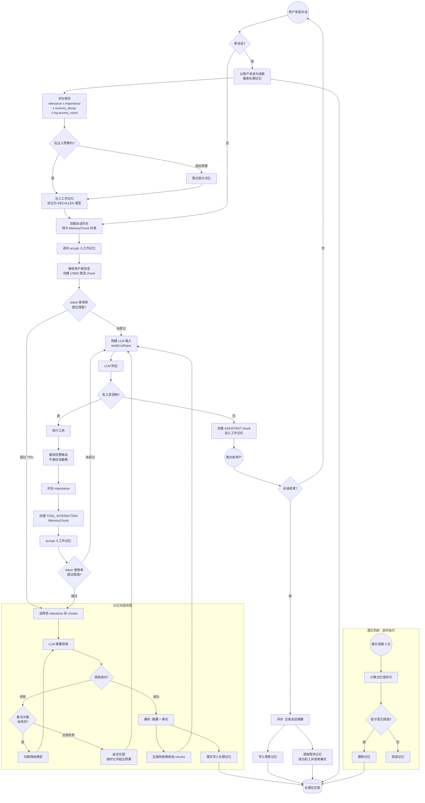

### 6.2 记忆类型流转对照

| 流转阶段 | 输入 | 处理 | 输出 | 记忆类型变化 |
|---------|------|------|------|------------|
| 工具输出入库 | 工具完整输出 | 评估 importance，创建 MemoryChunk | MemoryChunk | 无 → TOOL_INTERACTION |
| 进入工作记忆 | MemoryChunk | WorkingMemory.accept | 活跃 chunk | TOOL_INTERACTION 进入工作区 |
| 记忆巩固 | 旧的低 relevance chunks | LLM 摘要 + 事实提取 | 压缩块 + 事实 | TOOL_INTERACTION → CONSOLIDATED + 语义/情景事实 |
| 长期存储 | 提取的事实 / 会话摘要 | LongTermMemory.store | 持久化条目 | 事实 → episodic/semantic/procedural |
| 线索检索 | 用户新消息作为线索 | MemoryRetrieval.retrieve | 召回的 chunks | episodic/semantic/procedural → RECALLED |
| 遗忘 | 低分长期记忆 | ForgettingScheduler | 删除 | 记忆条目 → 删除 |

### 6.3 Plan 模式下的记忆流转

Plan 模式是 JavaClaw 的多步骤任务执行模式，Agent 按计划分步执行。Plan 模式下记忆流转有以下特殊之处：

#### 6.3.1 Plan 模式 vs 普通模式的差异

| 维度 | 普通对话模式 | Plan 模式 |
|------|------------|----------|
| **历史加载范围** | 整个会话的历史 | 仅当前 Plan 相关的历史（按 plan_id 筛选） |
| **系统提示** | 标准 system prompt | 标准 prompt + Plan 执行上下文（已完成步骤、当前步骤、待执行步骤） |
| **工作记忆内容** | 对话历史 + 工具交互 | 对话历史 + 工具交互 + Plan 状态（作为 SYSTEM chunk 的一部分） |
| **巩固时的 importance** | 标准评估 | Plan 当前步骤相关的 chunks 获得更高 importance |
| **会话结束记忆** | 整体会话摘要 | Plan 执行结果摘要（包含各步骤完成状态） |

#### 6.3.2 Plan 模式记忆流转图

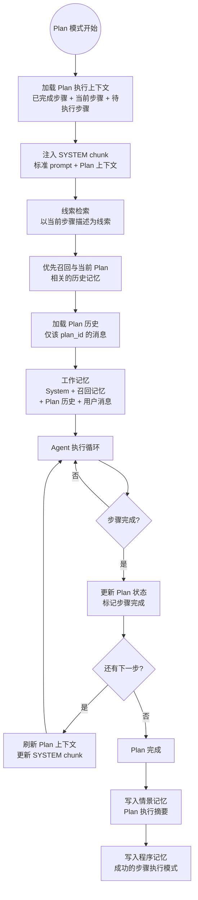

#### 6.3.3 Plan 模式下 chunk importance 的特殊规则

在 Plan 模式中，importance 评估增加了**任务对齐度（task_alignment）**：

```
importance = base_importance × task_alignment_boost
```

| 内容类型 | 普通模式 importance | Plan 模式 importance |
|---------|-------------------|---------------------|
| 与当前步骤直接相关的工具输出 | 0.5-0.8 | 0.9（boost x1.5） |
| 与已完成步骤相关的工具输出 | 0.5-0.8 | 0.3（降低，已是过去式） |
| 与待执行步骤相关的内容 | 0.5 | 0.7（预备知识保留） |
| 与 Plan 无关的对话 | 0.5 | 0.2（优先巩固） |

**效果**：巩固时优先压缩与 Plan 无关的内容和已完成步骤的详细输出，保留当前步骤和待执行步骤的完整上下文。

#### 6.3.4 Plan 完成后的记忆提取

当 Plan 执行完成时，异步提取两类长期记忆：

**情景记忆（Episodic）**：
- "执行了一个 5 步的代码重构 Plan，修改了 auth 模块的 3 个文件，所有测试通过"
- 包含：Plan 名称、步骤概要、关键结果、遇到的问题和解决方案

**程序记忆（Procedural）**：
- "重构任务的有效执行模式：先读取现有代码→分析依赖关系→逐文件修改→运行测试→修复失败"
- 下次遇到类似 Plan 时，可从程序记忆中召回有效的执行策略

---

### 6.4 端到端时序图

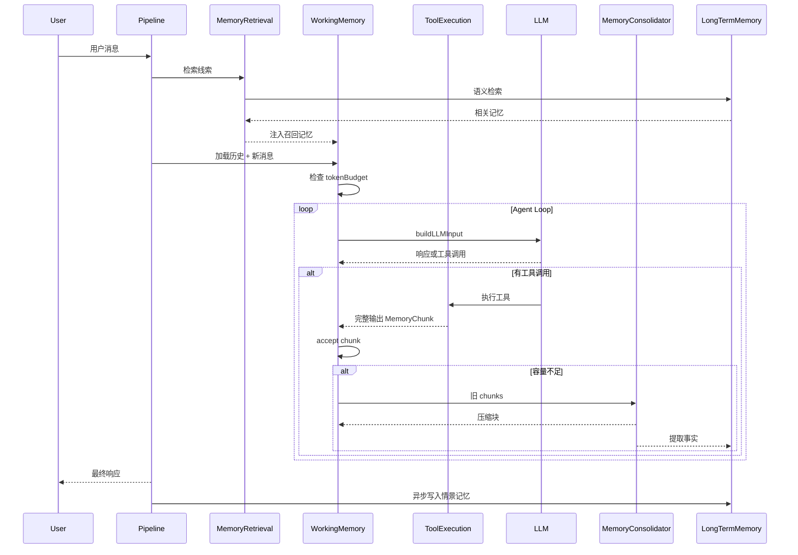

---

## 七、性能分析：每次对话不会变慢

### 7.1 各环节耗时估算

| 环节 | 触发频率 | 预计耗时 | 是否阻塞用户 | 与现有系统对比 |
|------|---------|---------|-------------|-------------|
| **工具输出入库** | 每次工具调用 | <1ms | 否（直接创建 chunk） | 与现有方式相当（去掉了截断开销） |
| **工作记忆 accept** | 每次新消息/工具结果 | <1ms | 否（内存操作） | 与现有 addToolResultChars 相当 |
| **buildLLMInput** | 每轮 LLM 调用 | <1ms | 否（列表组装） | 与现有 history 组装相当 |
| **记忆巩固** Consolidation | 仅当 token 使用率超过阈值时 | 1-3s | 是（LLM 调用） | **新增开销**，但仅偶尔触发 |
| **线索检索** Retrieval | 仅在新会话开始时 | 10-50ms | 否（数据库查询） | 替代现有 LIMIT 50 查询，耗时相近 |
| **长期记忆写入** | 仅在会话结束时 | 异步 | 否（异步执行） | **新增**，但完全异步 |
| **遗忘清理** | 每天凌晨 3 点 | 离线批处理 | 否 | **新增**，离线执行 |

### 7.2 关键结论

**工作记忆管理、LLM 输入构建等操作不增加延迟**——都是毫秒级的纯内存操作，与现有系统耗时相当。

**唯一的新增开销是记忆巩固（1-3 秒）**，但它有以下特点：

1. **低触发频率**：只在 token 使用率超过 75% 时才触发，一次对话中通常触发 0-2 次
2. **使用轻量模型**：巩固使用 qwen-turbo 等快速模型（而非主模型），延迟更低
3. **节省后续 token**：巩固释放的 token 空间意味着后续 LLM 调用的输入更短，反而**加速**后续轮次
4. **对比现有方案**：现有的 ContextCondenser 虽然是 0ms（纯截断），但导致信息丢失后 Agent 经常**重复调用工具**，浪费了远超 3 秒的时间

### 7.3 耗时对比：一次 50 轮对话

```
                    现有系统              新记忆架构
────────────────────────────────────────────────────
历史加载            ~20ms (LIMIT 50)     ~30ms (检索+加载)
每轮上下文管理      ~2ms (tracker)       ~3ms (WM管理)
工具输出处理        ~0ms (盲截断)        ~0ms (直接入库，不截断)
巩固触发           无                   ~2s (LLM，触发0-2次)
因信息丢失重复工具   ~30s (估算6次重复)   ~0s (信息未丢失)
────────────────────────────────────────────────────
总额外开销          ~30s (隐性浪费)      ~4s (显性投资)
```

**结论**：新架构的显性开销（巩固 LLM 调用约 4 秒）远小于现有系统的隐性浪费（因截断丢失信息导致的重复工具调用约 30 秒）。工具输出不做截断直接入库，减少了处理环节，整体上对话效率**提升而非下降**。

### 7.4 异步优化策略

对于对延迟极度敏感的场景，可进一步异步化：

```java
// 巩固可以在下一轮 LLM 调用前异步完成
CompletableFuture<ConsolidationResult> future =
    CompletableFuture.supplyAsync(() -> consolidator.consolidate(chunks));
// 用户正在阅读上一轮的输出时，巩固在后台并行执行
```

---

## 八、配置简化对比

### 7.1 现有配置（12+ 参数）

```yaml
# 分散在不同层级的 12+ 个配置/常量
javaclaw.agent.history-limit: 50
javaclaw.agent.max-context-tokens: 128000
javaclaw.agent.max-tool-result-chars: 16000
javaclaw.agent.max-turns: 128
javaclaw.agent.condenser-keep-recent: 20
javaclaw.agent.condenser-summary-length: 200
javaclaw.agent.condenser-min-turns-between: 5
# 硬编码常量（未暴露为配置）
TOTAL_MAX_CHARS: 150000
ExecTool.MAX_OUTPUT_CHARS: 8000
FileReadTool.MAX_LINES_PER_READ: 500
WebSearchTool.maxResults: 10
ToolResultCache.MAX_ENTRIES: 50
```

### 7.2 新架构配置（6 个核心参数）

```yaml
javaclaw:
  memory:
    # 感觉寄存器层: 当前无需配置（工具输出直接入库）

    working:
      token-budget: 128000                # 工作记忆: 唯一容量约束
      consolidation-threshold: 0.75       # 触发巩固的使用率

    consolidation:
      model: qwen-turbo                   # 巩固首选模型
      fallback-model: qwen-lite           # 巩固降级模型

    long-term:
      enabled: false                      # 长期记忆开关
      max-injection-tokens: 2048          # 检索注入预算
```

**简化效果**：从 12+ 个含义分散的参数减少到 **6 个语义清晰** 的参数，且每个参数都能直接映射到人脑记忆的一个概念。**彻底去除截断机制**——信息不会被盲目丢弃。

---

## 八、实施路线

### Phase 0: 模块创建与基础搭建（1 周）

创建独立的 `javaclaw-memory` Maven 模块，建立基础架构。

| 任务 | 交付物 |
|------|-------|
| 创建 `javaclaw-memory` 模块目录和 pom.xml | Maven 模块骨架 |
| 在父 POM 的 `<modules>` 中注册 | 构建集成 |
| 在 `javaclaw-agent` 和 `javaclaw-gateway` 中添加依赖 | 依赖链建立 |
| `MemoryProperties` 配置类 + `MemorySystem` 门面骨架 | 配置和 API 框架 |
| `MemoryChunk` / `ChunkType` / `ContentCategory` 模型类 | 公共数据模型 |

### Phase A: 感觉寄存器 + 工作记忆 + 记忆巩固（2-3 周）

解决最核心的问题——统一上下文管理模型、用 LLM 摘要替代盲截断。

| 周 | 任务 | 交付物 |
|----|------|-------|
| W1 | `ImportanceAssessor` + 工具输出完整入库机制 | 废弃截断，工具输出直接进入工作记忆 |
| W1 | `WorkingMemory` 核心（token 预算、分块、巩固触发） | 统一上下文管理器 |
| W2 | `MemoryConsolidator`（LLM 摘要 + 重试 + 降级模型） | 智能巩固 |
| W2 | 重构 `AgentRuntime`：通过 `MemorySystem` API 管理上下文 | Agent 侧迁移 |
| W2 | 从 `AgentRuntime` 移除 ContextWindowTracker / ContextCondenser / truncateToolResult | 旧代码清理 |
| W2 | 工具调用链持久化（DB Schema + 写入逻辑） | 巩固数据基础 |
| W3 | 重构 `MessagePipeline`：通过 `MemorySystem` 加载历史 | Gateway 侧迁移 |
| W3 | 集成测试 + 回归测试 + 配置迁移文档 | 质量保障 |

### Phase B: 长期记忆 + 线索检索 + 遗忘机制（2-3 周）

构建跨会话记忆能力——当前完全缺失的功能。

| 周 | 任务 | 交付物 |
|----|------|-------|
| W1 | `LongTermMemory` 三子系统 + `agent_memory` DB Schema (Flyway) | 长期记忆基础设施 |
| W1 | `MemoryRetrieval` 线索检索 + 评分公式 | 智能检索替代 LIMIT N |
| W2 | 会话结束时的情景记忆写入 | 跨会话情景记忆 |
| W2 | 巩固过程中的语义事实提取 | 自动知识积累 |
| W2 | 新会话开始时的记忆召回注入 | 记忆驱动的上下文初始化 |
| W3 | `ForgettingScheduler` 遗忘定时任务 | 记忆库健康管理 |
| W3 | 集成测试 + 性能测试 | 质量保障 |

---

## 九、与现有方案的关键差异

| 维度 | 现有 Phase 1/2/3 方案 | 人脑记忆架构 |
|------|---------------------|------------|
| **设计哲学** | 在碎片化机制上叠加新机制 | 用统一模型替代所有碎片化机制 |
| **核心抽象** | Condenser 接口 + 多种实现 + EventStore + ContextView + MemoryService | 3 层记忆 + 2 个过程（5 个组件） |
| **配置复杂度** | 12+ 参数 + 新增参数 | 5 个参数 |
| **容量控制** | 多个独立阈值互不感知 | 单一 tokenBudget 全局协调 |
| **压缩策略** | 策略可插拔但仍是"压缩" | "巩固"——摘要 + 事实提取一体化 |
| **长期记忆** | Phase 2 才涉及，与压缩独立设计 | 巩固过程自然产生长期记忆 |
| **理论基础** | 工程经验 + 业界对标 | 70 年认知心理学 + 神经科学研究 |
| **心智模型** | Condenser / Tracker / Pipeline / EventStore | 感觉 / 工作记忆 / 长期记忆 → 直觉可理解 |

---

## 十、风险与缓解

| 风险 | 影响 | 缓解措施 |
|------|------|---------|
| **模块拆分带来的回归风险** | 迁移过程中现有行为可能改变 | Phase 0 先建模块骨架不迁代码；Phase A 逐步迁移并保持旧代码可回退 |
| **跨模块 API 设计不当** | 模块耦合度过高或 API 过于复杂 | MemorySystem 作为唯一门面；内部实现对外不可见 |
| LLM 巩固增加延迟 | 每次巩固 1-3s | 使用轻量模型；设置超时；重试+降级模型策略 |
| LLM 巩固丢失关键信息 | 后续决策错误 | 巩固 prompt 强调保留关键细节；保留最近 chunks 原文 |
| 长期记忆注入不当 | 过时记忆干扰当前任务 | 遗忘曲线 + importance 衰减；用户可手动清理 |
| 大工具输出快速占满 tokenBudget | 频繁触发巩固 | 巩固使用轻量模型；异步巩固；未来升级为子 Agent 委派 |
| 向量检索基础设施 | Phase B 需要嵌入模型 | 初期可用关键词匹配；后续引入向量检索 |
| **Flyway 迁移脚本位置** | agent_memory 表的 migration 放在哪个模块 | Flyway 脚本保留在 javaclaw-gateway（主应用），memory 模块仅定义 Entity |

---

## 十一、参考文献

### 认知心理学与神经科学

1. Atkinson, R. C., & Shiffrin, R. M. (1968). Human memory: A proposed system and its control processes. *Psychology of Learning and Motivation*, 2, 89-195.
2. Sperling, G. (1960). The information available in brief visual presentations. *Psychological Monographs*, 74(11), 1-29.
3. Miller, G. A. (1956). The magical number seven, plus or minus two: Some limits on our capacity for processing information. *Psychological Review*, 63(2), 81-97.
4. Baddeley, A. D., & Hitch, G. (1974). Working memory. In G. H. Bower (Ed.), *Psychology of Learning and Motivation*, Vol. 8, pp. 47-89.
5. Baddeley, A. D. (2000). The episodic buffer: a new component of working memory? *Trends in Cognitive Sciences*, 4(11), 417-423.
6. Cowan, N. (1999). An embedded-processes model of working memory. In *Models of Working Memory*, pp. 62-101. Cambridge University Press.
7. Tulving, E. (1972). Episodic and semantic memory. In E. Tulving & W. Donaldson (Eds.), *Organization of Memory*, pp. 381-403.
8. Squire, L. R. (1992). Memory and the hippocampus: A synthesis from findings with rats, monkeys, and humans. *Psychological Review*, 99(2), 195-231.
9. Squire, L. R., & Zola, S. M. (1996). Structure and function of declarative and nondeclarative memory systems. *PNAS*, 93(24), 13515-13522.
10. Tulving, E., & Thomson, D. M. (1973). Encoding specificity and retrieval processes in episodic memory. *Psychological Review*, 80(5), 352-373.
11. Roediger, H. L., & Karpicke, J. D. (2006). Test-enhanced learning. *Psychological Science*, 17(3), 249-255.
12. Ebbinghaus, H. (1885). *Uber das Gedachtnis*. Leipzig: Duncker & Humblot.
13. Murre, J. M., & Dros, J. (2015). Replication and analysis of Ebbinghaus' forgetting curve. *PLOS ONE*, 10(7), e0120644.
14. Bhatt, D. H., et al. (2016). Forgetting of long-term memory requires activation of NMDA receptors. *Scientific Reports*, 6, 22771.
15. McClelland, J. L., McNaughton, B. L., & O'Reilly, R. C. (1995). Why there are complementary learning systems. *Psychological Review*, 102(3), 419-457.
16. Diekelmann, S., & Born, J. (2010). The memory function of sleep. *Nature Reviews Neuroscience*, 11(2), 114-126.
17. Frankland, P. W., & Bontempi, B. (2005). The organization of recent and remote memories. *Nature Reviews Neuroscience*, 6(2), 119-130.

### AI Agent 上下文管理

18. OpenHands — LLMSummarizingCondenser, PipelineCondenser, Event Store + View 投影
19. Cursor — 动态上下文发现, 大输出文件化, RL 自摘要
20. DeerFlow — SummarizationMiddleware + MemoryMiddleware
21. LangGraph — trim_messages, Checkpointer, Store
22. CrewAI — Unified Memory, 分层检索 (相似度×时效×重要性)

---

## 十二、与现有文档的关系

| 文档 | 关系 |
|------|------|
| [上下文管理主流方案调研报告](上下文管理主流方案调研报告.md) | 本方案的业界对标基础，调研结论被本方案吸收并以人脑模型重新组织 |
| [JavaClaw上下文管理优化设计方案](JavaClaw上下文管理优化设计方案.md) | 本方案的替代方案；如采纳本方案则该文档归档为历史参考 |
| [上下文压缩行为全景清单](../上下文压缩行为全景清单.md) | 本方案的现状基线；Phase A 完成后需同步更新 |
