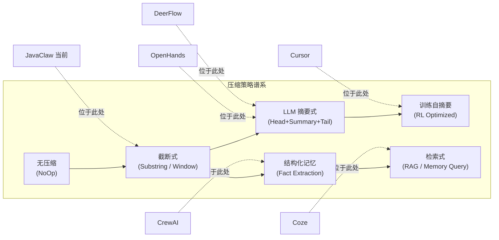

# AI Agent 上下文管理主流方案调研报告

> 调研时间：2026-04
>
> 调研范围：OpenHands、Cursor、DeerFlow、LangGraph/LangChain、AutoGen、CrewAI、Dify/Coze 共 7 个主流 Agent 框架/产品

---

## 一、调研背景与目的

大模型 Agent 在多轮对话和复杂工具调用场景下，上下文窗口管理是影响任务成功率、推理成本和用户体验的关键因素。本报告系统梳理当前主流 Agent 项目在以下四个维度的实现策略：

1. **上下文窗口管理** — 如何在有限 token 预算内组织对话历史
2. **持久化与记忆** — 会话内和跨会话的状态存储机制
3. **压缩与摘要策略** — 上下文超限时的信息保留方法
4. **工具结果处理** — 工具调用输出在上下文中的管理方式

---

## 二、各框架详细分析

### 2.1 OpenHands（原 OpenDevin）

**项目地址**: [github.com/All-Hands-AI/OpenHands](https://github.com/All-Hands-AI/OpenHands)

#### 核心架构：事件日志 + View 投影

OpenHands 的上下文管理围绕一个 **append-only 的事件日志（Event Log）** 构建。Agent 的所有交互——消息、工具调用、观察结果——都以 **强类型事件（Event）** 的形式追加到日志中，原始事件永远不被删除。

LLM 实际看到的上下文是一个 **View**：通过 `View.from_events()` 从完整事件日志中投影而来。Condenser 的职责是决定哪些事件在 View 中可见、哪些被替换为摘要。

```
完整事件日志（不可变）
    ↓ View.from_events()
LLM 可见的 View = [保留的 head 事件] + [摘要] + [保留的 tail 事件]
    ↓ events_to_messages()
实际发送给 LLM 的消息列表
```

#### 上下文窗口管理

- 事件数量触发：View 中事件数超过 `max_size`（默认 120）时启动压缩
- 压缩后目标大小约为 `max_size / 2`（约 60 事件）
- 支持 `CondensationRequest` 应急机制：当 LLM 返回"context window exceeded"错误时，强制触发压缩

#### 压缩策略：LLM 摘要式 Condenser

`LLMSummarizingCondenser` 是核心压缩器，采用 **head + summary + tail** 三段式策略：

| 区域 | 处理方式 |
|------|---------|
| **Head**（前 `keep_first` 条，默认 4） | 原样保留（通常包含系统设置、初始上下文） |
| **Middle**（head 与 tail 之间） | 由独立 LLM 实例生成摘要，替换为单条 `CondensationSummaryEvent` |
| **Tail**（最近的事件） | 原样保留（保持最新交互的完整性） |

关键设计：
- 摘要聚焦于 **用户目标、当前进展、剩余工作**，而非逐条复述
- 支持使用独立的（通常更便宜的）模型来生成摘要（`usage_id="condenser"`）
- 压缩记录（`Condensation`）本身也是事件，包含 `forgotten_event_ids` 和 `summary`
- 设计上兼顾 **Prompt Cache**：避免过于频繁的压缩导致缓存失效

#### 其他 Condenser 类型

| 类型 | 说明 |
|------|------|
| `NoOpCondenser` | 不压缩，View 等于完整事件日志 |
| `PipelineCondenser` | 链式组合多个压缩阶段（如先裁剪再摘要） |
| `RollingCondenser` | 滚动窗口基类，支持自定义触发逻辑 |

#### 持久化

- 每个 Conversation 独立目录：`base_state.json` + `events/event-NNNNN-<id>.json`
- 每个事件一个文件，append-only，支持增量恢复
- 压缩不删除底层事件文件——仅在 View 中标记为"forgotten"

#### 工具结果处理

- `ActionEvent`（agent 发起的工具调用）→ LLM `assistant` 角色 + `tool_calls`
- `ObservationEvent`（工具执行结果）→ LLM `tool` 角色
- 并行工具调用通过 `llm_response_id` 分组，合并为一条 assistant 消息
- 压缩时 action/observation 对作为整体被摘要替换

---

### 2.2 Cursor

**产品地址**: [cursor.com](https://www.cursor.com)

#### 核心架构：训练时自摘要 + 动态上下文发现

Cursor 的上下文管理分为两个层面：**产品层 harness**（工具/规则/搜索）和 **模型层 Composer**（自摘要训练）。

#### 上下文窗口管理

- 有限窗口 + 摘要：窗口填满时自动或手动触发摘要，Agent 获得一个压缩后的"全新窗口"
- 摘要后的历史可搜索：聊天历史以文件形式暴露，Agent 可以搜索被摘要遗漏的细节
- 用户可通过 `@Past Chats` 在新会话中选择性引用旧对话内容

#### 压缩策略：RL 训练的自摘要

Cursor 为其 Composer 模型设计了 **强化学习训练的自摘要机制**：

1. 接近固定 token 长度触发时，生成暂停
2. 模型获得 scratch space，生成 **压缩后的上下文**（包含计划、剩余任务、摘要计数等状态）
3. 整个过程在 RL 训练中端到端优化——好的摘要（不丢失关键信息）获得更高奖励

与传统 prompt-based 摘要对比：
- 摘要 prompt 更短
- 平均摘要体积约 ~1k tokens（对比传统 ~5k+）
- ~5x token 效率提升
- 压缩错误率降低约 50%
- 支持 KV Cache 复用

#### 动态上下文发现

核心理念：**减少预加载的静态上下文，让 Agent 按需拉取**。

| 机制 | 说明 |
|------|------|
| Rules（静态） | `.cursor/rules/` 中的规则，每次对话加载 |
| Skills（动态） | 仅名称/描述在静态 prompt 中，完整内容按需读取 |
| MCP 工具描述 | 同步到文件夹，Agent 按需查找——实测减少约 47% Agent 总 token 消耗 |

#### 工具结果处理：文件作为接口

- 大体量工具输出写入文件，Agent 通过 `tail` / 按需读取获取
- 终端会话同步到文件系统，Agent 可以 grep 相关部分
- 避免将巨大 JSON 直接内联到上下文——防止盲目截断导致信息丢失

---

### 2.3 DeerFlow（字节跳动）

**项目地址**: [github.com/bytedance/deer-flow](https://github.com/bytedance/deer-flow)

#### 核心架构：LangGraph + 中间件链

DeerFlow 基于 LangGraph 构建，采用中间件链架构（9 个中间件），其中 `SummarizationMiddleware` 和 `MemoryMiddleware` 负责上下文管理。

#### 上下文窗口管理

标准 LangGraph 状态中的消息列表 + 可选的自动摘要中间件。

#### 压缩策略：SummarizationMiddleware

支持三种触发条件（OR 逻辑）：
- **Token 数量**超过阈值
- **消息条数**超过阈值
- 达到模型最大输入的**指定比例**

压缩行为：
- 保留最近的 N 条消息（默认 `keep=20`）
- 旧消息块由 LLM 生成摘要
- AI/Tool 消息对保持完整性（不拆分工具调用和结果）
- 摘要以 `HumanMessage` 形式注入（"Here is a summary…"）
- token 估算采用近似算法（如 Anthropic 约 3.3 chars/token）

#### 长期记忆：MemoryMiddleware

- 存储在本地文件 `backend/.deer-flow/memory.json`
- 仅从 `HumanMessage` / `AIMessage`（无 `tool_calls`）中提取事实
- 事实属性：confidence、category、source thread
- 去抖动更新（默认 30s 间隔）
- 注入时受 `max_injection_tokens` 和 `max_facts` 限制

#### 持久化

- LangGraph Checkpointer 持久化会话状态（含摘要后的历史）
- 长期记忆通过 `memory.json` 文件持久化
- 提供 API 端点：get / reload / config

---

### 2.4 LangGraph / LangChain

**项目地址**: [github.com/langchain-ai/langgraph](https://github.com/langchain-ai/langgraph)

#### 核心架构：图状态 + 检查点 + 可选摘要

LangGraph 作为底层框架，提供灵活但需要手动编排的上下文管理原语。

#### 上下文窗口管理

- **State messages**: 对话历史存储在图的 `messages` state 中
- **trim_messages**: 内置工具函数，按 token 预算裁剪消息列表
- 重要约束：裁剪时必须保持 `tool_calls` ↔ `ToolMessage` 的配对完整性

#### 压缩策略

| 方式 | 说明 |
|------|------|
| `trim_messages` | 按 token 数裁剪，保留最近 N 条 |
| LangMem `summarize_messages` | 运行摘要 + 保留尾部 |
| 自定义 Summarization 中间件 | token 阈值触发 → LLM 摘要 → 替换旧消息 |

#### 持久化

| 层级 | 机制 |
|------|------|
| 会话内 | Checkpointer（`InMemorySaver`, `SqliteSaver`, `PostgresSaver`）按 `thread_id` 快照 |
| 跨会话 | Store 抽象：命名空间化的文档存储，跨 thread 可检索 |
| 外部 | RAG 知识库、自定义存储 |

#### 工具结果处理

- `ToolMessage` 与 `AIMessage.tool_calls` 配对
- `trim_messages` 内置孤立 `ToolMessage` 处理逻辑——自动移除无对应 `tool_calls` 的消息

---

### 2.5 Microsoft AutoGen

**项目地址**: [github.com/microsoft/autogen](https://github.com/microsoft/autogen)

#### 核心架构：Memory 协议 + model_context

AutoGen 通过统一的 Memory 协议管理上下文，核心操作为 `add`、`query`、`update_context`、`clear`、`close`。

#### 上下文窗口管理

- `model_context` 是发送给 LLM 的消息列表
- `MessageHistoryLimiter` Transform：按条数限制，自动保持 `tool_call` + `tool` 消息对的完整性
- `TransformMessages` 管道：支持链式组合多个消息变换

#### 压缩策略

- 文档级推荐自定义 `model_context` 的 token/消息数限制
- 社区讨论中有对自动摘要的需求，但非默认内置

#### 持久化

- `save_state` / `load_state` API：序列化 `model_context`（消息列表）及其他 Agent 状态
- 需要应用层显式调用

#### 工具结果处理

- 工具结果作为标准消息存在于 `model_context`
- `MessageHistoryLimiter` 在截断时保持 tool_calls / tool 消息配对

---

### 2.6 CrewAI

**项目地址**: [github.com/crewAIInc/crewAI](https://github.com/crewAIInc/crewAI)

#### 核心架构：统一记忆系统

CrewAI 采用结构化的 **Unified Memory** 系统，通过 `remember` / `recall` / `forget` 三个核心操作管理记忆。

#### 上下文窗口管理

- 隐式管理：通过 prompt 组装 + 模型 token 限制约束
- 任务输出和先前交互传入 LLM prompt
- 无内置的 trim/summarize 中间件

#### 压缩策略：结构化记忆 + 检索

不同于摘要式压缩，CrewAI 采用 **事实抽取 + 分层检索** 策略：
- 自动从任务输出中提取事实（`memory=True` 启用）
- 记忆存储在分层树路径中
- 检索时综合 **相似度 + 时效性 + 重要性** 排序
- 任务执行前自动 recall 相关记忆注入 prompt

#### 持久化

- Unified Memory 支持序列化
- 优化：排除 embedding 向量的序列化以减少体积

#### 工具结果处理

- 工具输出通过 task/agent 叙事流入上下文
- 大工具输出可能触及 embedding 模型的 token 限制（需分块处理）

---

### 2.7 Dify / Coze（扣子）

#### Dify

**项目地址**: [github.com/langgenius/dify](https://github.com/langgenius/dify)

- **窗口管理**: TokenBufferMemory 风格，可配置窗口大小（轮次），有 ~2000 token 和 ~500 消息的产品级硬上限
- **持久化**: 按 `conversation_id` 的会话短期缓存 + 知识库（向量数据库）+ 会话变量（结构化字段）
- **压缩策略**: 以窗口截断为主，无默认的自动摘要
- **工具结果**: 在消息图中与普通消息同等对待，大工具 JSON 需工作流层面处理

#### Coze（扣子）

**产品地址**: [coze.cn](https://www.coze.cn)

- **窗口管理**: 模型对话轮次上限 + 长期记忆检索节点
- **持久化**: 变量（用户级/系统级）+ 数据库节点 + 长期记忆（记录 + 召回）+ 文件盒
- **压缩策略**: 检索导向——通过记忆查询节点召回关键信息，而非对全线程做摘要
- **工具结果**: 工作流节点输出按节点设计传递，大输出通常在前置步骤中摘要

---

## 三、对比矩阵

### 3.1 四维度横向对比

| 框架 | 窗口管理策略 | 持久化机制 | 压缩/摘要策略 | 工具结果处理 |
|------|-------------|-----------|--------------|-------------|
| **OpenHands** | 事件数触发（max_size=120） | 事件文件（per-event JSON）+ base_state.json | **LLM 摘要**：head + summary + tail | Action/Observation 强类型事件，并行调用分组 |
| **Cursor** | token 预算 + 自动摘要 | 聊天历史文件化，可搜索 | **RL 训练的自摘要**（~1k tokens，5x 效率） | **文件化输出**，按需读取而非内联 |
| **DeerFlow** | token/消息数/比例三种触发 | Checkpointer + memory.json | **LLM 摘要** + 事实抽取长期记忆 | AI/Tool 对保持完整性 |
| **LangGraph** | trim_messages + 手动编排 | Checkpointer（多后端）+ Store | **可选 LLM 摘要** / trim 裁剪 | ToolMessage ↔ tool_calls 配对保护 |
| **AutoGen** | MessageHistoryLimiter + model_context | save_state / load_state API | 自定义 transform 管道 | Limiter 保持 tool 对完整 |
| **CrewAI** | 隐式（prompt + 模型限制） | Unified Memory 序列化 | **结构化记忆检索**（非摘要） | 通过 task 叙事传递 |
| **Dify/Coze** | TokenBuffer 窗口 / 轮次上限 | conversation_id + 知识库 + 变量 | **窗口截断** / 检索召回 | 与消息同等 / 工作流处理 |

### 3.2 压缩策略分类



### 3.3 上下文生命周期对比

```mermaid
flowchart TD
    subgraph openhands_flow ["OpenHands 模式"]
        OH_Event["事件追加"] --> OH_View["View 投影"]
        OH_View --> OH_Condense{"超过 max_size?"}
        OH_Condense -->|Yes| OH_LLM_Summary["LLM 摘要 middle"]
        OH_LLM_Summary --> OH_NewView["Head + Summary + Tail"]
        OH_Condense -->|No| OH_Send["发送 LLM"]
        OH_NewView --> OH_Send
    end

    subgraph cursor_flow ["Cursor 模式"]
        C_Msg["消息追加"] --> C_Budget{"接近 token 预算?"}
        C_Budget -->|Yes| C_SelfSum["模型自摘要（RL 训练）"]
        C_SelfSum --> C_Fresh["压缩上下文 ~1k tokens"]
        C_Budget -->|No| C_Send["发送 LLM"]
        C_Fresh --> C_Send
        C_Send --> C_Search["历史可搜索回溯"]
    end

    subgraph javaclaw_flow ["JavaClaw 当前模式"]
        JC_DB["DB LIMIT 50"] --> JC_History["加载历史"]
        JC_History --> JC_Near{"token > 70%?"}
        JC_Near -->|Yes| JC_Truncate["截断旧 ToolResponse<br/>前 200 字符"]
        JC_Near -->|No| JC_Send["发送 LLM"]
        JC_Truncate --> JC_Send
    end
```



---

## 四、关键发现与启示

### 4.1 行业趋势

1. **LLM 摘要取代盲截断**：OpenHands、Cursor、DeerFlow 均采用 LLM 生成摘要而非 substring 截断，这是当前最主流的做法
2. **事件溯源 > 消息列表**：OpenHands 的 Event Store 模式允许底层数据不丢失，仅在投影层做压缩——比直接修改消息列表更灵活、可回溯
3. **工具结果特殊处理**：所有框架都认识到 tool_call/tool_response 必须配对保护；Cursor 更进一步将大输出文件化
4. **多层记忆分离**：短期（当前会话窗口）、中期（会话摘要）、长期（跨会话事实/知识库）三层逐渐成为标配
5. **动态上下文发现**：Cursor 和 DeerFlow 都在向"按需拉取"而非"预加载一切"的方向演进，显著降低 token 消耗
6. **KV Cache 友好设计**：Cursor 的自摘要机制和 OpenHands 的 head 保持策略都考虑了 KV Cache 复用

### 4.2 JavaClaw 当前差距

| 维度 | JavaClaw 现状 | 行业主流 | 差距 |
|------|-------------|---------|------|
| 压缩方式 | substring 截断（前 200 字符） | LLM 摘要 | **关键差距**：丢失大量有效信息 |
| 压缩范围 | 仅 ToolResponseMessage | 全类型消息均可压缩 | 中等差距 |
| 工具链持久化 | 不持久化 tool call/response | 强类型事件持久化 | **关键差距**：跨 turn 无法回放工具链 |
| 跨会话记忆 | 无 | 事实抽取 + 长期记忆 | 较大差距 |
| 上下文组织 | 扁平消息列表 | 事件日志 + View 投影 | 架构层差距 |
| 配置灵活性 | 部分硬编码（70% 阈值） | 全量可配置 | 小差距，易修复 |
| 工具输出管理 | 全部内联到上下文 | 大输出文件化 + 按需读取 | 中等差距 |

### 4.3 优先级建议

基于投入产出比排序：

1. **P0 — LLM 摘要式 Condenser**：参考 OpenHands 的 head + summary + tail 模式，用独立（可便宜的）LLM 做摘要，信息保留率大幅提升
2. **P0 — 工具调用链持久化**：transcript 中写入 tool_call 和 tool_response，保证跨 turn 可回放
3. **P1 — 压缩配置化**：阈值、保留策略等全部从硬编码移至 `application.yml`
4. **P1 — Pipeline Condenser**：支持多阶段压缩组合（先裁剪明显冗余，再 LLM 摘要）
5. **P2 — 跨会话长期记忆**：参考 DeerFlow 的 fact extraction
6. **P2 — 大工具输出文件化**：参考 Cursor 的文件作为接口设计
7. **P3 — 事件日志系统**：参考 OpenHands 的 Event Store，长期架构演进方向

---

## 五、参考资料

| 项目 | 核心文档 |
|------|---------|
| OpenHands | [Events 架构](https://docs.openhands.dev/sdk/arch/events)、[Condenser 架构](https://docs.openhands.dev/sdk/arch/condenser)、[持久化指南](https://docs.openhands.dev/sdk/guides/convo-persistence) |
| Cursor | [Dynamic Context Discovery](https://www.cursor.com/blog/dynamic-context-discovery)、[Self-Summarization](https://www.cursor.com/blog/self-summarization)、[Agent Best Practices](https://www.cursor.com/blog/agent-best-practices) |
| DeerFlow | [GitHub Repo](https://github.com/bytedance/deer-flow)、[Summarization 文档](https://github.com/bytedance/deer-flow/blob/main/backend/docs/summarization.md)、[Memory 概念](https://bytedance-deer-flow.mintlify.app/concepts/memory) |
| LangGraph | [Persistence How-tos](https://langchain-ai.github.io/langgraph/how-tos/persistence/)、[Long-term Memory Blog](https://blog.langchain.com/launching-long-term-memory-support-in-langgraph) |
| AutoGen | [Memory and RAG](https://microsoft.github.io/autogen/stable/user-guide/agentchat-user-guide/memory.html)、[State Tutorial](https://microsoft.github.io/autogen/stable/user-guide/agentchat-user-guide/tutorial/state.html) |
| CrewAI | [Memory Docs](https://docs.crewai.com/concepts/memory) |
| Dify | [Agent 文档](https://docs.dify.ai/en/use-dify/nodes/agent)、[会话变量 Blog](https://dify.ai/blog/dify-conversation-variables-building-a-simplified-openai-memory) |
| Coze | [长期记忆检索节点](https://www.coze.cn/open/docs/guides/memory_query_node) |
