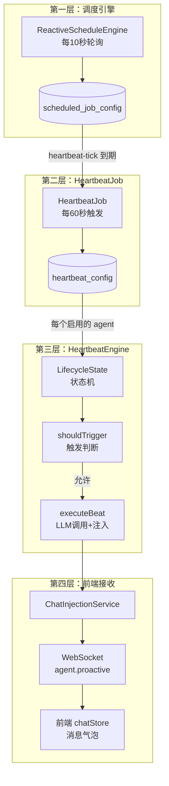
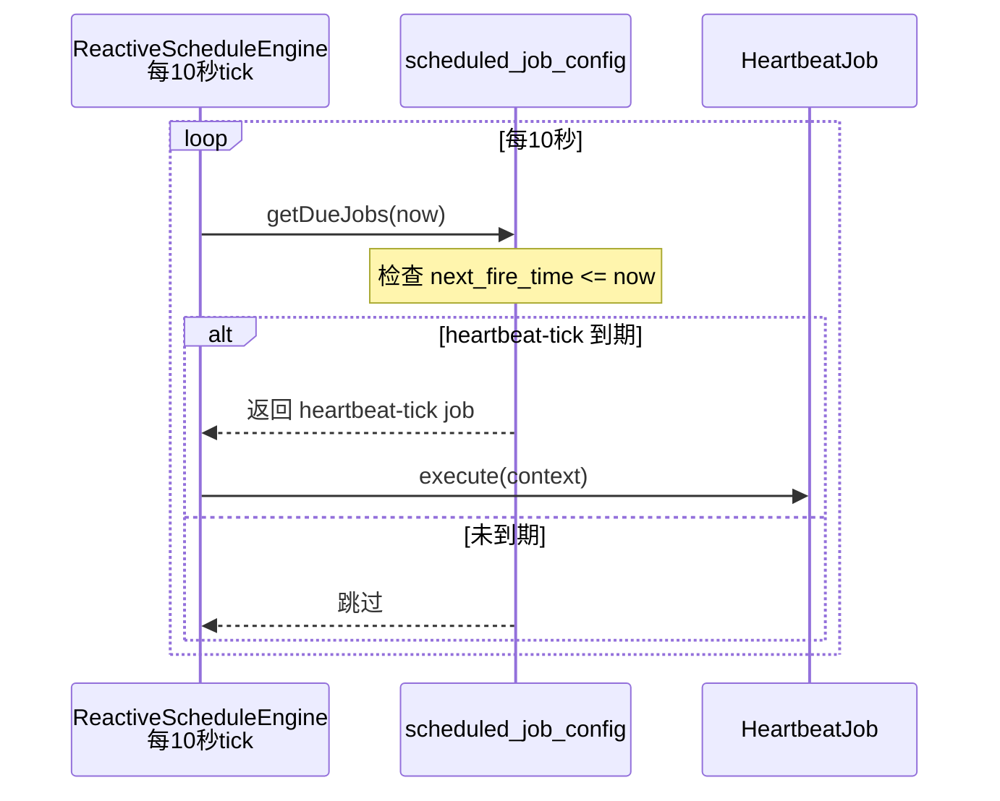
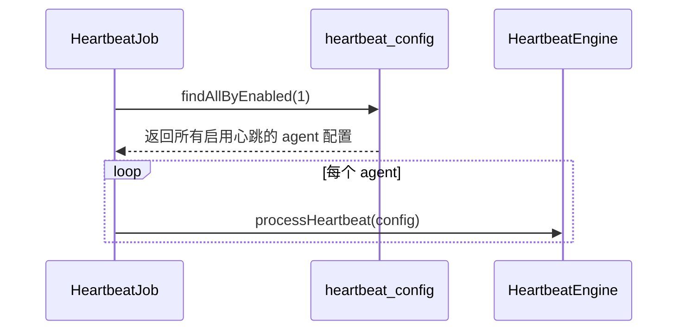
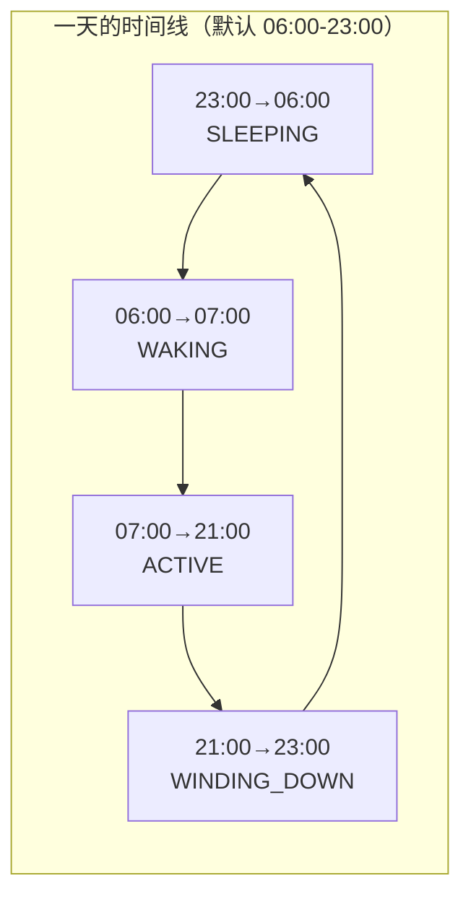
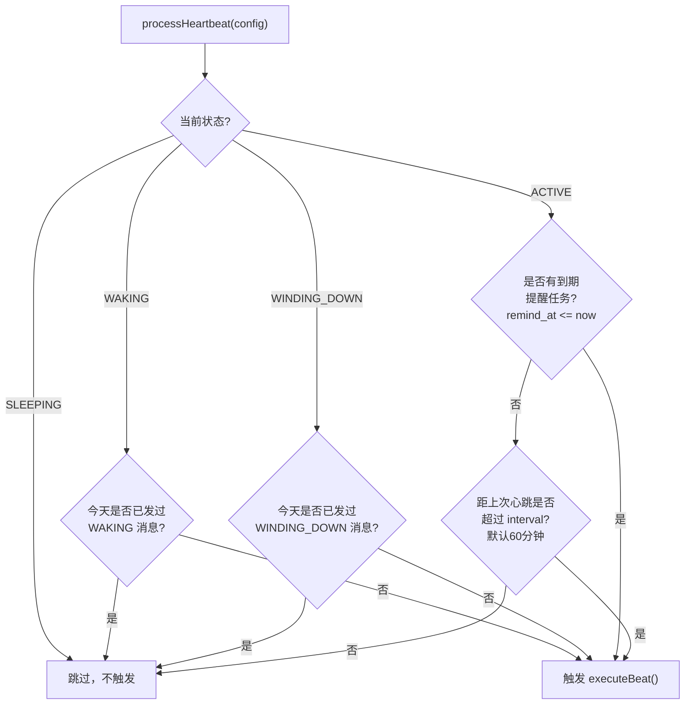
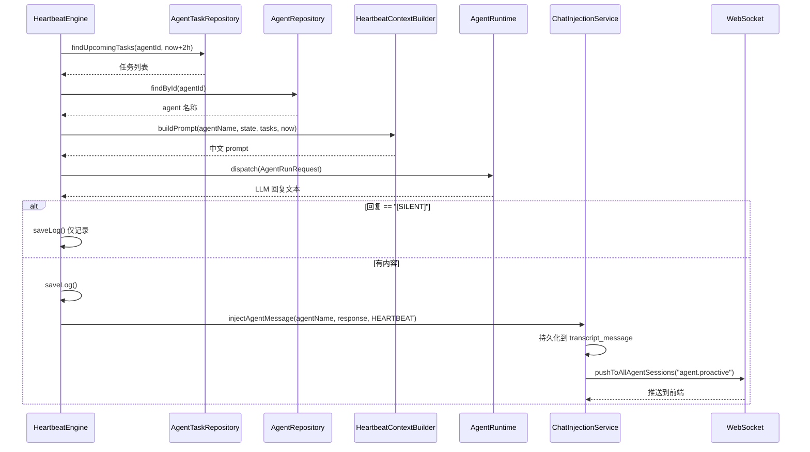
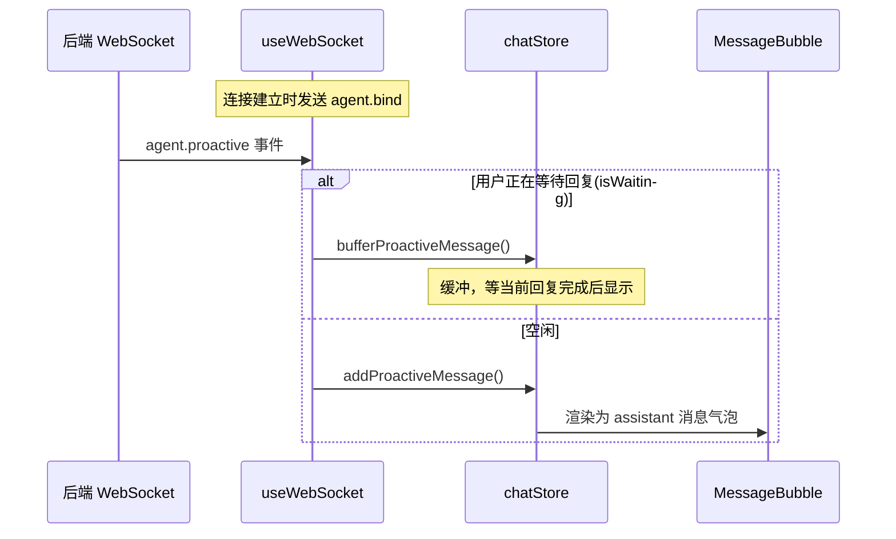
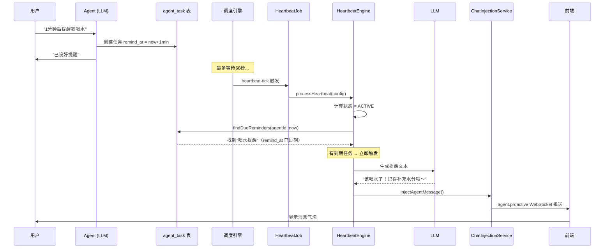

# 心跳触发机制详解

## 架构总览

心跳系统由四层组成：调度引擎 → HeartbeatJob → HeartbeatEngine → 前端接收。

## 第一层：调度引擎（时钟）

`ReactiveScheduleEngine` 是 Spring `SmartLifecycle` 服务，启动后运行一个 `Flux.interval` 定时循环。

| 参数 | 值 | 配置位置 |
|------|-----|---------|
| 轮询周期 | 10 秒 | `application.yml` → `intellimate.scheduler.tick-period-seconds` |
| heartbeat-tick 间隔 | 60 秒 | `scheduled_job_config.trigger_value = 60000` |

每次 tick 检查数据库中 `scheduled_job_config` 表里所有已启用 job 的 `next_fire_time`。`heartbeat-tick` 配置为 `FIXED_RATE = 60000ms`，所以每 60 秒被调度一次。

## 第二层：HeartbeatJob（遍历 agent）

`HeartbeatJob` 从 `heartbeat_config` 表中查出所有 `enabled=1` 的 agent 配置，逐个调用 `HeartbeatEngine.processHeartbeat(config)`。

## 第三层：HeartbeatEngine（决策 + 执行）

### 3.1 生命周期状态计算

根据当前时间和 agent 配置的 `wake_time`/`sleep_time`/`timezone`，计算出当前处于哪个生命周期状态。

| 状态 | 默认时间窗 | 说明 |
|------|-----------|------|
| SLEEPING | 23:00 → 06:00 | 不触发任何心跳 |
| WAKING | 06:00 → 07:00 | 每天一次晨间问候 |
| ACTIVE | 07:00 → 21:00 | 任务提醒 + 间隔主动消息 |
| WINDING_DOWN | 21:00 → 23:00 | 每天一次晚间总结 |

### 3.2 触发判断（shouldTrigger）

核心规则：

- **SLEEPING**：永不触发
- **WAKING / WINDING_DOWN**：每天各触发一次
- **ACTIVE**：
  - 有到期提醒任务 → **立即触发**（绕过间隔限制）
  - 无到期任务 → 检查 `heartbeat_interval_minutes`（默认 60 分钟）间隔

### 3.3 执行流程（executeBeat）

| 步骤 | 说明 |
|------|------|
| findUpcomingTasks | 查找未来 2 小时内到期的任务 |
| buildPrompt | 将 agent 名、状态、任务列表组装成中文 prompt |
| dispatch | 调用 LLM 生成自然语言回复，超时 30 秒 |
| [SILENT] | LLM 判断不需要说话时返回此标记 |
| injectAgentMessage | 持久化 + WebSocket 推送 |

LLM 调用失败时，自动降级为硬编码的占位文本（如 "早上好！新的一天开始了"）。

## 第四层：前端接收

### 离线恢复

用户断线重连时：

1. 前端发送 `agent.bind` 事件
2. 后端调用 `ChatInjectionService.deliverPendingMessages()`
3. 从 `transcript_message` 中查找 TTL 窗口内（默认 24 小时）的未送达消息
4. 逐条以 `agent.proactive` 事件推送到前端
5. 超过 TTL 的过期消息自动丢弃

## 配置参数汇总

| 参数 | 默认值 | 配置位置 | 说明 |
|------|--------|---------|------|
| tick-period-seconds | 10 | `application.yml` | 调度引擎轮询周期 |
| heartbeat-tick trigger_value | 60000 (60s) | `scheduled_job_config` DB | 心跳检查频率 |
| heartbeat_interval_minutes | 60 | `heartbeat_config` DB（每 agent） | 无任务时的主动消息间隔 |
| wake_time / sleep_time | 06:00 / 23:00 | `heartbeat_config` DB（每 agent） | 活跃窗口 |
| timezone | Asia/Shanghai | `heartbeat_config` DB（每 agent） | 时区 |
| enabled | 0（默认关闭） | `heartbeat_config` DB（每 agent） | 需手动开启 |
| LLM 超时 | 30s | `HeartbeatEngine.LLM_TIMEOUT` | LLM 调用超时 |
| message-ttl-hours | 24 | `application.yml` → `intellimate.proactive` | 主动消息有效期 |
| replay-limit | 20 | `application.yml` → `intellimate.proactive` | 重连时最大回放数 |
| log-retention-days | 30 | `application.yml` → `intellimate.scheduler` | 日志保留天数 |

## 完整示例：一个提醒任务的生命周期

用户说："1 分钟后提醒我喝水"

