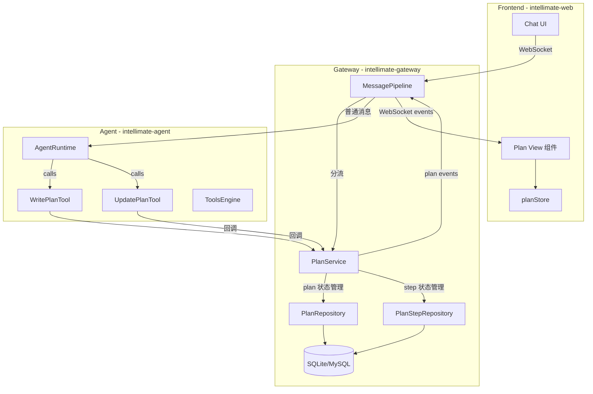
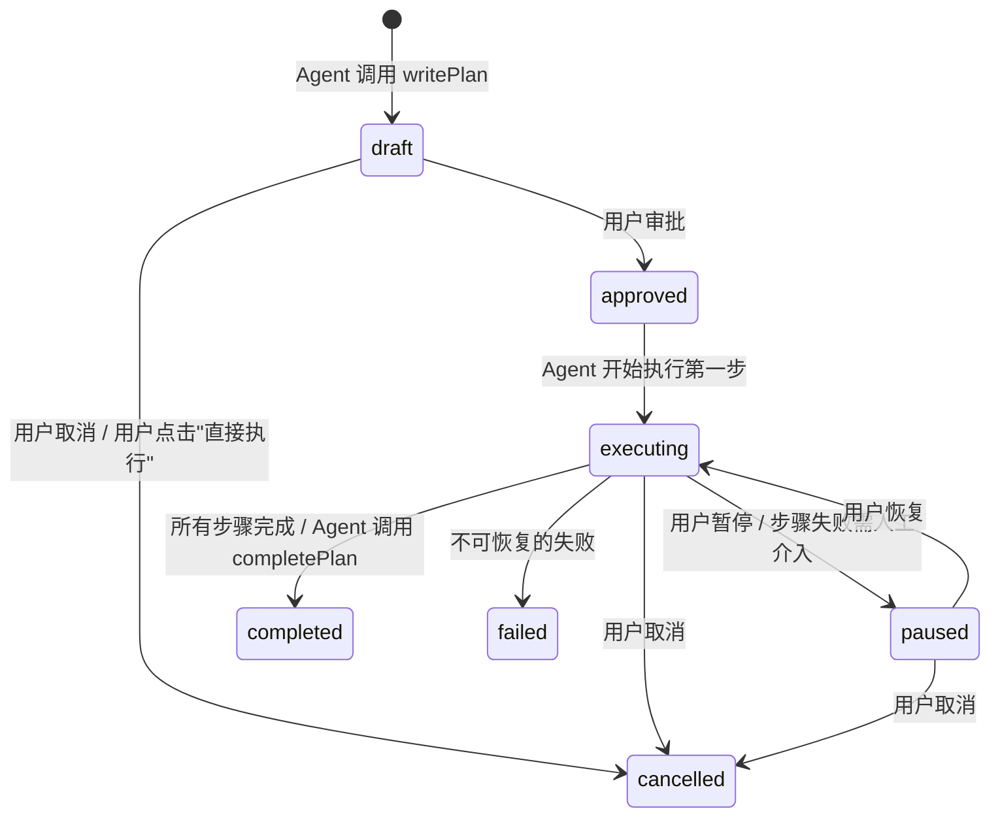
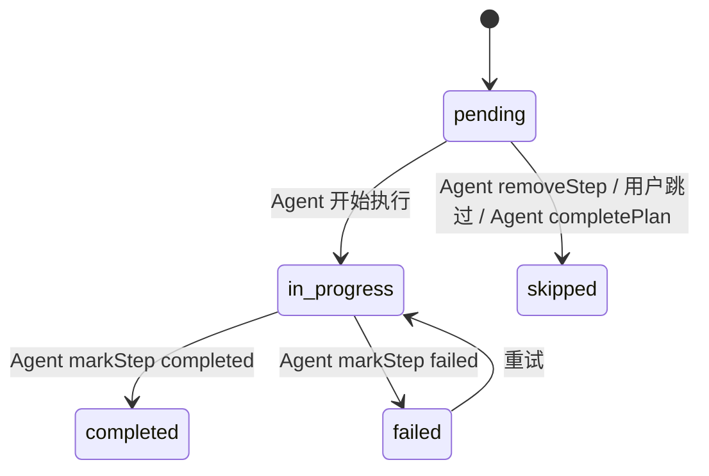
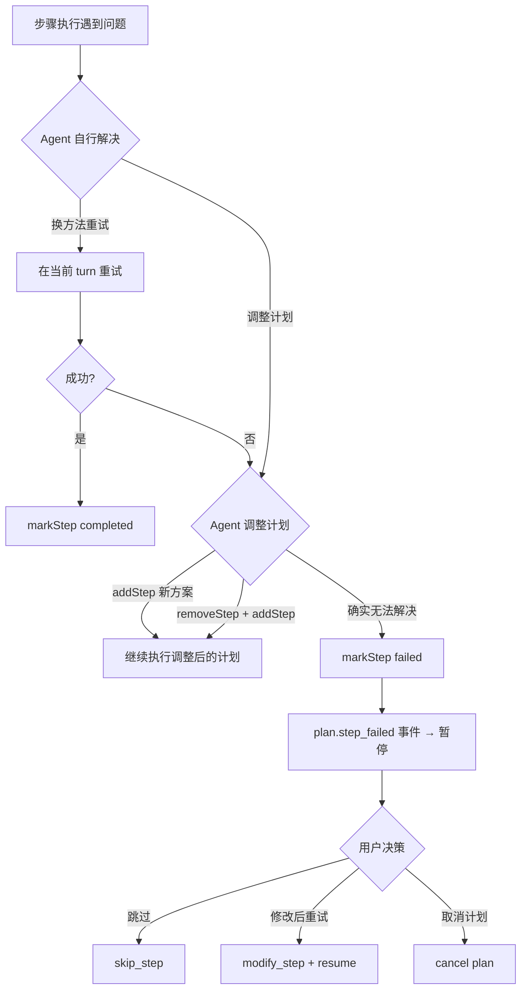
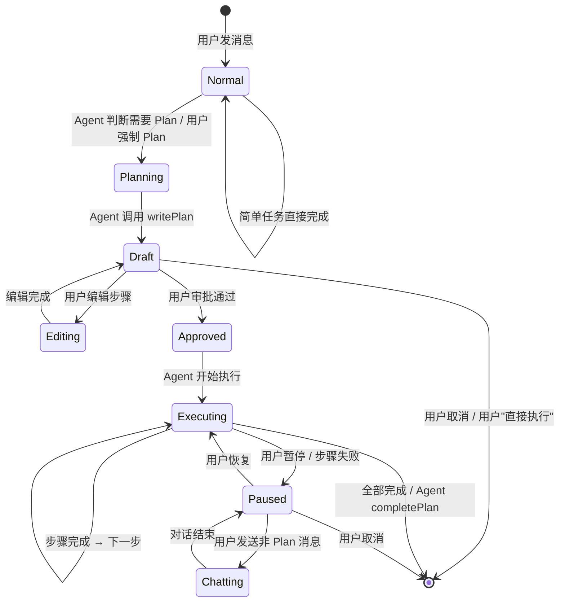
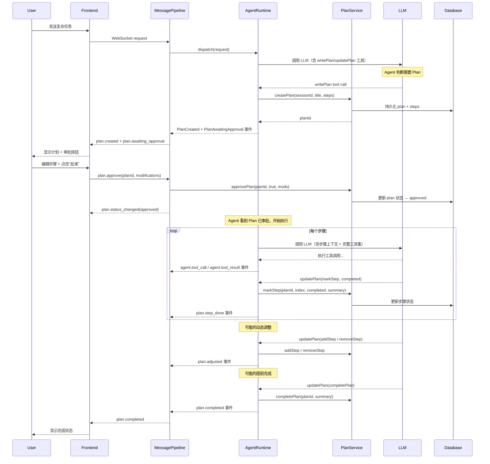
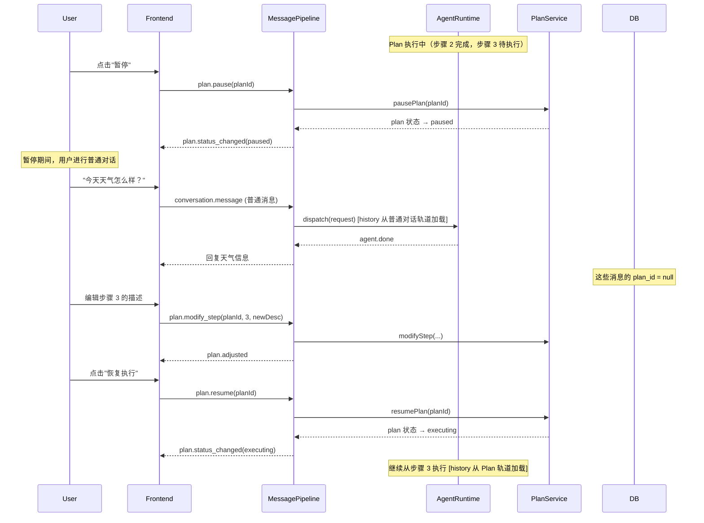

# IntelliMate Plan Mode 技术方案设计

> 版本：2.0
> 日期：2026-04-03
> 依赖调研：[agent-planning-research.md](agent-planning-research.md)
> 修订说明：基于 9 项关键设计问题的全面修订，涵盖触发机制、动态调整、失败处理、提前完成、暂停对话、会话隔离

---

## 一、设计目标

### 1.1 核心问题

IntelliMate 当前的 Agent 执行是一个标准 ReAct 循环（`AgentRuntime.executeLoopTurn`），对用户而言是黑盒：

```
用户消息 → [LLM 推理 → 工具调用 → 观察结果] × N → 最终响应
```

用户只能看到中间的 `agent.tool_call` / `agent.tool_result` 事件，无法预知 Agent 要做什么、为什么做、还剩多少步。

### 1.2 目标状态

引入 Plan 模式后，复杂任务的执行流程变为：

```
用户消息 → Agent 自主判断复杂度 → [Plan: 生成 Todo] → 用户审批/编辑 → [Execute: 按步骤执行，可暂停/调整/提前完成] → 完成
```

**具体目标：**

1. **可观测性**：用户在执行前即可看到完整的行动计划
2. **可控性**：用户可以审批、编辑、跳过、暂停计划中的步骤
3. **可追踪性**：每个步骤的状态（待执行/执行中/已完成/失败/跳过）实时可见
4. **灵活性**：简单任务自动跳过 Plan 直接执行，Agent 自行判断是否需要 Plan
5. **动态性**：执行过程中 Agent 可以动态增删步骤、提前完成计划
6. **可中断性**：用户可以在任意步骤间暂停，进行对话调整，再恢复执行
7. **隔离性**：Plan 执行上下文与临时对话互不污染

---

## 二、设计原则

| 原则 | 来源 | 在 IntelliMate 中的体现 |
|------|------|---------------------|
| Agent 自主决策 | Claude Code TodoWrite | Agent 通过 system prompt 自行判断是否需要 Plan，而非用户/框架强制 |
| Planning as Tool | DeerFlow / Claude Code | `writePlan` / `updatePlan` 作为 Agent 可调用的工具 |
| 结构化状态追踪 | DeerFlow / Claude Code | `PlanStep` 数据模型，持久化到数据库 |
| 不侵入核心循环 | DeerFlow | Plan 逻辑作为 `AgentRuntime` 的上层编排，核心 ReAct 循环不修改 |
| 事件流驱动 | 所有框架 | 通过 WebSocket 事件将 Plan 状态推送到前端 |
| 双轨会话隔离 | 新增 | Plan 执行上下文与用户临时对话通过 `planId` 标记隔离 |
| 渐进式降级 | 新增 | Agent 优先自行解决问题，解决不了才暂停等待用户干预 |

---

## 三、整体架构

### 3.1 架构总览



### 3.2 核心设计变化（相对 v1.0）

v1.0 的 `PlanEngine` 是一个"上层编排器"，硬编码了 Plan→Approve→Execute 三阶段流程，替代 `AgentRuntime` 驱动执行。

v2.0 的核心变化：**Agent 始终在 `AgentRuntime` 的 ReAct 循环中运行**，`PlanService` 退化为纯粹的 Plan 状态管理服务。Agent 通过工具自主控制 Plan 的创建、执行和调整。

| v1.0 | v2.0 |
|------|------|
| PlanEngine 编排器驱动 | AgentRuntime 始终驱动，Plan 只是工具 |
| 硬分离 Plan/Execute 两阶段 | 同一循环内，Agent 自主切换 |
| Agent 只能标记步骤状态 | Agent 可增删步骤、提前完成、动态调整 |
| 无暂停/恢复机制 | 支持暂停、对话、恢复 |
| 无会话隔离 | 双轨会话，planId 标记隔离 |

### 3.3 模块职责

| 模块 | 层 | 职责 |
|------|---|------|
| `PlanService` | intellimate-gateway | Plan 状态管理（CRUD、状态流转）——不编排执行 |
| `WritePlanTool` | intellimate-agent | Agent 可调用的工具，创建结构化计划 |
| `UpdatePlanTool` | intellimate-agent | Agent 可调用的工具，标记/增删步骤/提前完成 |
| `PlanEntity` | intellimate-gateway | 计划数据模型 |
| `PlanStepEntity` | intellimate-gateway | 计划步骤数据模型 |
| `PlanRepository` | intellimate-gateway | 计划持久化 |
| `PlanStepRepository` | intellimate-gateway | 步骤持久化 |
| `planStore` | intellimate-web | 前端 Plan 状态管理 |
| `PlanView` | intellimate-web | 前端 Plan 可视化组件 |

---

## 四、详细设计

### 4.1 Plan Mode 触发机制

采用 **Agent 自主决策 + 用户可覆盖** 的模型：

#### 4.1.1 三级触发

| 触发方式 | 行为 | 使用场景 |
|---------|------|---------|
| **默认（自动判断）** | `writePlan` / `updatePlan` 工具始终注册在工具集中，Agent 通过 system prompt 引导自行判断任务复杂度——简单任务直接执行，复杂任务（3+ 步骤）自动创建 Plan | 日常使用 |
| **用户强制 Plan** | 前端 Plan 开关 / `/plan <描述>` 命令，system prompt 中追加强制指令："你必须先调用 `writePlan` 创建计划" | 用户想要预览计划再执行 |
| **用户跳过 Plan** | 当 Agent 创建了 Plan 但用户不想走 Plan 流程，点击"直接执行"，plan 状态设为 cancelled，Agent 在普通模式下继续 | 觉得 Plan 多余时 |

#### 4.1.2 通过提示词引导

模型进入 Plan 的方式是通过 system prompt 注入 `<plan_system>` 段落。不需要硬分离 Plan 阶段和 Execute 阶段——`writePlan` 和 `updatePlan` 始终可用，Agent 自行决定何时使用。

```markdown
<plan_system>
你拥有 `writePlan` 和 `updatePlan` 两个工具来管理任务计划。

### 何时创建计划
- 当任务涉及 3 个以上独立步骤时，先调用 `writePlan` 创建计划
- 简单任务（1-2 步）不需要创建计划，直接执行即可
- 用户显式要求时，必须创建计划

### 创建计划的要求
1. 每个步骤应该是独立、可验证的
2. 步骤标题简洁明确，描述包含具体操作内容
3. 步骤之间的依赖关系要在描述中说明
4. 合理评估步骤数量，避免过于细碎或笼统

### 执行计划
- 创建计划后等待用户审批，用户可能会编辑步骤
- 审批通过后，按步骤顺序执行
- 每完成一步，调用 `updatePlan` 的 `markStep` 标记完成
- 如果发现需要调整计划，使用 `updatePlan` 的 `addStep` / `removeStep`
- 如果发现后续步骤已不再必要，调用 `updatePlan` 的 `completePlan`，不要执行多余步骤

### 失败处理
- 步骤失败时先自行尝试不同方法解决
- 如果确实无法完成，调用 `updatePlan` 的 `markStep` 标记 failed，并说明原因
- 可以通过 `addStep` 新增替代步骤，或 `removeStep` 删除不可行的步骤
</plan_system>
```

### 4.2 数据模型

#### 4.2.1 数据库表

```sql
-- Flyway migration: V12__plan_tables.sql
CREATE TABLE plan (
    id          INTEGER PRIMARY KEY AUTOINCREMENT,
    session_id  BIGINT NOT NULL,
    title       VARCHAR(500) NOT NULL,
    status      VARCHAR(20) NOT NULL DEFAULT 'draft',
    -- draft / approved / executing / paused / completed / failed / cancelled
    created_at  TIMESTAMP NOT NULL DEFAULT CURRENT_TIMESTAMP,
    updated_at  TIMESTAMP NOT NULL DEFAULT CURRENT_TIMESTAMP,
    FOREIGN KEY (session_id) REFERENCES session(id)
);

CREATE TABLE plan_step (
    id          INTEGER PRIMARY KEY AUTOINCREMENT,
    plan_id     BIGINT NOT NULL,
    step_index  INTEGER NOT NULL,
    title       VARCHAR(500) NOT NULL,
    description TEXT,
    status      VARCHAR(20) NOT NULL DEFAULT 'pending',
    -- pending / in_progress / completed / failed / skipped
    result_summary TEXT,
    started_at  TIMESTAMP,
    completed_at TIMESTAMP,
    FOREIGN KEY (plan_id) REFERENCES plan(id)
);

CREATE INDEX idx_plan_session ON plan(session_id);
CREATE INDEX idx_plan_step_plan ON plan_step(plan_id);
```

对 `transcript_message` 表新增 `plan_id` 字段（用于双轨会话隔离）：

```sql
-- Flyway migration: V13__transcript_plan_id.sql
ALTER TABLE transcript_message ADD COLUMN plan_id BIGINT;
CREATE INDEX idx_transcript_plan ON transcript_message(plan_id);
```

#### 4.2.2 Java Entity 类

```java
@Table("plan")
public class PlanEntity {
    @Id private Long id;
    private Long sessionId;
    private String title;
    private String status;  // draft, approved, executing, paused, completed, failed, cancelled
    private LocalDateTime createdAt;
    private LocalDateTime updatedAt;
}

@Table("plan_step")
public class PlanStepEntity {
    @Id private Long id;
    private Long planId;
    private Integer stepIndex;
    private String title;
    private String description;
    private String status;  // pending, in_progress, completed, failed, skipped
    private String resultSummary;
    private LocalDateTime startedAt;
    private LocalDateTime completedAt;
}
```

#### 4.2.3 Plan 状态机



Step 状态机：



### 4.3 Agent 工具设计

#### 4.3.1 WritePlanTool — 创建计划

Agent 通过此工具创建结构化计划。计划创建后进入 `draft` 状态，等待用户审批。

```java
@Component
public class WritePlanTool {

    public record PlanInput(
        String title,
        List<StepInput> steps
    ) {}

    public record StepInput(
        String title,
        String description
    ) {}
}
```

**工具调用示例：**

```json
{
  "name": "writePlan",
  "arguments": {
    "title": "重构用户认证模块",
    "steps": [
      {"title": "分析现有认证流程", "description": "阅读 AuthService 和相关中间件代码"},
      {"title": "设计 JWT 令牌方案", "description": "设计 token 生成、刷新、验证的完整流程"},
      {"title": "实现 token 服务", "description": "创建 JwtTokenService"},
      {"title": "更新中间件", "description": "修改认证中间件使用新 JWT 方案"},
      {"title": "编写测试", "description": "为 token 服务和中间件编写单元测试"}
    ]
  }
}
```

**工具返回值：**

```json
{
  "planId": 42,
  "status": "draft",
  "message": "计划已创建，共 5 个步骤。等待用户审批..."
}
```

#### 4.3.2 UpdatePlanTool — 更新计划（增强版）

Agent 在执行过程中使用此工具管理计划。支持多种操作：

```java
@Component
public class UpdatePlanTool {

    public record UpdateInput(
        String action,          // markStep / addStep / removeStep / completePlan
        Integer stepIndex,      // markStep / removeStep 时使用
        String status,          // markStep 时: completed / failed
        String resultSummary,   // markStep / completePlan 时: 结果摘要
        Integer afterIndex,     // addStep 时: 在哪个步骤后插入（-1 表示最前面）
        String title,           // addStep 时: 新步骤标题
        String description      // addStep 时: 新步骤描述
    ) {}
}
```

**操作一：标记步骤状态**

```json
{
  "name": "updatePlan",
  "arguments": {
    "action": "markStep",
    "stepIndex": 0,
    "status": "completed",
    "resultSummary": "AuthService 使用 session-based 认证，需要替换为 JWT"
  }
}
```

**操作二：新增步骤（动态调整）**

```json
{
  "name": "updatePlan",
  "arguments": {
    "action": "addStep",
    "afterIndex": 2,
    "title": "迁移现有 session 数据",
    "description": "将 Redis 中的 session 数据迁移到 JWT 方案"
  }
}
```

**操作三：删除步骤**

```json
{
  "name": "updatePlan",
  "arguments": {
    "action": "removeStep",
    "stepIndex": 4,
    "resultSummary": "测试已在步骤 3 中一并完成"
  }
}
```

**操作四：提前完成整个计划**

```json
{
  "name": "updatePlan",
  "arguments": {
    "action": "completePlan",
    "resultSummary": "步骤 3 的实现已覆盖了剩余所有需求，计划提前完成"
  }
}
```

#### 4.3.3 工具注册策略

`writePlan` 和 `updatePlan` **始终注册在工具集中**，不区分 Plan 阶段和 Execute 阶段。Agent 在同一个 ReAct 循环内自行决定何时调用。

```java
// ToolsEngine 中
// writePlan 和 updatePlan 作为 builtin 工具始终注册
// 与 fileRead, webSearch 等工具并列
```

### 4.4 失败处理策略

采用**渐进式降级**——Agent 优先自行解决，解决不了才暂停等用户。

#### 4.4.1 分级失败流程



#### 4.4.2 Agent 自主失败处理（在 system prompt 中引导）

```markdown
### 失败处理
当步骤执行遇到问题时：
1. 先尝试用不同的方法解决（如换一个工具、调整参数）
2. 如果当前步骤确实行不通，可以：
   - 调用 updatePlan 的 addStep 新增替代方案步骤
   - 调用 updatePlan 的 removeStep 删除不可行的步骤
   - 继续执行调整后的计划
3. 只有当你完全无法解决问题时，才调用 updatePlan 的 markStep 标记为 failed
   此时执行会暂停，等待用户介入
```

#### 4.4.3 用户介入（暂停后的操作）

当 Agent 标记步骤为 `failed` 后，`PlanService` 自动将 plan 状态设为 `paused`，前端显示失败信息和操作按钮：

- **跳过此步骤**：`plan.skip_step` → 步骤标记为 `skipped`，继续执行下一步
- **修改后重试**：用户编辑步骤描述 → `plan.modify_step` + `plan.resume` → 重新执行该步骤
- **取消计划**：`plan.cancel` → 整个计划取消

### 4.5 提前完成机制

当 Agent 在执行过程中发现后续步骤不再需要时，应主动结束而不浪费 token 执行多余步骤。

#### 4.5.1 Agent 触发提前完成

**场景示例**：Plan 有 5 步，Agent 在执行步骤 3 时发现步骤 4、5 的目标已在步骤 3 中顺带完成。

Agent 调用：
```json
{"action": "completePlan", "resultSummary": "步骤 3 已覆盖剩余需求"}
```

`PlanService` 收到后：
1. 将所有 `pending` 状态的步骤标记为 `skipped`（附带 `resultSummary`："随计划提前完成"）
2. Plan 状态设为 `completed`
3. 发出 `plan.completed` 事件

**场景示例 2**：Agent 发现只有部分后续步骤不需要，而不是全部。

Agent 调用：
```json
{"action": "removeStep", "stepIndex": 4, "resultSummary": "已在步骤 3 中完成"}
```

然后继续执行剩余步骤。

#### 4.5.2 system prompt 引导

```markdown
### 提前完成
- 如果在执行某个步骤时发现后续步骤已不再必要，立即调用 updatePlan：
  - 后续全部不需要：使用 completePlan
  - 只有部分不需要：使用 removeStep 删除特定步骤
- 不要执行多余的步骤浪费资源
```

### 4.6 暂停、对话与会话隔离

这是 Plan Mode 最复杂的设计点，解决的核心问题是：**用户在 Plan 执行过程中需要暂停、与 Agent 对话（可能与计划相关或无关），然后恢复执行，且对话不能污染 Plan 的执行上下文。**

#### 4.6.1 暂停与恢复

| 触发方式 | 行为 |
|---------|------|
| 用户主动暂停 | 前端发送 `plan.pause`，当前步骤执行完毕后暂停（不中断正在执行的步骤） |
| 步骤失败暂停 | Agent 标记步骤 `failed`，`PlanService` 自动暂停 |
| 用户恢复 | 前端发送 `plan.resume`，从下一个 `pending` 步骤继续 |

暂停后，Plan 状态从 `executing` 变为 `paused`。此时用户可以：
- 在聊天窗口正常对话（与计划无关的内容）
- 编辑待执行的步骤
- 恢复执行或取消计划

#### 4.6.2 双轨会话隔离

**方案：上下文标记法**

在 `TranscriptMessageEntity` 中新增 `plan_id` 字段：

```java
@Table("transcript_message")
public class TranscriptMessageEntity {
    @Id private Long id;
    private Long sessionId;
    private Long planId;     // 新增：null 表示普通对话，非 null 表示属于某个 Plan
    private String role;
    private String content;
    private String toolCallId;
    private String toolName;
    private String metadataJson;
    private LocalDateTime createdAt;
}
```

**上下文加载规则：**

| 场景 | 加载的 history |
|------|---------------|
| **普通对话**（无活跃 Plan 或 Plan 已暂停） | `planId IS NULL` 的消息（普通对话轨道） |
| **Plan 执行中** | `planId = 当前 planId` 的消息（Plan 执行轨道）+ Plan 上下文注入 |
| **恢复 Plan** | `planId = 当前 planId` 的消息，跳过暂停期间的普通对话 |

```java
// SessionManager 中新增方法
public Flux<TranscriptMessageEntity> getPlanHistory(Long sessionId, Long planId, int limit) {
    // SELECT * FROM transcript_message WHERE session_id = ? AND plan_id = ? ORDER BY created_at DESC LIMIT ?
}

public Flux<TranscriptMessageEntity> getChatHistory(Long sessionId, int limit) {
    // SELECT * FROM transcript_message WHERE session_id = ? AND plan_id IS NULL ORDER BY created_at DESC LIMIT ?
}
```

#### 4.6.3 暂停期间的对话处理

**与计划无关的对话：**

```
用户: "今天天气怎么样？"  ← plan_id = null，进入普通对话轨道
Agent: "今天北京晴天..."   ← plan_id = null
```

恢复 Plan 时，这些消息不会被加载到 Plan 的执行上下文中。

**与计划相关的调整：**

用户想调整计划内容（如"把第 4 步改成 XXX"），有两种方式：

1. **通过 Plan UI 编辑**（推荐）：用户在 PlanView 组件中直接编辑步骤，触发 `plan.modify_step` 请求
2. **通过聊天对话**：此场景较复杂——用户的消息进入普通对话轨道，Agent 回复后用户仍需在 Plan UI 中确认修改

#### 4.6.4 Plan 执行时的 system prompt 上下文注入

每次 Plan 中的步骤执行时，在 system prompt 中注入当前计划进度：

```markdown
## PLAN EXECUTION CONTEXT

你正在执行一个已审批的计划。

### 整体计划: ${plan.title}

### 已完成的步骤:
${completedSteps.map(s -> "- [x] Step " + s.stepIndex + ": " + s.title + " → " + s.resultSummary)}

### 当前步骤 (${currentStep.stepIndex + 1}/${totalSteps}):
**${currentStep.title}**
${currentStep.description}

### 待执行的步骤:
${pendingSteps.map(s -> "- [ ] Step " + s.stepIndex + ": " + s.title)}

请专注于完成当前步骤。完成后调用 `updatePlan` 的 `markStep` 标记完成。
如果发现需要调整计划，可以使用 addStep / removeStep / completePlan。
```

### 4.7 PlanService 设计

`PlanService` 是纯粹的 Plan 状态管理服务，不负责编排执行。

```java
@Service
public class PlanService {

    private final PlanRepository planRepository;
    private final PlanStepRepository planStepRepository;

    // ===== WritePlanTool 回调 =====

    /** 创建计划，返回 planId */
    public Mono<PlanEntity> createPlan(Long sessionId, String title, List<StepInput> steps);

    // ===== UpdatePlanTool 回调 =====

    /** 标记步骤完成/失败 */
    public Mono<PlanStepEntity> markStep(Long planId, int stepIndex, String status, String summary);

    /** 在指定位置后新增步骤 */
    public Mono<PlanStepEntity> addStep(Long planId, int afterIndex, String title, String description);

    /** 删除步骤 */
    public Mono<Void> removeStep(Long planId, int stepIndex, String reason);

    /** 提前完成整个计划 */
    public Mono<PlanEntity> completePlan(Long planId, String summary);

    // ===== 用户操作 =====

    /** 用户审批计划（可附带修改） */
    public Mono<PlanEntity> approvePlan(Long planId, boolean approved, List<StepModification> mods);

    /** 用户暂停计划 */
    public Mono<PlanEntity> pausePlan(Long planId);

    /** 用户恢复计划 */
    public Mono<PlanEntity> resumePlan(Long planId);

    /** 用户取消计划 */
    public Mono<PlanEntity> cancelPlan(Long planId);

    /** 用户跳过步骤 */
    public Mono<PlanStepEntity> skipStep(Long planId, int stepIndex);

    /** 用户编辑步骤 */
    public Mono<PlanStepEntity> modifyStep(Long planId, int stepIndex, String title, String description);

    // ===== 查询 =====

    /** 获取 session 的活跃计划 */
    public Mono<PlanEntity> getActivePlan(Long sessionId);

    /** 获取计划的所有步骤 */
    public Flux<PlanStepEntity> getSteps(Long planId);

    /** 获取下一个待执行步骤 */
    public Mono<PlanStepEntity> getNextPendingStep(Long planId);
}
```

### 4.8 AgentEvent 扩展

在 `AgentEvent` sealed interface 中新增 Plan 相关事件：

```java
// Plan 创建
record PlanCreated(
    Long planId, String title, List<PlanStepInfo> steps
) implements AgentEvent {}

record PlanStepInfo(int index, String title, String description) {}

// Plan 等待审批
record PlanAwaitingApproval(Long planId) implements AgentEvent {}

// Plan 状态变更
record PlanStatusChanged(
    Long planId, String status  // approved, executing, paused, completed, failed, cancelled
) implements AgentEvent {}

// 步骤开始执行
record PlanStepStart(Long planId, int stepIndex, String title) implements AgentEvent {}

// 步骤完成
record PlanStepDone(
    Long planId, int stepIndex, String status, String resultSummary
) implements AgentEvent {}

// 计划动态调整（新增/删除步骤）
record PlanAdjusted(
    Long planId, String adjustType, // addStep, removeStep
    List<PlanStepInfo> currentSteps  // 调整后的完整步骤列表
) implements AgentEvent {}

// 计划完成
record PlanCompleted(Long planId, String status) implements AgentEvent {}
```

### 4.9 WebSocket 协议扩展

#### 4.9.1 服务端事件（EventFrame）

| 事件名 | 触发时机 | Payload |
|--------|---------|---------|
| `plan.created` | Agent 创建计划后 | `{planId, title, steps: [{index, title, description}]}` |
| `plan.awaiting_approval` | 等待用户审批 | `{planId}` |
| `plan.status_changed` | Plan 状态变更 | `{planId, status}` |
| `plan.step_start` | 步骤开始执行 | `{planId, stepIndex, title}` |
| `plan.step_done` | 步骤执行完毕 | `{planId, stepIndex, status, resultSummary}` |
| `plan.adjusted` | 计划动态调整 | `{planId, adjustType, currentSteps}` |
| `plan.completed` | 计划完成 | `{planId, status}` |

#### 4.9.2 客户端请求（RequestFrame）

| 方法 | 用途 | Params |
|------|------|--------|
| `plan.approve` | 审批计划 | `{planId, approved, modifications?}` |
| `plan.pause` | 暂停执行 | `{planId}` |
| `plan.resume` | 恢复执行 | `{planId}` |
| `plan.cancel` | 取消计划 | `{planId}` |
| `plan.skip_step` | 跳过步骤 | `{planId, stepIndex}` |
| `plan.modify_step` | 编辑步骤 | `{planId, stepIndex, title?, description?}` |

#### 4.9.3 用户审批时的编辑能力

```typescript
interface PlanApproveRequest {
  planId: number;
  approved: boolean;
  modifications?: {
    type: 'edit' | 'add' | 'remove' | 'reorder';
    stepIndex?: number;
    title?: string;
    description?: string;
    newIndex?: number;  // reorder 时使用
  }[];
}
```

### 4.10 MessagePipeline 集成

```java
// MessagePipeline.processRequest 中新增:
case "plan.approve" -> processPlanApproval(request);
case "plan.pause" -> processPlanPause(request);
case "plan.resume" -> processPlanResume(request);
case "plan.cancel" -> processPlanCancel(request);
case "plan.skip_step" -> processPlanSkipStep(request);
case "plan.modify_step" -> processPlanModifyStep(request);
```

**消息分流逻辑：**

```java
// processMessageStreaming 中的分流
PlanEntity activePlan = planService.getActivePlan(session.getId()).block();

if (activePlan != null && "executing".equals(activePlan.getStatus())) {
    // Plan 执行中：消息归属 Plan 轨道（plan_id 非空）
    // history 从 Plan 轨道加载
} else if (activePlan != null && "paused".equals(activePlan.getStatus())) {
    // Plan 暂停中：消息归属普通对话轨道（plan_id 为空）
    // history 从普通对话轨道加载
} else {
    // 无活跃 Plan：正常流程
}
```

### 4.11 前端设计

#### 4.11.1 状态管理（planStore.ts）

```typescript
interface PlanStep {
  index: number;
  title: string;
  description: string;
  status: 'pending' | 'in_progress' | 'completed' | 'failed' | 'skipped';
  resultSummary?: string;
}

interface Plan {
  planId: number;
  title: string;
  status: 'draft' | 'approved' | 'executing' | 'paused' | 'completed' | 'failed' | 'cancelled';
  steps: PlanStep[];
}

interface PlanStore {
  plans: Record<string, Plan>;  // keyed by agentName
  activePlanId: number | null;

  handlePlanCreated(payload): void;
  handleStepStart(payload): void;
  handleStepDone(payload): void;
  handlePlanAdjusted(payload): void;
  handlePlanStatusChanged(payload): void;
  handlePlanCompleted(payload): void;

  approvePlan(planId: number, modifications?): void;
  pausePlan(planId: number): void;
  resumePlan(planId: number): void;
  cancelPlan(planId: number): void;
  skipStep(planId: number, stepIndex: number): void;
  modifyStep(planId: number, stepIndex: number, title?: string, description?: string): void;
}
```

#### 4.11.2 Plan View 组件

**Draft 状态（等待审批）：**

```
┌──────────────────────────────────────────────────┐
│  计划: 重构用户认证模块                           │
│  状态: 等待审批                                   │
├──────────────────────────────────────────────────┤
│  1. 分析现有认证流程            [编辑] [删除]     │
│     阅读 AuthService 和相关中间件代码             │
│  2. 设计 JWT 令牌方案           [编辑] [删除]     │
│     设计 token 生成、刷新、验证的完整流程          │
│  3. 实现 token 服务             [编辑] [删除]     │
│     创建 JwtTokenService                         │
│  4. 更新中间件                  [编辑] [删除]     │
│     修改认证中间件使用新 JWT 方案                  │
│  5. 编写测试                    [编辑] [删除]     │
│     为 token 服务和中间件编写单元测试              │
│                                                  │
│  [+ 添加步骤]                                     │
├──────────────────────────────────────────────────┤
│  [批准执行]        [直接执行(跳过Plan)]  [取消]    │
└──────────────────────────────────────────────────┘
```

**Executing 状态（执行中）：**

```
┌──────────────────────────────────────────────────┐
│  计划: 重构用户认证模块                           │
│  状态: 执行中 (3/5)                              │
├──────────────────────────────────────────────────┤
│  [done]  1. 分析现有认证流程                      │
│          结果: AuthService 使用 session 方式       │
│  [done]  2. 设计 JWT 令牌方案                     │
│          结果: 采用 RS256 + refresh token          │
│  [run]   3. 实现 token 服务                       │
│          执行中...                                │
│  [wait]  4. 更新中间件                 [编辑]     │
│  [wait]  5. 编写测试                   [编辑]     │
├──────────────────────────────────────────────────┤
│  [暂停]                                [取消计划]  │
└──────────────────────────────────────────────────┘
```

**Paused 状态（已暂停，步骤失败）：**

```
┌──────────────────────────────────────────────────┐
│  计划: 重构用户认证模块                           │
│  状态: 已暂停 — 步骤 3 执行失败                   │
├──────────────────────────────────────────────────┤
│  [done]  1. 分析现有认证流程                      │
│  [done]  2. 设计 JWT 令牌方案                     │
│  [fail]  3. 实现 token 服务                       │
│          失败原因: RS256 密钥生成失败              │
│          [跳过此步骤]  [修改后重试]                │
│  [wait]  4. 更新中间件                 [编辑]     │
│  [wait]  5. 编写测试                   [编辑]     │
├──────────────────────────────────────────────────┤
│  [恢复执行]                            [取消计划]  │
│                                                  │
│  你可以在下方继续与 Agent 对话，不影响计划执行上下文 │
└──────────────────────────────────────────────────┘
```

#### 4.11.3 useWebSocket 事件处理扩展

```typescript
case 'plan.created':
  planStore.handlePlanCreated(payload);
  break;
case 'plan.awaiting_approval':
  planStore.setAwaitingApproval(payload.planId);
  break;
case 'plan.status_changed':
  planStore.handlePlanStatusChanged(payload);
  break;
case 'plan.step_start':
  planStore.handleStepStart(payload);
  break;
case 'plan.step_done':
  planStore.handleStepDone(payload);
  break;
case 'plan.adjusted':
  planStore.handlePlanAdjusted(payload);
  break;
case 'plan.completed':
  planStore.handlePlanCompleted(payload);
  break;
```

### 4.12 配置扩展

```yaml
intellimate:
  agent:
    plan-max-steps: 20             # 单个计划最大步骤数
    plan-step-timeout-seconds: 120 # 单步执行超时
    plan-approval-timeout-seconds: 600 # 用户审批超时（超时自动取消）
```

注意：不再需要 `plan-mode-enabled` 和 `plan-mode-auto-detect` 开关。`writePlan` / `updatePlan` 工具始终可用，Agent 自主决策。

---

## 五、执行流程详解

### 5.1 完整状态机



### 5.2 完整时序图



### 5.3 暂停-对话-恢复时序



---

## 六、与现有架构的集成点

### 6.1 对现有代码的影响范围

| 文件 | 修改类型 | 内容 |
|------|---------|------|
| `AgentEvent.java` | 扩展 | 新增 7 个 Plan 相关事件 record |
| `AgentRunRequest.java` | **不修改** | 不再需要 `planModeEnabled`——工具始终可用 |
| `AgentRuntime.java` | **不修改** | 核心循环保持不变 |
| `ToolsEngine.java` | 扩展 | 注册 `WritePlanTool` / `UpdatePlanTool` 为 builtin 工具 |
| `MessagePipeline.java` | 扩展 | 新增 6 个 Plan 请求处理 + 消息分流逻辑 |
| `IntelliMateProperties.java` | 扩展 | 新增 3 个 Plan 配置字段 |
| `CommandHandler.java` | 扩展 | 新增 `/plan` 斜杠命令 |
| `TranscriptMessageEntity.java` | 扩展 | 新增 `planId` 字段 |
| `SessionManager` | 扩展 | 新增 `getPlanHistory()` / `getChatHistory()` 方法 |

### 6.2 新增文件清单

| 文件 | 层 | 职责 |
|------|---|------|
| `WritePlanTool.java` | intellimate-agent/tools | 创建计划的工具 |
| `UpdatePlanTool.java` | intellimate-agent/tools | 更新计划（标记/增删/完成）的工具 |
| `PlanService.java` | intellimate-gateway/service | Plan 状态管理服务 |
| `PlanEntity.java` | intellimate-gateway/entity | 计划实体 |
| `PlanStepEntity.java` | intellimate-gateway/entity | 步骤实体 |
| `PlanRepository.java` | intellimate-gateway/repository | 计划 DAO |
| `PlanStepRepository.java` | intellimate-gateway/repository | 步骤 DAO |
| `V12__plan_tables.sql` | resources/db/migration | Plan 表迁移 |
| `V13__transcript_plan_id.sql` | resources/db/migration | transcript 新增 planId 列 |
| `planStore.ts` | intellimate-web/src/stores | 前端状态管理 |
| `PlanView.tsx` | intellimate-web/src/components | 计划视图组件 |
| `PlanStepCard.tsx` | intellimate-web/src/components | 步骤卡片组件 |

### 6.3 不侵入 AgentRuntime 的设计

**核心原则：`AgentRuntime.executeLoopTurn` 不做任何修改。**

Plan Mode 通过以下方式与现有架构集成：

1. `writePlan` / `updatePlan` 作为普通的 builtin 工具注册，和 `fileRead` / `webSearch` 并列
2. 工具的回调函数调用 `PlanService` 进行状态管理
3. `MessagePipeline` 根据 Plan 状态决定 history 的加载策略（Plan 轨道 / 普通对话轨道）
4. `AgentRuntime` 完全不感知 Plan 的存在——它只是执行一个普通的 ReAct 循环，碰巧其中某些工具调用会影响 Plan 状态

---

## 七、Q&A 对照表

针对最初提出的 9 个设计问题，本方案的回答：

| # | 问题 | 回答 |
|---|------|------|
| Q1 | Plan 模式需要手动开启吗？ | **不需要**。`writePlan`/`updatePlan` 工具始终可用，Agent 自主判断是否需要创建计划。用户也可以通过 `/plan` 命令或前端开关强制 Agent 先创建计划。 |
| Q2 | 新增两个工具？ | **是**。`writePlan` 创建计划，`updatePlan` 管理计划（标记步骤/新增步骤/删除步骤/提前完成）。 |
| Q3 | 通过提示词让模型进入 Plan？ | **是**。通过 system prompt 中的 `<plan_system>` 段落引导 Agent 在复杂任务时主动使用 `writePlan`。 |
| Q4 | Todo 创建后能否手动修改？ | **能**。审批前可以编辑/添加/删除/排序步骤（通过 `plan.approve` 的 `modifications`）。执行中也可以编辑待执行步骤（通过 `plan.modify_step`）。 |
| Q5 | 没有 SubAgent？ | **是，当前方案是单 Agent**。Plan 在同一个 Agent 的 ReAct 循环中执行。SubAgent 并行执行是未来扩展方向。 |
| Q6 | 执行中 Agent 是否自动调整 Todo？ | **是**。Agent 可以通过 `updatePlan` 的 `addStep` / `removeStep` 在执行过程中动态增删步骤。 |
| Q7 | 步骤失败怎么办？ | **渐进式降级**：Agent 先自行重试/换方法 → 自行调整计划（addStep/removeStep） → 无法解决时 markStep failed 暂停等待用户 → 用户跳过/修改后重试/取消。 |
| Q8 | 中间发现可以直接完成？ | **不会执行多余步骤**。Agent 调用 `updatePlan` 的 `completePlan` 或 `removeStep` 结束计划，剩余步骤自动标记为 skipped。 |
| Q9 | 暂停、对话、与计划无关的内容？ | **支持暂停/恢复**。双轨会话隔离：Plan 执行的消息带 `planId`，暂停期间的普通对话 `planId=null`。恢复时只加载 Plan 轨道的 history，普通对话不污染 Plan 上下文。 |

---

## 八、实施计划

### Phase 1：数据层 + 工具（约 2-3 天）

1. `V12__plan_tables.sql` / `V13__transcript_plan_id.sql` 数据库迁移
2. `PlanEntity` / `PlanStepEntity` / Repository
3. `TranscriptMessageEntity` 新增 `planId` 字段
4. `PlanService` 状态管理服务
5. `WritePlanTool` / `UpdatePlanTool`
6. `AgentEvent` 扩展
7. `ToolsEngine` 注册新工具

### Phase 2：Pipeline 集成 + 会话隔离（约 2-3 天）

1. `MessagePipeline` 新增 Plan 请求处理（approve/pause/resume/cancel/skip/modify）
2. `MessagePipeline` 消息分流逻辑（Plan 轨道 / 普通对话轨道）
3. `SessionManager` 新增 `getPlanHistory()` / `getChatHistory()`
4. Plan 上下文注入（步骤信息注入 system prompt）
5. `/plan` 斜杠命令

### Phase 3：前端（约 2-3 天）

1. `planStore.ts` 状态管理
2. `useWebSocket` 扩展 Plan 事件处理
3. `PlanView.tsx` / `PlanStepCard.tsx` 组件
4. Draft 状态：步骤编辑 + 审批 UI
5. Executing 状态：进度显示 + 暂停按钮
6. Paused 状态：失败处理 + 恢复 UI

### Phase 4：配置与调优（约 1 天）

1. `IntelliMateProperties` Plan 配置
2. System prompt 调优
3. 端到端测试

---

## 九、风险与应对

| 风险 | 影响 | 应对措施 |
|------|------|---------|
| LLM 不遵循 writePlan 指令 | 无法生成结构化计划 | system prompt 强化 + 解析降级（从文本提取步骤） |
| Agent 执行时偏离计划 | 步骤结果与描述不符 | 步骤上下文注入强调聚焦 |
| 用户长时间不审批 | 资源占用 | 审批超时自动取消 |
| 双轨会话隔离不完美 | Plan 上下文泄露到普通对话 | `planId` 严格标记 + 加载时过滤 |
| 暂停期间对话修改了 Agent 状态 | 恢复后行为不一致 | Plan 恢复时重新注入完整 Plan 上下文 |
| Plan 增加 LLM 调用 | Token 消耗增加 | Agent 自主判断，简单任务不创建 Plan |
| Agent 频繁动态调整计划 | 用户感到混乱 | 前端清晰展示调整历史，限制单次调整量 |

---

## 十、未来扩展

1. **SubAgent 委派**：将独立步骤委派给子 Agent 并行执行
2. **Plan 模板**：常见任务的计划模板化，减少 LLM 规划开销
3. **Plan 历史与复用**：保存计划执行历史，支持类似任务复用
4. **Plan 评分**：基于执行结果评估计划质量
5. **并行步骤**：支持无依赖关系的步骤声明并行执行
6. **跨 Session Plan 恢复**：Plan 持久化到数据库后支持断点续传
