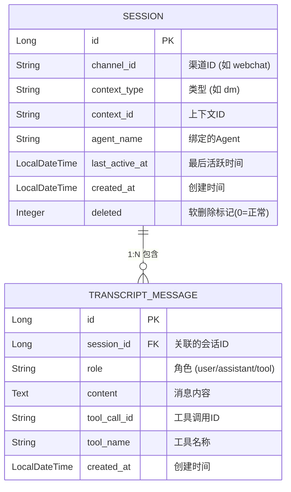
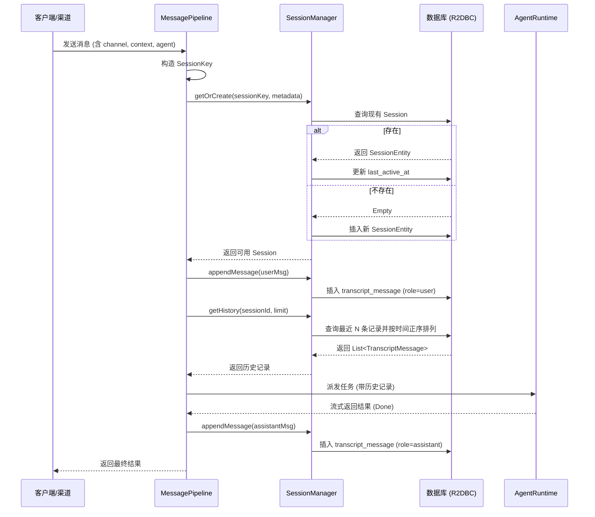

# IntelliMate 会话管理设计文档

## 1. 设计理念 (Design Philosophy)

IntelliMate 的会话管理系统负责维护用户与 Agent 之间的对话上下文。其核心设计理念包括：

- **多渠道统一抽象 (Multi-channel Support)**: 
  通过 `channelId`、`contextType` 和 `contextId` 的三元组组合，统一支持 WebChat、企业微信、飞书等不同接入渠道，以及单聊 (dm) 和群聊 (group) 场景。这种抽象使得核心逻辑无需关心具体的接入渠道。

- **Agent 隔离 (Agent Isolation)**: 
  会话上下文与具体的 Agent 强绑定。在 WebChat 场景中，`contextId` 包含了 `agentName`，确保用户在切换不同的 Agent 时，拥有完全独立的对话记忆，避免上下文污染。

- **全链路响应式 (Reactive & Non-blocking)**: 
  基于 Project Reactor (`Mono`/`Flux`) 和 Spring Data R2DBC 实现。从网络接收、业务处理到数据库读写，全程非阻塞，能够以极低的资源消耗处理高并发的会话请求。

- **持久化与历史追踪 (Persistence & History Tracking)**: 
  采用会话元数据（Session）与对话记录（Transcript）分离存储的结构。不仅支持长效的对话记忆，还便于实现基于轮数的上下文截断（Context Window Management）和审计。

---

## 2. 核心模型与标识 (Core Models & Identification)

会话的标识和元数据定义在 `intellimate-core` 模块中，作为跨模块传递的基础数据结构。

### 2.1 SessionKey (会话核心标识)

`SessionKey` 是定位一个会话的唯一凭证，由三个维度构成：

```java
public record SessionKey(
        String channelId,    // 渠道标识，如 "webchat", "wechat", "feishu"
        String contextType,  // 上下文类型，如 "dm" (单聊), "group" (群聊)
        String contextId     // 渠道内的具体上下文ID (如 userId 或 groupId)
) {
    public String toCompositeKey() {
        return channelId + ":" + contextType + ":" + contextId;
    }
}
```

### 2.2 SessionMetadata (会话元数据)

在创建或更新会话时，需要携带额外的元数据信息：

```java
public record SessionMetadata(
        String agentName,    // 关联的 Agent 名称
        String senderName,   // 发送者名称（可选）
        String channelId,
        String contextType,
        String contextId
) {}
```

### 2.3 WebChat 场景下的 ContextId 构造

在 Web 端的 WebSocket 聊天中，为了实现 Agent 隔离，`contextId` 被设计为 WebSocket Session ID 与 Agent 名称的组合：

```java
// MessagePipeline.java 中的构造逻辑
String baseContextId = params.getOrDefault("contextId", wsSessionId);
String contextId = baseContextId + "::" + agentName; // 例如: ws-12345::default-agent
```

---

## 3. 数据库结构与实体 (Database Schema & Entities)

会话数据持久化在关系型数据库中，分为主表 `session` 和明细表 `transcript_message`。



### 3.1 SessionEntity (`session` 表)
- **唯一约束**: `uk_session_key` 建立在 `(channel_id, context_type, context_id)` 上，确保同一上下文中只有一个活跃会话。
- **软删除**: 使用 `deleted` 字段进行软删除（0 表示活跃），便于实现 `/clear` 或 `/reset` 等重置指令而不丢失历史审计数据。

### 3.2 TranscriptMessageEntity (`transcript_message` 表)
- **外键级联**: 绑定到 `session.id`。
- **角色区分**: 严格区分 `user`（用户输入）、`assistant`（大模型输出）和 `tool`（工具执行结果），这与 Spring AI / OpenAI 的 Message 角色规范一致。

---

## 4. 核心接口与实现机制 (Core Interface & Implementation)

`SessionManager` 接口定义了会话的生命周期管理操作：

```java
public interface SessionManager {
    Mono<SessionEntity> resolveSession(InboundEnvelope envelope);
    Mono<SessionEntity> getOrCreate(SessionKey key, SessionMetadata metadata);
    Mono<Void> appendMessage(Long sessionId, TranscriptMessageEntity message);
    Flux<TranscriptMessageEntity> getHistory(Long sessionId, int limit);
    Mono<Void> resetSession(Long sessionId);
}
```

### 4.1 高效的 Get-or-Create 模式

在 `SessionManagerImpl` 中，`getOrCreate` 方法利用了 Project Reactor 的特性，实现了高效且非阻塞的“获取或创建”逻辑：

```java
public Mono<SessionEntity> getOrCreate(SessionKey key, SessionMetadata metadata) {
    return sessionRepository.findBySessionKey(key.channelId(), key.contextType(), key.contextId())
            .flatMap(existing -> {
                // 如果存在，更新最后活跃时间
                existing.setLastActiveAt(LocalDateTime.now());
                return sessionRepository.save(existing);
            })
            .switchIfEmpty(Mono.defer(() -> {
                // 如果不存在，延迟执行创建逻辑
                SessionEntity session = new SessionEntity();
                session.setChannelId(key.channelId());
                session.setContextType(key.contextType());
                session.setContextId(key.contextId());
                session.setAgentName(metadata.agentName());
                session.setLastActiveAt(LocalDateTime.now());
                session.setCreatedAt(LocalDateTime.now());
                session.setDeleted(0);
                return sessionRepository.save(session);
            }));
}
```
**设计亮点**: 使用 `switchIfEmpty(Mono.defer(...))` 确保只有在数据库中未查询到记录时，才会实例化新的 `SessionEntity` 并执行插入操作，避免了不必要的对象创建和数据库开销。

---

## 5. 生命周期与数据流转 (Lifecycle & Data Flow)

当一条用户消息通过 WebSocket 或其他渠道进入网关时，会话管理系统的数据流转如下：



### 流转说明：
1. **会话解析**: 请求到达 `MessagePipeline` 后，首先解析出 `SessionKey`。
2. **会话保障**: 调用 `getOrCreate` 确保数据库中有对应的活跃会话记录。
3. **用户消息落库**: 将用户的输入作为 `user` 角色的消息追加到 `transcript_message` 表。
4. **上下文加载**: 根据 Agent 配置的 `historyLimit`，从数据库加载最近的 N 条历史记录，构建大模型的上下文。
5. **模型推理**: 将历史记录和当前消息传递给 `AgentRuntime` 进行推理。
6. **助手消息落库**: 推理完成后，将大模型的完整回复作为 `assistant` 角色的消息追加到数据库。