# IntelliMate WebSocket 架构文档

## 目录

1. [总体架构概览](#1-总体架构概览)
2. [协议层 (Protocol Layer)](#2-协议层-protocol-layer)
3. [后端实现](#3-后端实现)
4. [前端实现](#4-前端实现)
5. [关键流程时序图](#5-关键流程时序图)
6. [连接生命周期](#6-连接生命周期)
7. [错误处理](#7-错误处理)
8. [关键文件索引](#8-关键文件索引)

---

## 1. 总体架构概览

IntelliMate 的 WebSocket 通信采用 **全双工、事件驱动** 的架构，基于 Spring WebFlux Reactive WebSocket 构建。前端通过单一 `/ws` 端点与后端网关建立持久连接，所有用户消息、Agent 流式响应、工具调用与审批均在此通道内完成。

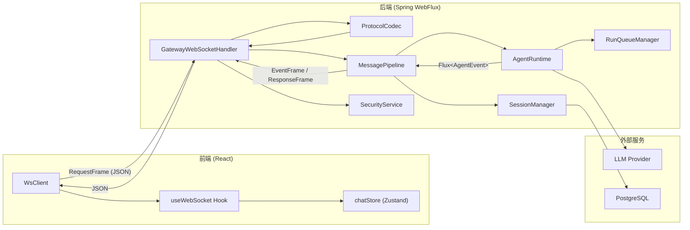

### 分层职责

| 层次 | 组件 | 职责 |
|------|------|------|
| **传输层** | `WsClient` / `GatewayWebSocketHandler` | WebSocket 连接管理、帧收发、心跳 |
| **协议层** | `ProtocolCodec` / `protocol.ts` | JSON 编解码、帧类型分发 |
| **业务层** | `MessagePipeline` | 请求路由、会话管理、事件映射、审计 |
| **运行时层** | `AgentRuntime` / `RunQueueManager` | Agent 循环、工具执行、流式输出 |
| **存储层** | `SessionManager` / PostgreSQL | 会话持久化、聊天记录管理 |

---

## 2. 协议层 (Protocol Layer)

### 2.1 帧类型体系

通信协议基于 JSON，使用 `type` 字段进行多态分发。后端通过 Java 的 sealed interface + Jackson `@JsonTypeInfo` 实现类型安全的序列化与反序列化。

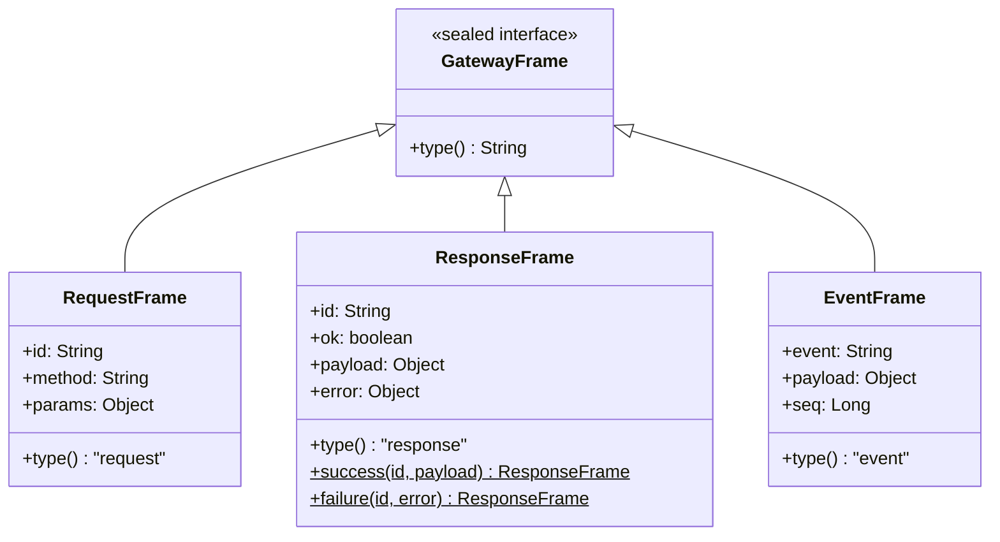

### 2.2 RequestFrame (客户端 -> 服务端)

客户端发起的请求，每个请求携带唯一 `id` 用于关联响应。

```json
{
  "type": "request",
  "id": "550e8400-e29b-41d4-a716-446655440000",
  "method": "conversation.message",
  "params": {
    "text": "你好",
    "channelId": "webchat",
    "contextType": "dm",
    "agentName": "default"
  }
}
```

**支持的方法 (method)：**

| 方法 | 说明 | params 字段 |
|------|------|------------|
| `conversation.message` | 发送用户消息给 Agent | `text`, `channelId`(默认"webchat"), `contextType`(默认"dm"), `contextId`(默认wsSessionId), `agentName`(可选) |
| `conversation.approve_tool` | 对工具调用做出审批决定 | `sessionId`, `toolCallId`, `approved`, `modifiedArguments`(可选) |

### 2.3 ResponseFrame (服务端 -> 客户端)

对 `RequestFrame` 的应答，`id` 字段与请求的 `id` 一一对应。

**成功响应：**
```json
{
  "type": "response",
  "id": "550e8400-e29b-41d4-a716-446655440000",
  "ok": true,
  "payload": { "text": "Agent 的完整回复文本" },
  "error": null
}
```

**失败响应：**
```json
{
  "type": "response",
  "id": "550e8400-e29b-41d4-a716-446655440000",
  "ok": false,
  "payload": null,
  "error": "Error processing request: ..."
}
```

### 2.4 EventFrame (服务端 -> 客户端，心跳双向)

用于服务端主动推送流式数据和状态变更。每个事件携带单调递增的 `seq` 序列号。

**事件类型完整清单：**

| 事件名称 | 方向 | 说明 | payload 字段 |
|---------|------|------|-------------|
| `session.welcome` | Server -> Client | 连接建立确认 | `wsSessionId` |
| `ping` | Server -> Client | 心跳探测 | `{}` |
| `pong` | Client -> Server | 心跳响应 | `{}` |
| `agent.turn_start` | Server -> Client | Agent 开始新一轮推理 | `turn`, `maxTurns`, `requestId` |
| `agent.chunk` | Server -> Client | LLM 流式文本片段 | `text`, `requestId` |
| `agent.tool_call` | Server -> Client | Agent 决定调用工具 | `toolCallId`, `name`, `arguments`, `turn`, `requestId` |
| `agent.tool_result` | Server -> Client | 工具执行结果 | `toolCallId`, `name`, `result`, `success`, `turn`, `requestId` |
| `agent.done` | Server -> Client | Agent 本次执行完成 | `text`(完整文本), `totalTurns`, `requestId` |
| `agent.approval_required` | Server -> Client | 工具需要人工审批 | `toolCallId`, `name`, `arguments`, `requestId` |

### 2.5 前端协议类型定义

前端在 `protocol.ts` 中定义了对等的 TypeScript 类型：

```typescript
// EventFrame, RequestFrame, ResponseFrame 三种帧类型
// 工具函数:
//   createRequest(method, params)  — 构造请求帧，自动生成 UUID
//   createPong()                   — 构造心跳响应帧
//   isEventFrame(frame)            — 类型守卫
//   isResponseFrame(frame)         — 类型守卫
```

---

## 3. 后端实现

### 3.1 WebSocket 网关层

#### WebSocketRouterConfig

路由配置类，将 `/ws` 路径映射到 `GatewayWebSocketHandler`。

- **端点**：`/ws`
- **优先级**：`order = -1`（高于默认映射）
- **CORS**：允许所有来源、所有头、所有方法，支持凭证
- **适配器**：使用 `WebSocketHandlerAdapter` 适配 WebFlux

#### GatewayWebSocketHandler

核心 WebSocket 处理器，实现 Spring WebFlux 的 `WebSocketHandler` 接口。

**主要职责：**

1. **Token 认证**：从 URL query param (`?token=xxx`) 或 HTTP header (`Authorization: Bearer xxx`) 提取 Token，调用 `SecurityService.validateToken()` 校验
2. **出站通道**：使用 `Sinks.Many<GatewayFrame>` unicast sink 作为统一出站通道
3. **Welcome 事件**：连接成功后立即发送 `session.welcome` 事件，携带 `wsSessionId`
4. **心跳机制**：每 30 秒发送 `ping`，客户端需回复 `pong`；连续 30 次未收到 `pong` 则关闭连接
5. **入站帧路由**：通过 `routeFrame()` 按帧类型分发：
   - `RequestFrame` -> `handleRequest()` -> `MessagePipeline.processRequest()`
   - `EventFrame` -> `handleEvent()`（处理 `pong`，重置计数器）
   - `ResponseFrame` -> 忽略（客户端不应发送）
6. **生命周期管理**：`doFinally` 中清理心跳定时器并记录断开日志

**数据流模型：**

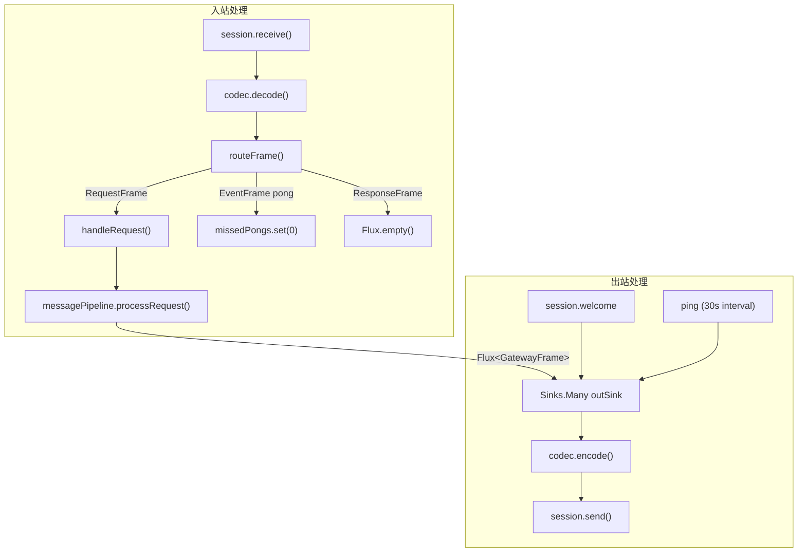

#### ProtocolCodec

JSON 编解码组件，负责将 WebSocket 文本帧在 `String` (JSON) 与 `GatewayFrame` 之间互相转换。底层依赖 Jackson `ObjectMapper`，利用 `@JsonTypeInfo` 注解实现自动多态序列化。

### 3.2 消息管道 (MessagePipeline)

`MessagePipeline` 是请求处理的核心业务组件，桥接 WebSocket 网关层和 Agent 运行时层。

**请求处理流程：**

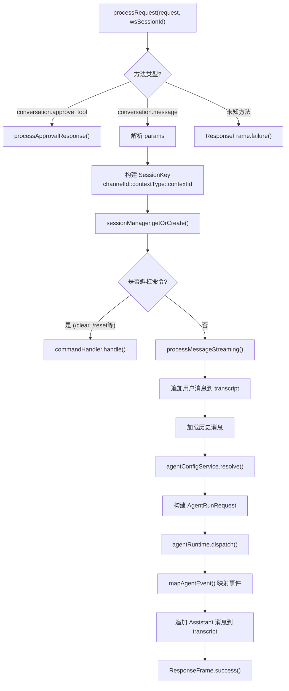

**AgentEvent -> EventFrame 映射关系：**

| AgentEvent 类型 | 映射为 | 附加行为 |
|----------------|--------|---------|
| `TurnStart` | `EventFrame("agent.turn_start")` | -- |
| `TextChunk` | `EventFrame("agent.chunk")` | 追加到 fullResponse StringBuilder |
| `ToolCall` | `EventFrame("agent.tool_call")` | -- |
| `ToolResult` | `EventFrame("agent.tool_result")` | -- |
| `Done` | `EventFrame("agent.done")` | 替换 fullResponse 为最终文本 |
| `Error` | `ResponseFrame.failure()` | 终止流 |
| `ApprovalRequired` | `EventFrame("agent.approval_required")` | -- |
| `ApprovalResponse` | 不发送 (`Flux.empty()`) | 内部事件 |

**Session Key 构造规则：**

```
channelId  = params.channelId  ?? "webchat"
contextType = params.contextType ?? "dm"
contextId  = (params.contextId ?? wsSessionId) + "::" + agentName
```

组合键格式：`webchat::dm::{wsSessionId}::{agentName}`

### 3.3 Agent 运行时

#### AgentEvent

Agent 执行过程中产生的事件，使用 Java sealed interface 定义 8 种变体：

| 变体 | 字段 | 含义 |
|------|------|------|
| `TurnStart(turn, maxTurns)` | turn 计数, 最大轮数 | 新一轮 LLM 推理开始 |
| `TextChunk(text)` | 文本片段 | LLM 流式输出的 token |
| `ToolCall(toolCallId, name, arguments, turn)` | 工具调用信息 | LLM 决定调用工具 |
| `ToolResult(toolCallId, name, result, success, turn)` | 执行结果 | 工具执行完毕 |
| `Done(fullText, totalTurns)` | 完整文本, 总轮数 | Agent 循环正常结束 |
| `Error(message)` | 错误信息 | Agent 循环出错 |
| `ApprovalRequired(toolCallId, toolName, arguments)` | 工具信息 | 需要人工审批 |
| `ApprovalResponse(toolCallId, approved, modifiedArguments)` | 审批结果 | 用户审批响应（内部事件） |

#### AgentRunRequest

封装单次 Agent 运行所需的全部上下文：

| 字段 | 类型 | 说明 |
|------|------|------|
| `sessionId` | `Long` | 所属会话 ID |
| `agent` | `IntelliMateProperties.Agent` | Agent 配置（模型、最大轮数、超时等） |
| `userMessage` | `String` | 用户输入文本 |
| `history` | `List<Message>` | 对话历史（Spring AI Message 格式） |
| `toolsEnabled` | `String` | 内置/自定义工具过滤规则 |
| `mcpToolsEnabled` | `String` | MCP 工具过滤规则 |
| `skillsEnabled` | `String` | Skill 过滤规则 |

#### AgentRuntime

Agent 循环执行引擎，核心方法 `dispatch()` 将请求入队并返回 `Flux<AgentEvent>` 响应式事件流。

**执行流程：**

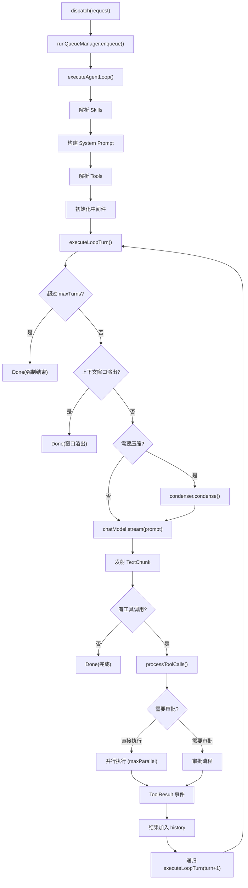

**中间件链：**

| 中间件 | 作用 |
|--------|------|
| `ToolCallLoopDetector` | 检测工具调用循环（相同参数重复调用），支持 WARN/TERMINATE 两级 |
| `ContextWindowTracker` | 跟踪上下文 token 数量，防止溢出 |
| `ContextCondenser` | 当上下文接近上限时压缩历史消息 |
| `ToolResultCache` | 缓存工具执行结果，避免重复调用 |
| `ToolApprovalGate` | 对配置的敏感工具要求人工审批后才执行 |

#### RunQueueManager

每个 Session 维护一个 FIFO 队列，保证同一 Session 内的 Agent 运行串行执行，不同 Session 之间并行。

**核心机制：**

```
sessionChains: ConcurrentMap<Long, Mono<Void>>

enqueue(sessionId, runSupplier):
  1. 获取该 session 的前序 Mono（链尾）
  2. 创建 replay Sink 用于事件广播
  3. 新 run = 前序完成后 -> 执行 runSupplier -> 事件推送到 Sink
  4. 缓存并订阅
  5. 返回 Sink 的 Flux
```

### 3.4 会话管理

`SessionManager` 负责会话的生命周期管理和聊天记录持久化。

**核心接口：**

| 方法 | 说明 |
|------|------|
| `getOrCreate(SessionKey, SessionMetadata)` | 获取或创建会话 |
| `appendMessage(sessionId, message)` | 追加聊天记录 |
| `getHistory(sessionId, limit)` | 获取历史消息 |
| `resetSession(sessionId)` | 重置会话 |

**数据模型：**

- **SessionEntity**：`id`, `channelId`, `contextType`, `contextId`, `agentName`, `lastActiveAt`, `createdAt`, `updatedAt`, `deleted`
- **TranscriptMessageEntity**：`id`, `sessionId`, `role`(user/assistant/tool), `content`, `toolCallId`, `toolName`, `metadataJson`, `createdAt`
- **SessionKey**：`channelId` + `contextType` + `contextId` 三元组

### 3.5 安全认证

`SecurityService` 提供 WebSocket 连接的安全校验。

**Token 认证流程：**

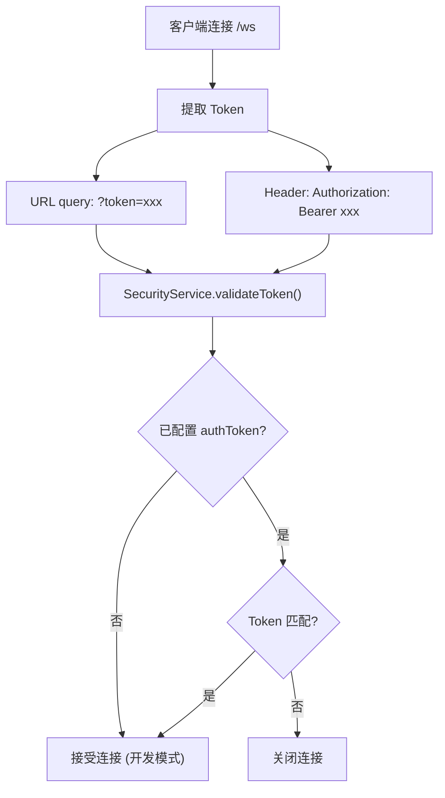

**安全特性：**

- Token 仅在 WebSocket 握手阶段校验，后续消息不做二次鉴权
- 未配置 `authToken` 时自动进入开发模式，接受所有连接
- 支持 Allowlist 机制限制特定用户接入
- 支持 DM Pairing 配对认证（6 位验证码）

---

## 4. 前端实现

### 4.1 WsClient

`WsClient` 是对浏览器原生 `WebSocket` API 的封装，提供连接管理、帧路由和自动重连能力。

**连接状态机：**

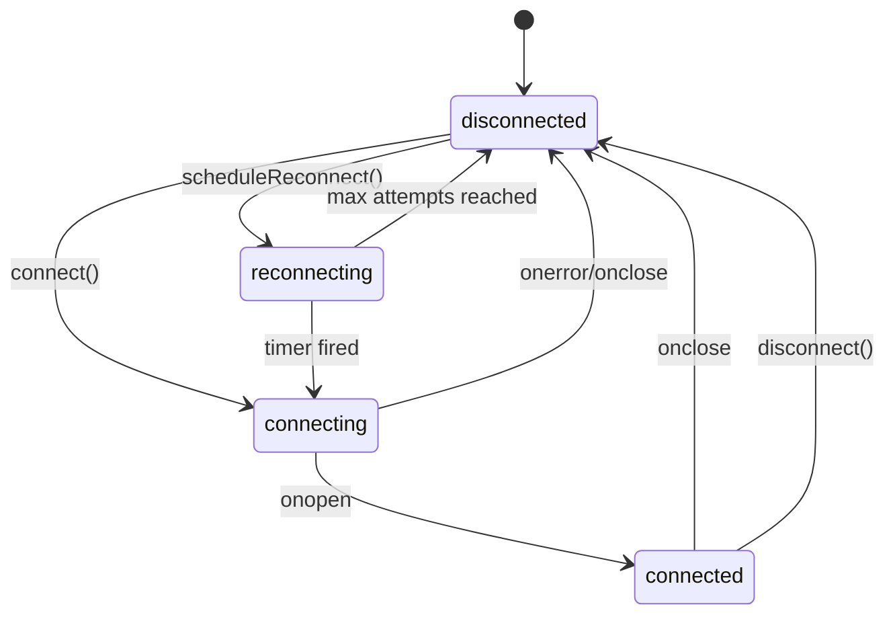

**帧路由逻辑：**

```
收到消息 -> JSON.parse() -> handleFrame()
  ├── EventFrame
  │   ├── event === "ping" -> 自动回复 createPong()
  │   └── 其他 -> onEvent 回调
  └── ResponseFrame -> onResponse 回调
```

**重连策略：**

| 参数 | 值 |
|------|-----|
| 最大重连次数 | 5 次（可配置） |
| 退避算法 | 指数退避 `min(1000 * 2^(attempt-1), 30000)` |
| 延迟序列 | 1s -> 2s -> 4s -> 8s -> 16s（封顶 30s） |
| 触发条件 | `onclose` 事件 |
| 重置条件 | 连接成功（`onopen`）时重置计数器 |

### 4.2 useWebSocket Hook

React Hook，负责在组件挂载时创建 `WsClient`，并将 WebSocket 事件分发到 Zustand Store。

**核心行为：**

1. **初始化**：`useEffect` 中创建 `WsClient`，传入 Token 和回调，调用 `connect()`
2. **事件分发**：`onEvent` 回调根据 `event.event` 分发到 `chatStore` 的不同 action
3. **发送消息**：`sendMessage()` 构造 `conversation.message` 请求，设置 5 分钟超时
4. **清理**：组件卸载时断开连接、清除超时定时器

**事件到 Store Action 映射：**

| WebSocket 事件 | chatStore Action | 作用 |
|---------------|-----------------|------|
| `session.welcome` | `setWsSessionId(id)` | 存储 WebSocket 会话 ID |
| `agent.chunk` | `appendChunk(requestId, text)` | 追加流式文本片段 |
| `agent.done` | `finishStreaming(requestId, text, totalTurns)` | 标记流式传输完成 |
| `agent.turn_start` | `setTurnStart(requestId, turn, maxTurns)` | 更新当前 Turn 信息 |
| `agent.tool_call` | `addToolCall(requestId, toolCall)` | 添加工具调用记录 |
| `agent.tool_result` | `updateToolResult(requestId, toolCallId, result, success)` | 更新工具执行结果 |
| ResponseFrame | `addResponse(response)` | 处理最终响应 |
| 连接状态变更 | `setConnectionState(state)` | 更新连接状态 |

**请求超时：**

- 超时时间：`REQUEST_TIMEOUT_MS = 300_000`（5 分钟）
- 超时后调用 `chatStore.timeoutRequest(requestId)`
- 收到 `agent.done` 或 `ResponseFrame` 时清除对应定时器

### 4.3 状态管理 (Zustand Store)

**chatStore** 管理与 WebSocket 通信相关的所有 UI 状态：

| 状态字段 | 说明 |
|---------|------|
| `connectionState` | WebSocket 连接状态 |
| `wsSessionId` | 当前 WebSocket 会话 ID |
| `messages` | 消息列表（用户消息 + Agent 消息） |
| `isWaiting` | 是否正在等待 Agent 响应 |
| `currentTurn` / `maxTurns` | 当前 Turn 进度 |

**agentStore** 仅在发消息时提供 `activeAgent` 字段，不参与 WebSocket 事件处理。

### 4.4 UI 组件交互

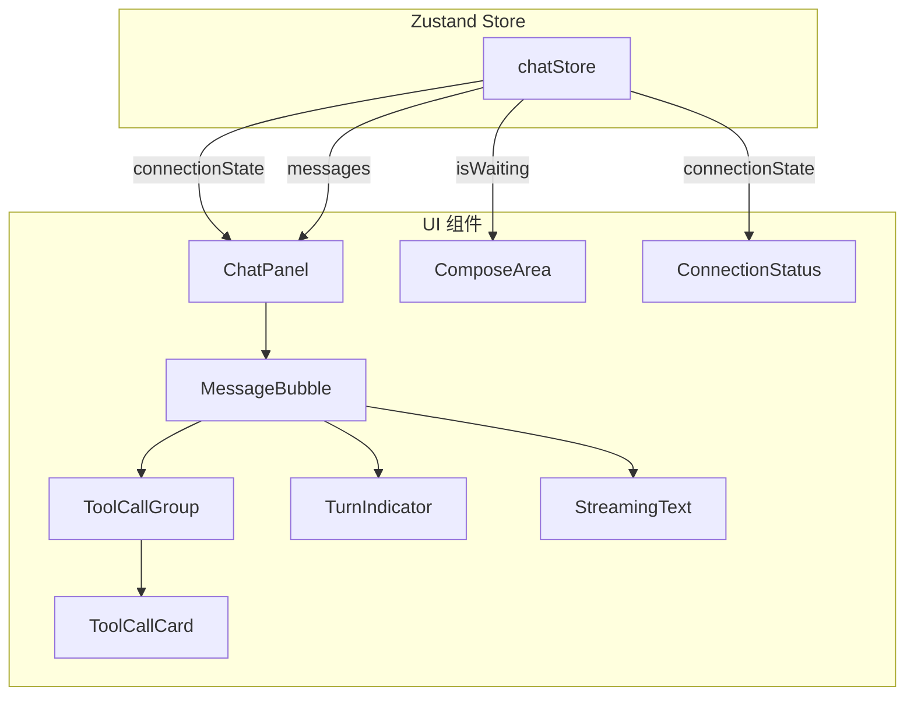

| 组件 | 响应的 WebSocket 事件 | 行为 |
|------|---------------------|------|
| `ConnectionStatus` | 连接状态变更 | 显示 connecting/connected/disconnected/reconnecting |
| `ChatPanel` | 连接状态 | 断连时禁用输入 |
| `ComposeArea` | `isWaiting` | 等待响应时禁用输入 |
| `MessageBubble` | `agent.chunk`, `agent.done` | 流式渲染文本 |
| `TurnIndicator` | `agent.turn_start` | 显示 "Turn 2/10" 进度 |
| `ToolCallGroup` | `agent.tool_call`, `agent.tool_result` | 按 Turn 分组展示工具调用 |
| `ToolCallCard` | `agent.tool_call`, `agent.tool_result` | 显示单个工具调用状态（calling/done/error） |

---

## 5. 关键流程时序图

### 5.1 用户发送消息完整流程

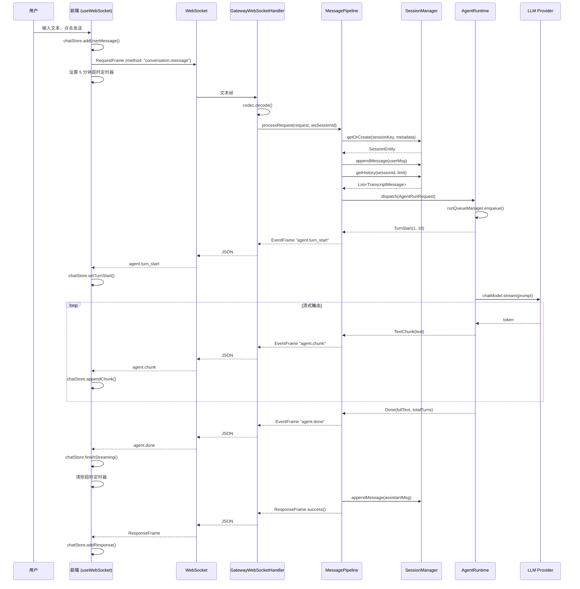

### 5.2 工具调用流程

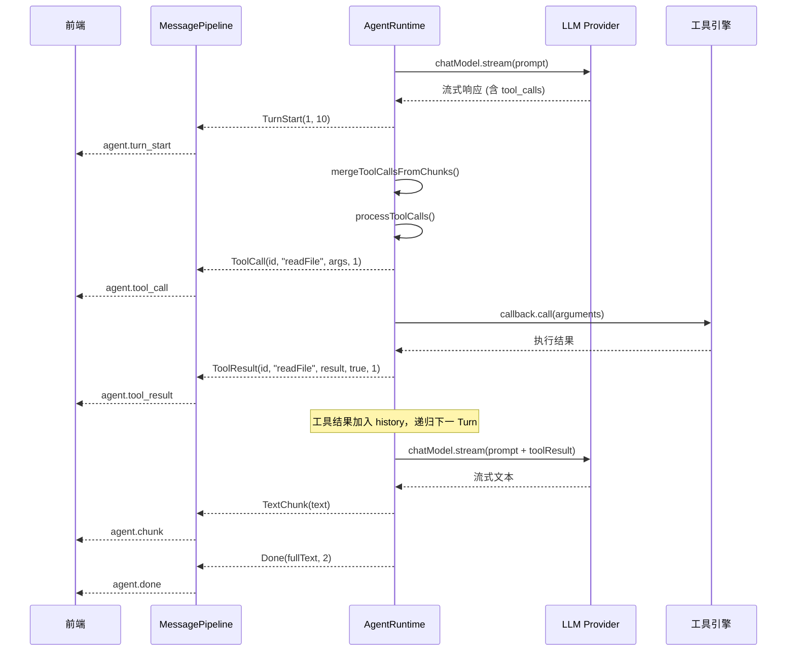

### 5.3 工具审批流程

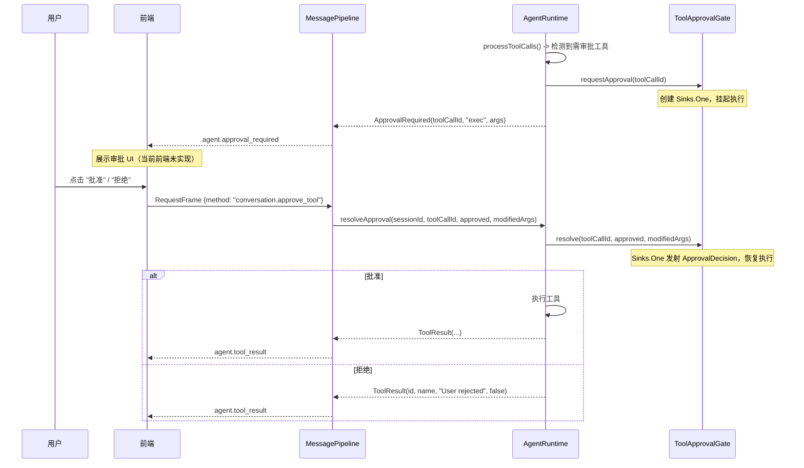

### 5.4 心跳与断线重连

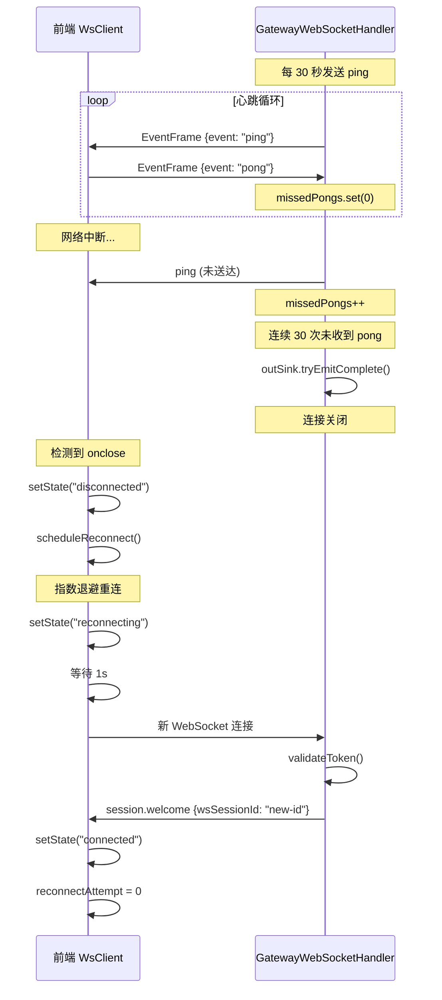

---

## 6. 连接生命周期

### 6.1 完整生命周期

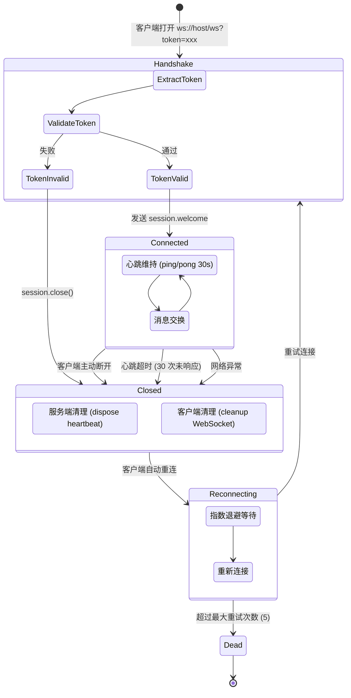

### 6.2 阶段详解

| 阶段 | 服务端行为 | 客户端行为 |
|------|-----------|-----------|
| **握手** | 从 URL/Header 提取 Token，调用 `SecurityService.validateToken()` | 构造 `ws://host/ws?token=xxx` URL，创建 WebSocket |
| **Welcome** | 生成 `wsSessionId`，发送 `session.welcome` 事件 | 存储 `wsSessionId` 到 chatStore |
| **活跃** | 30s 间隔 ping，处理入站请求，推送 Agent 事件 | 自动回复 pong，发送请求，处理事件 |
| **断开** | `doFinally` 清理心跳定时器，记录日志 | 清除 WebSocket 引用和事件监听器 |
| **重连** | 无感知（新连接即新握手） | 指数退避重连，状态切换到 reconnecting |

---

## 7. 错误处理

### 7.1 后端错误处理层次

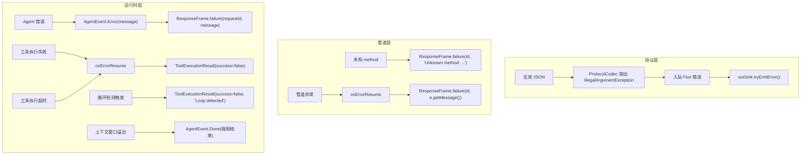

### 7.2 错误类型与处理策略

| 错误场景 | 发生位置 | 处理策略 | 客户端表现 |
|---------|---------|---------|-----------|
| 无效 JSON | `ProtocolCodec.decode()` | 抛出 `IllegalArgumentException`，日志记录 | 连接可能中断 |
| 未知请求方法 | `MessagePipeline.processRequest()` | 返回 `ResponseFrame.failure` | 收到错误响应 |
| 管道处理异常 | `MessagePipeline` | `onErrorResume` 捕获，返回 `ResponseFrame.failure` | 收到错误响应 |
| Agent 运行错误 | `AgentRuntime` | 发射 `AgentEvent.Error`，映射为 `ResponseFrame.failure` | 收到错误响应 |
| 工具执行失败 | `AgentRuntime.doExecuteTool()` | `onErrorResume` 捕获，返回 `ToolExecutionResult(success=false)` | 收到 `agent.tool_result(success=false)` |
| 工具执行超时 | `AgentRuntime` | `timeout(toolTimeout)` 触发 | 工具标记为失败 |
| 工具调用循环 | `ToolCallLoopDetector` | WARN: 追加警告；TERMINATE: 返回失败结果 | 工具标记为失败 |
| 上下文窗口溢出 | `ContextWindowTracker` | 先尝试压缩，仍溢出则强制 Done | 收到 `agent.done` |
| LLM 调用超时 | `AgentRuntime.executeLoopTurn()` | `timeout(timeout)` 触发 | Agent 运行失败 |
| 请求超时 (5min) | 前端 `useWebSocket` | `setTimeout` 到期，调用 `chatStore.timeoutRequest()` | UI 提示超时 |
| WebSocket 断开 | 前端 `WsClient` | 触发 `onclose`，启动重连 | 显示 disconnected/reconnecting |

### 7.3 工具重试机制

`AgentRuntime` 对可重试的工具错误自动重试：

| 参数 | 值 |
|------|-----|
| 最大重试次数 | 2 |
| 重试延迟 | 1 秒（指数退避） |
| 可重试错误 | `SocketTimeoutException`, `ConnectException`, `TimeoutException`, HTTP 429 |
| 不可重试错误 | `FileNotFoundException`, `IllegalArgumentException`, `SecurityException`, `ToolExecutionException` |
| 不可重试工具 | 配置在 `nonRetryableTools` 中的工具 |

---

## 8. 关键文件索引

### 后端 (Java)

| 模块 | 文件路径 | 职责 |
|------|---------|------|
| 协议 | `intellimate-core/.../protocol/GatewayFrame.java` | 帧类型 sealed interface |
| 协议 | `intellimate-core/.../protocol/EventFrame.java` | 事件帧 record |
| 协议 | `intellimate-core/.../protocol/RequestFrame.java` | 请求帧 record |
| 协议 | `intellimate-core/.../protocol/ResponseFrame.java` | 响应帧 record |
| 网关 | `intellimate-gateway/.../websocket/GatewayWebSocketHandler.java` | WebSocket 核心处理器 |
| 网关 | `intellimate-gateway/.../websocket/WebSocketRouterConfig.java` | `/ws` 路由配置 |
| 网关 | `intellimate-gateway/.../websocket/ProtocolCodec.java` | JSON 编解码 |
| 管道 | `intellimate-gateway/.../pipeline/MessagePipeline.java` | 请求处理、事件映射 |
| 管道 | `intellimate-gateway/.../pipeline/CommandHandler.java` | 斜杠命令处理 |
| 运行时 | `intellimate-agent/.../runtime/AgentRuntime.java` | Agent 循环执行引擎 |
| 运行时 | `intellimate-agent/.../runtime/AgentEvent.java` | Agent 事件类型定义 |
| 运行时 | `intellimate-agent/.../runtime/AgentRunRequest.java` | 运行请求封装 |
| 运行时 | `intellimate-agent/.../runtime/RunQueueManager.java` | 每 Session FIFO 队列 |
| 运行时 | `intellimate-agent/.../runtime/ToolApprovalGate.java` | 工具审批门控 |
| 运行时 | `intellimate-agent/.../runtime/ToolCallLoopDetector.java` | 工具调用循环检测 |
| 运行时 | `intellimate-agent/.../runtime/ContextWindowTracker.java` | 上下文窗口跟踪 |
| 运行时 | `intellimate-agent/.../runtime/ContextCondenser.java` | 上下文压缩 |
| 运行时 | `intellimate-agent/.../runtime/ToolResultCache.java` | 工具结果缓存 |
| 会话 | `intellimate-gateway/.../session/SessionManager.java` | 会话管理接口 |
| 会话 | `intellimate-gateway/.../session/SessionManagerImpl.java` | 会话管理实现 |
| 安全 | `intellimate-gateway/.../security/SecurityService.java` | Token 校验、Allowlist |

### 前端 (TypeScript/React)

| 文件路径 | 职责 |
|---------|------|
| `intellimate-web/src/lib/protocol.ts` | 协议类型定义、工具函数 |
| `intellimate-web/src/lib/wsClient.ts` | WebSocket 客户端封装 |
| `intellimate-web/src/hooks/useWebSocket.ts` | React Hook，事件分发 |
| `intellimate-web/src/stores/chatStore.ts` | 聊天状态管理 (Zustand) |
| `intellimate-web/src/stores/agentStore.ts` | Agent 配置状态 |
| `intellimate-web/src/components/MessageBubble.tsx` | 消息渲染 |
| `intellimate-web/src/components/ToolCallGroup.tsx` | 工具调用分组展示 |
| `intellimate-web/src/components/ToolCallCard.tsx` | 单个工具调用卡片 |
