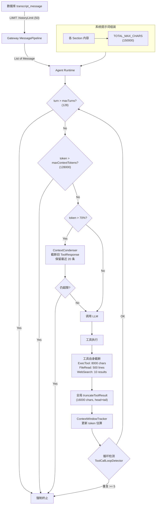

# IntelliMate 项目上下文压缩行为全景清单

项目中存在 **多层级、多位置** 的上下文压缩机制。以下按数据流经的顺序（从外到内）逐一列出。

---

## 一、历史消息加载层（Gateway）

### 1. 历史消息条数硬上限 (`history-limit: 50`)

从数据库加载对话历史时，仅取最近 N 条消息。

- **配置**: [application.yml](../intellimate-gateway/src/main/resources/application.yml) `intellimate.agent.history-limit: 50`
- **默认值定义**: [IntelliMateProperties.java](../intellimate-core/src/main/java/com/atm/intellimate/core/config/IntelliMateProperties.java) `historyLimit = 50`
- **SQL 执行**: [TranscriptMessageRepository.java](../intellimate-gateway/src/main/java/com/atm/intellimate/gateway/repository/TranscriptMessageRepository.java) — 三条查询均使用 `ORDER BY created_at DESC LIMIT :limit`
- **调用入口**: [MessagePipeline.java](../intellimate-gateway/src/main/java/com/atm/intellimate/gateway/pipeline/MessagePipeline.java) `loadHistory()` 方法

**效果**: 超过 50 条的早期消息直接丢弃，不进入 LLM 上下文。

---

## 二、Agent 运行时上下文控制层

### 2. 上下文窗口追踪器 (`ContextWindowTracker`)

实时估算当前上下文 token 消耗，当超限时强制终止。

- **实现**: [ContextWindowTracker.java](../intellimate-agent/src/main/java/com/atm/intellimate/agent/runtime/ContextWindowTracker.java)
- **配置**: `max-context-tokens: 128000`
- **估算策略**: 优先使用 API 返回的真实 token 数（`updateFromApiUsage`），回退到字符数 / 3.5 的估算
- **关键方法**:
  - `isNearLimit(0.70)` — 达到 70% 时触发 condenser
  - `isOverLimit()` — 超限时强制结束 agent 循环
  - `recalculate()` — condenser 执行后重新计算

### 3. 上下文压缩器 (`ContextCondenser`)

**核心压缩机制**：对历史中较早的 `ToolResponseMessage` 做 substring 截断。

- **实现**: [ContextCondenser.java](../intellimate-agent/src/main/java/com/atm/intellimate/agent/runtime/ContextCondenser.java)
- **配置**:
  - `condenser-keep-recent: 20` — 保留最近 20 条消息不压缩
  - `condenser-summary-length: 200` — 被压缩的工具结果截取前 200 字符
  - `condenser-min-turns-between: 5` — 两次压缩之间至少间隔 5 个 turn
- **触发条件**: `tracker.isNearLimit(0.70)` 且距上次压缩 >= 5 轮
- **压缩方式**: `substring(0, summaryLength) + "... [condensed: ...]"` — **纯截断，非 LLM 摘要**
- **影响范围**: 只压缩 `ToolResponseMessage`，`SystemMessage` / `UserMessage` / `AssistantMessage` 不受影响

### 4. 工具返回值全局截断 (`truncateToolResult`)

每个工具的返回结果在进入对话历史前被截断。

- **实现**: [AgentRuntime.java](../intellimate-agent/src/main/java/com/atm/intellimate/agent/runtime/AgentRuntime.java) `truncateToolResult()` 方法
- **配置**: `max-tool-result-chars: 16000`
- **策略**: 保留前 8000 字符 + 后 8000 字符（head+tail），中间用 `[truncated]` 标记

### 5. 系统提示词总长度截断

组装系统提示词时，对最终结果做硬截断。

- **实现**: [AgentRuntime.java](../intellimate-agent/src/main/java/com/atm/intellimate/agent/runtime/AgentRuntime.java)
- **常量**:
  - `TOTAL_MAX_CHARS = 150_000` — 系统提示词总长上限，超出直接截断 + `[truncated]`
  - `SECTION_MAX_CHARS = 20_000` — 每个 section 上限（当前代码中被注释掉，未启用）

### 6. 最大轮次限制 (`max-turns: 128`)

Agent 循环的硬上限，超过直接终止。

- **配置**: `max-turns: 128`
- **检查点**: [AgentRuntime.java](../intellimate-agent/src/main/java/com/atm/intellimate/agent/runtime/AgentRuntime.java) 主循环开头 `if (turn > maxTurns)`

### 7. 工具调用循环检测器 (`ToolCallLoopDetector`)

间接的上下文控制：检测重复工具调用，防止无意义地膨胀上下文。

- **实现**: [ToolCallLoopDetector.java](../intellimate-agent/src/main/java/com/atm/intellimate/agent/runtime/ToolCallLoopDetector.java)
- **配置**:
  - `loop-detector-window-size: 8` — 滑动窗口大小
  - `loop-detector-warn-threshold: 3` — 重复 3 次警告
  - `loop-detector-terminate-threshold: 5` — 重复 5 次终止

---

## 三、工具输出层（源头控制）

各工具在返回结果时自行截断，在进入 `truncateToolResult` 之前就已缩减。

### 8. Shell 执行工具 (`ExecTool`) — 8000 字符

- **实现**: [ExecTool.java](../intellimate-agent/src/main/java/com/atm/intellimate/agent/tools/ExecTool.java)
- **策略**: `MAX_OUTPUT_CHARS = 8_000`，head+tail 截断

### 9. 文件读取工具 (`FileReadTool`) — 500 行分页

- **实现**: [FileReadTool.java](../intellimate-agent/src/main/java/com/atm/intellimate/agent/tools/FileReadTool.java)
- **策略**: `MAX_LINES_PER_READ = 500`，超出时自动分页

### 10. 网页搜索工具 (`WebSearchTool`) — 最多 10 条结果

- **实现**: [WebSearchTool.java](../intellimate-agent/src/main/java/com/atm/intellimate/agent/tools/WebSearchTool.java)
- **策略**: 默认 5 条，最多 10 条

### 11. 工具结果缓存 (`ToolResultCache`) — 最多 50 条

- **实现**: [ToolResultCache.java](../intellimate-agent/src/main/java/com/atm/intellimate/agent/runtime/ToolResultCache.java)
- **策略**: LRU 缓存最多 50 条，缓存命中的结果仍经过 `truncateToolResult` 截断

---

## 四、Prompt 指令层（行为引导式压缩）

### 12. Plan 执行输出规范

通过 prompt 指令引导模型减少冗余输出，间接缩减上下文增长速度。

- **文件**: [plan-execution-context-footer.md](../intellimate-gateway/src/main/resources/prompts/plan-execution-context-footer.md)
- **规则**:
  - 禁止输出介绍性、过渡性、总结性对话
  - 步骤成果只记录在 `resultSummary` 参数中，不在对话正文重复
  - 工具调用之间不插入解释文字

**效果**: 减少 assistant 消息的文本量，降低上下文增长速率。

---

## 五、非 LLM 上下文的截断（附录）

以下截断不影响 LLM 输入，但为完整性列出：

- **审计日志** ([MessagePipeline.java](../intellimate-gateway/src/main/java/com/atm/intellimate/gateway/pipeline/MessagePipeline.java)): 用户消息预览截取 200 字符
- **错误消息** ([ModelProviderController.java](../intellimate-gateway/src/main/java/com/atm/intellimate/gateway/http/ModelProviderController.java)): API 错误信息截取 500 字符
- **前端 UI 展示** ([ToolCallCard.tsx](../intellimate-web/src/components/ToolCallCard.tsx), [MessageBubble.tsx](../intellimate-web/src/components/MessageBubble.tsx), [PlanStepCard.tsx](../intellimate-web/src/components/PlanStepCard.tsx)): 工具参数 300 字符、结果 500 字符、描述 60 字符等
- **调试日志** ([AgentRuntime.java](../intellimate-agent/src/main/java/com/atm/intellimate/agent/runtime/AgentRuntime.java)): `truncate()` 方法限制 500 字符，仅用于 debug 日志

---

## 配置参数速查表

| 参数 | 默认值 | 所在层级 | 说明 |
|------|--------|---------|------|
| `history-limit` | 50 | Gateway | 从 DB 加载的最大消息条数 |
| `max-context-tokens` | 128000 | Agent Runtime | 上下文窗口 token 上限 |
| `max-tool-result-chars` | 16000 | Agent Runtime | 单次工具结果最大字符数 |
| `max-turns` | 128 | Agent Runtime | Agent 循环最大轮次 |
| `condenser-keep-recent` | 20 | Agent Runtime | 压缩时保留最近 N 条不压缩 |
| `condenser-summary-length` | 200 | Agent Runtime | 压缩后保留的字符数 |
| `condenser-min-turns-between` | 5 | Agent Runtime | 两次压缩最小间隔轮次 |
| `loop-detector-window-size` | 8 | Agent Runtime | 循环检测滑动窗口大小 |
| `loop-detector-warn-threshold` | 3 | Agent Runtime | 循环检测警告阈值 |
| `loop-detector-terminate-threshold` | 5 | Agent Runtime | 循环检测终止阈值 |
| `TOTAL_MAX_CHARS` | 150000 | Agent Runtime | 系统提示词总长上限（硬编码） |
| `MAX_OUTPUT_CHARS` (ExecTool) | 8000 | 工具层 | Shell 输出最大字符数（硬编码） |
| `MAX_LINES_PER_READ` (FileReadTool) | 500 | 工具层 | 文件读取最大行数（硬编码） |
| `MAX_ENTRIES` (ToolResultCache) | 50 | 工具层 | 工具结果缓存最大条目数（硬编码） |

---

## 数据流全景图

---

## 关键发现

- **没有 LLM 摘要式压缩**: 当前 `ContextCondenser` 是纯 substring 截断（前 200 字符），并非调用 LLM 做摘要。设计文档中提到了 `LLMSummarizingCondenser` 的调研，但未实现。
- **`SECTION_MAX_CHARS` 被注释掉**: 系统提示词中单 section 的 20000 字符限制已注释，仅 150000 总上限生效。
- **多层截断可能叠加**: 工具结果经历 "工具自身截断 -> `truncateToolResult` -> `ContextCondenser`" 三层处理。
- **`historyLimit` 仅在 Gateway 层应用**: Agent 模块不做额外的历史消息裁剪。
